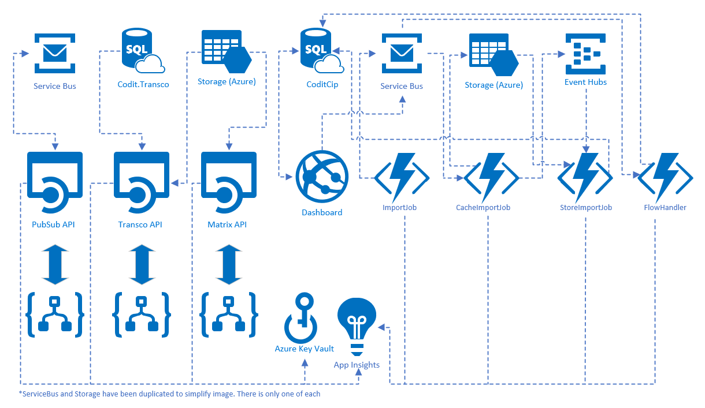

[home](../README.md)

# Invictus for Azure Architecture Diagram

## Component types

The above components can be mainly split into 3 categories.

* **Framework**

   Consists of PubSubAPI, TranscoAPI, and MatrixAPI. These are the services which expose the functionality of each component, they are mainly used with LogicApps to execute the functions they expose.

* **Dashboard**

  * *Frontend*: Mainly consists of the database which is used to monitor all flows that have been saved to the database and their status.

  * *Import*: The import which is mainly made up of the ImportJob, CacheImportJob, StoreImportJob, and FlowHandler. The ImportJob functions are used to listen on EventHub for all LogicApp executions, all data is then merged and finally pushed to the Database. The FlowHandler is used to handle Ignores, Resubmit and Resume requests for flows.

## Usage of components

### Azure Service Bus

- Used by PubSub API to push messages to Subscriptions
- Used by ImportJob to push data to CacheImportJob after splitting data by ClientTrackingId
- Used by Dashboard to queue requests for Ignore/Resume/Resubmit which are then picked up by the Flow Handler

### Azure Storage

- Used by PubSub to create Blobs for ClaimCheck pattern
- Used by CacheImportJob to all events received from EventHub as a temporary cache

### CoditCip

- Database for Frontend, data is pushed by StoreImportJob

### Azure Event Hubs

- Diagnostic settings for LogicApps that are tracked is pushed there
- The ImportJob listens on this Eventhub and reads these events which are then processed and mapped to a flow
 
### Azure Application Insights

- All APIs, WebApps, and Functions point to a single AppInsights which contains all traces and logs that were created
 
### Azure Key Vault

- Used to store passwords for Database, API keys, and Transco Connectionstring, etc
