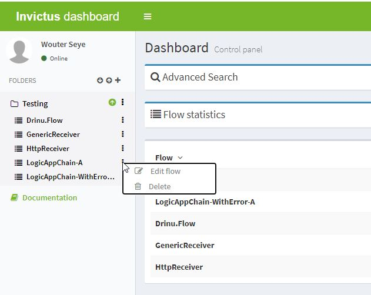
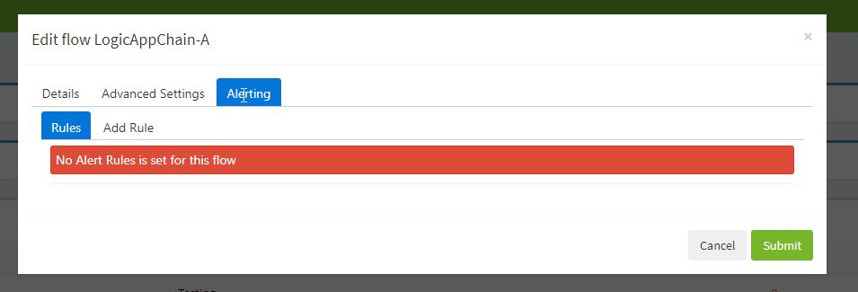
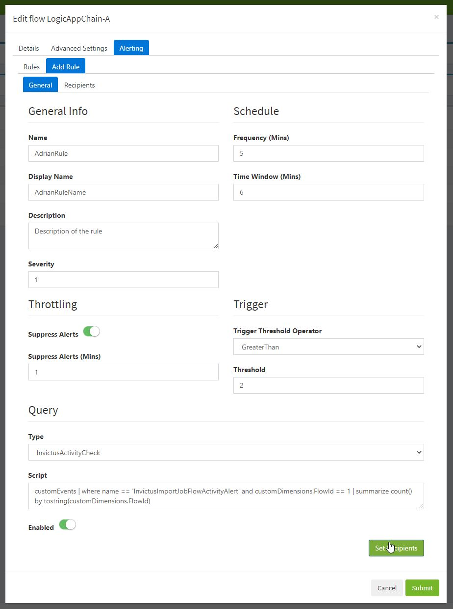
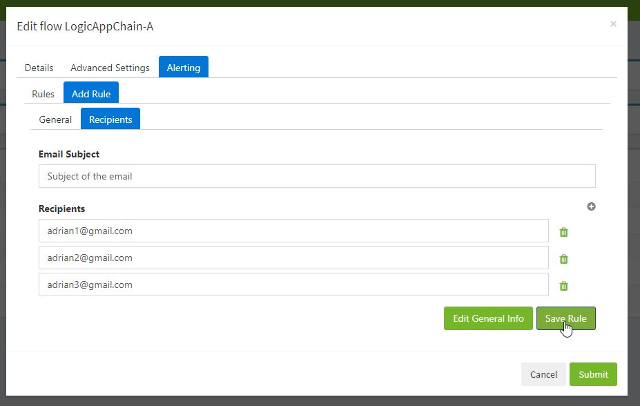
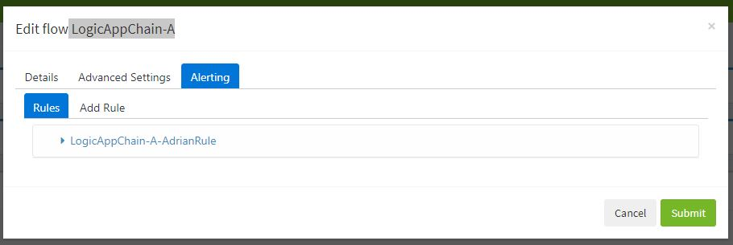
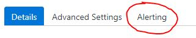
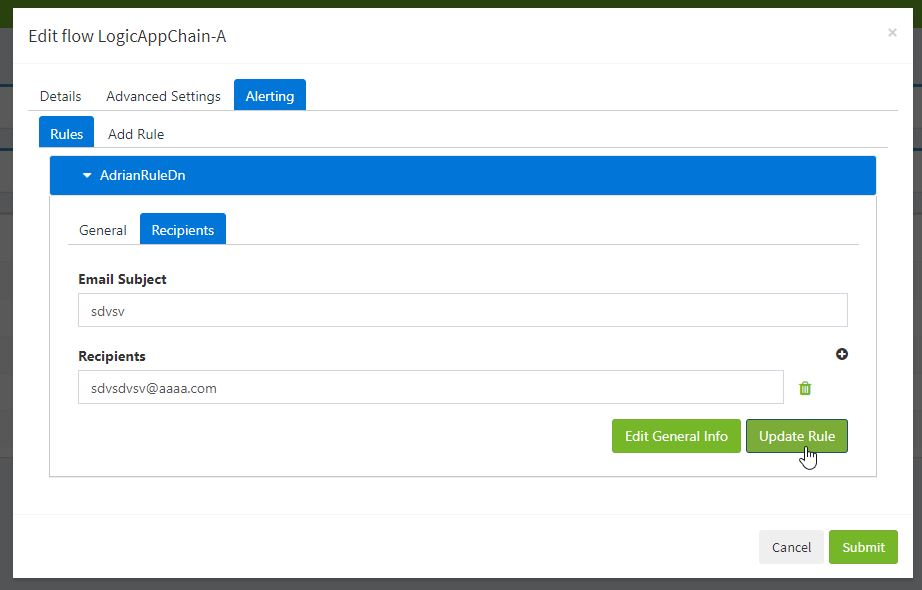
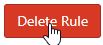

[home](../README.md) | [dashboard](dashboard.md) | [Alerting](alerting.md)

# Alerting

This is a step by step on how to set up alerting. The following functionality is covered in this document:

- Create a Rule
- Update a Rule
- Delete a Rule
- Setup Activity check for a flow
- Setup Error check for a flow

**When creating the a rule, the name will always automatically have the flowname as the prefix set, example: {{flowname}}-AdrianRule**

## Add a new rule

First you need to choose a flow from the left panel which you want to see the rules. Then click on the 3 dots next to it and choose the Edit Flow.

As soon as the Edit Flow modal pop up opens, you can see that there is a new tab "Alerting". Click on it.

To add a rule, you need to click on the "Add Rule" tab and start inserting the rule information. 

As soon as you are ready from the first tab, you can click on the "Set Recipient "button underneath. 

In here you can enter the email subject and the emails of those individuals who need to be prompted.

When you are done, you can click on the "Save Rule" and give it some time till it saves. When it saves it will take you to the Rules tab with the new rule being added there.

## Edit a rule

First you need to choose a flow from the left panel which you want to see the rules. Then click on the 3 dots next to it and choose the Edit Flow.

As soon as the Edit Flow modal pop up opens, you can see that there is a new tab. It's called Alerting. Click on it.

Click on the Rule you want to edit. In this case I will be editing the {{FlowName}}-AdrianRule one.

Change any information and click on the Set Recepients button underneath and click on the Update Rule button.

## Delete a rule

First you need to choose a flow from the left panel which you want to see the rules. Then click on the 3 dots next to it and choose the Edit Flow.

As soon as the Edit Flow modal pop up opens, you can see that there is a new tab. It's called Alerting. Click on it.

Click on the Rule you want to delete. In this case I will be deleting the {{FlowName}}-AdrianRule one.

At the bottom, you will see a red button Delete Rule. Click on it and it will be deleted.

**The Alerting tab will be shown only when the Edit Flow is opened not Add new flow.**
