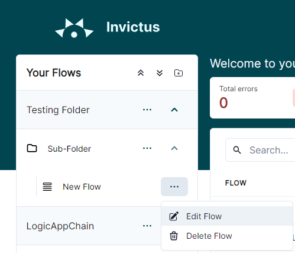
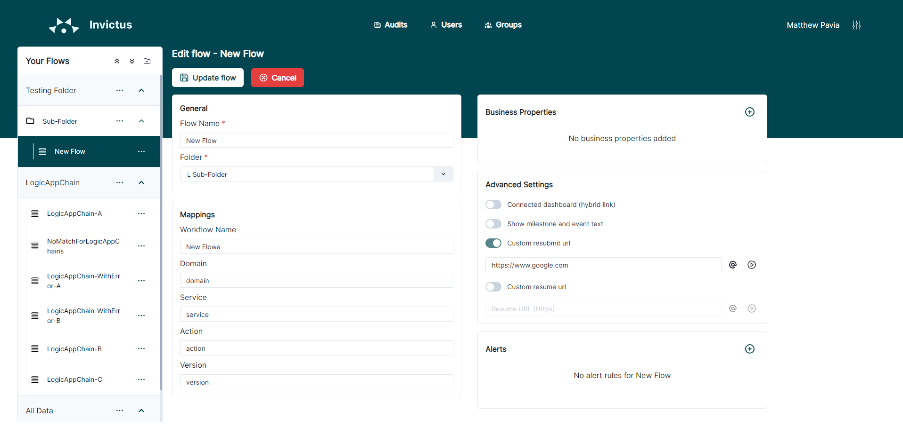
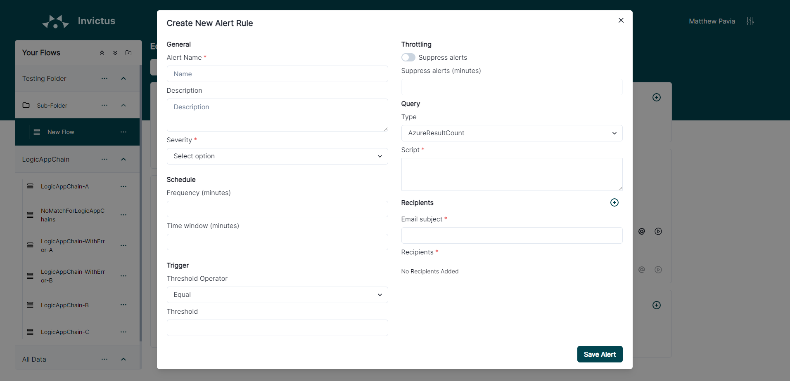
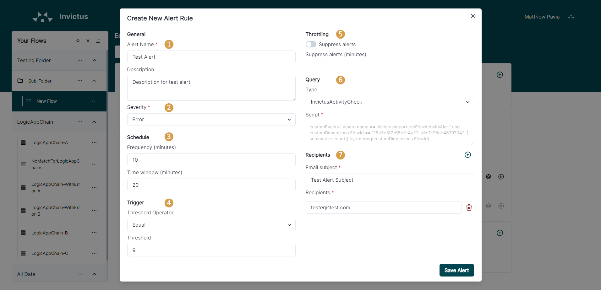
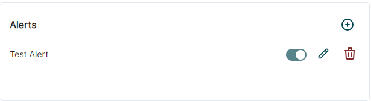

[home](../README.md) | [dashboard](dashboard.md) | [Alerting](alerting.md)

# Alerting

For this feature to function properly some role assignments need to be set in your Invictus installation. Please see [Access Control Rights](accesscontrolrights.md) for more info.

## Note

- When creating the a rule, the name will always automatically have the flowname as the prefix set, example: {{flowname}}-AdrianRule.
- The Alerting section will only be visible when editing a flow. This section will not be visible during the creation of a new flow.

## Add Alert Rule

To Add a rule, start by editing a flow.

In the bottom right of the edit flow page, there is the alerting section. 

To add a rule, click on the + icon button. Fill in the form with all your rule information, making sure to include all required information.

In the recipients section, you can enter the email subject and the email addresses of any individuals who need to be prompted.

When you are done, click on the "**Save Alert**" button. The new rule will then be listed in the alerts section.

## Edit Alert Rule

To Edit a rule, start by editing a flow.

In the alerts section, click on the pencil icon button next to the rule you wish to edit. A modal will appear with all the current rule information. Modify the rule as required.

## Delete Alert Rule

To Edit a rule, start by editing a flow.

In the alerts section, click on the trash icon button next to the alert you wish to delete.

Confirm your action in the confirmation pop up.

## Parameters Description

|Parameter Name|Required|Description|
| --- | --- | --- |
|Name|Yes|The name for the rule, must be unique per flow. Name will automatically have the flow name added as a prefix to it|
|Description|No|Description for the rule|
|Severity|Yes|Has to be a value between 1-4 which identifies the severity of a warning|
|Time Window|Yes|This value will be used by the Azure rule to check the logs for the last x minutes - value must be between the range of 5-2880|
|Frequency|Yes|The frequency how often the rule is executed - value must be between the range of 5-1440|
|Trigger Threshold Operator|Yes|The values available are: Equal/GreaterThan/LessThan, these operators are used along with the Threshold field to check if a rule needs to be triggered or not|
|Threshold|Yes|This is the value which will set the threshold for the rule|
|Suppress Alerts|No|This by default is set of, if enabled the Suppress Alerts in Mins is enabled|
|Suppress Alerts in Mins|No|The minutes value set here is used to suppress alerts for x minutes if alerts for a rule have been triggered|
Query Type|Yes|This value is used to select which type of query the alert rule will have AzureResultCount/InvictusActivityCheck/InvictusErrorCheck - AzureResultCount lets the user enter custom script which is accepted by the Azure Rule Syntax. The ones starting with "Invictus" are premade scripts for the user to select without having to modify|
|Email Subject|Yes|The subject for an email when an alert is sent|
|Recipients|Yes|The list of email recipients for a rule|

## Query Type Description

### Invictus Activity Check

This query type will filter logs on Azure Logs by the "InvictusImportJobFlowActivityAlert" property. The ImportJob will log activity for any flows that are active every hour. An example of how the alert settings for this flow could be set:

- Frequency: 60
- Time Window: 60
- Trigger Threshold Operator: LessThan
- Threshold: 0

This will create a rule to run every 60 minutes, scans the logs for the last 60 minutes and if the returned value is less than the threshold, it means that the flow is inactive, thus triggers the alert on Azure.

Please note that the importjob will not increment the activity for each message that is processed for a flow. This simply sends a single log per hour for each flow that is active, the count might be higher than one per hour due to scaling situations and multi-threaded scenarios. The logging frequency for the importjob can be increased by reducing the following value: **FlowActivityIntervalInMinutes**. This can be passed to the ARM template during deployment.

### Invictus Error Check

This query type will filter logs on Azure Logs by the "InvictusImportJobFlowErrorAlert" property. The ImportJob will log a message for each Flow that triggers an error. An example of how the alert settings for this flow could be set:

- Frequency: 10
- Time Window: 10
- Trigger Threshold Operator: GreaterThan
- Threshold: 0

This will create a rule to run every 10 minutes, scans the logs for the last 10 minutes and if the returned value is greater than the threshold, it means that the flow has failed messages, thus triggers the alert on Azure.

### AzureResultCount

This will enable custom scripts with the Azure Alert syntax. If you require further information about this type of syntax please refer to the official documentation by Microsoft.
