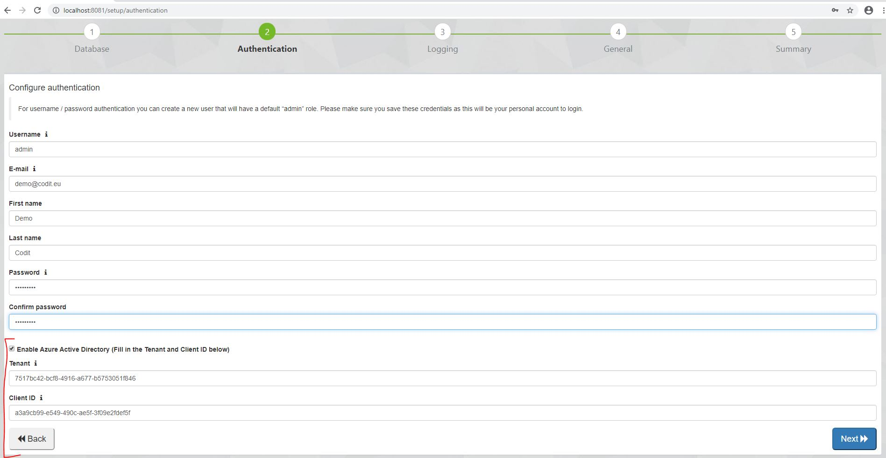
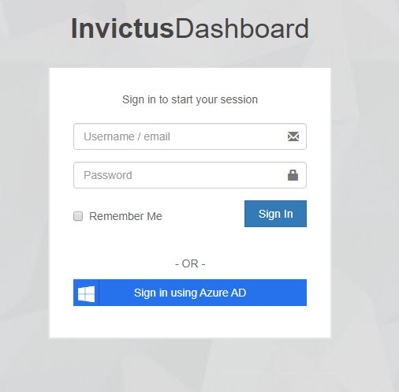

[home](../README.md) | [dashboard](dashboard.md) | [Azure AD Setup](azureADBiztalkSetup.md)

# Azure Active Directory Biztalk Setup

## Setting up the Azure Active Directory for the biztalk dashboard.

Important Notice: This only applies for the version that are not using LAD!

First, you have to install the new version with the AAD feature. When you finish the installation, you will be taken to the setup page like usual.

Now in here, as you can see there is a checkbox that enables you to insert the Tenant and the Client ID which the Azure Portal will provide you when you create AAD. Insert those fields and continue as usual.

When you finish doing the setup, you will be directed to the login screen with a new button underneath. Click on the "Sign in using Azure AD" and follow the instructions. At the end you will be logged in successfully in the dashboard and you are good to go.