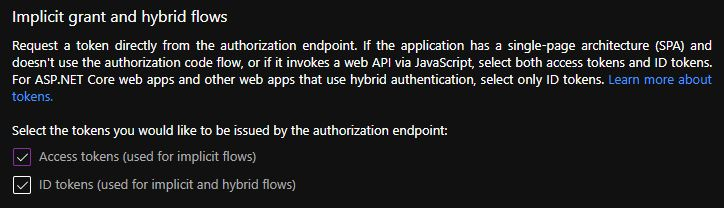
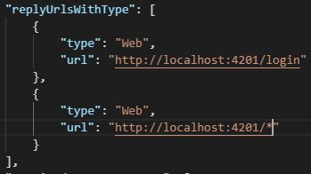

[home](../README.md) | [dashboard](dashboard.md) | [Azure AD Setup](azureADSetup.md)

# Azure Active Directory Setup

## Setting up the Azure Active Directory setup from the Azure Portal Dashboard 

First, go to "Azure Active Directory" and from the left side menu click on the "App Registrations" and click on the "New Registration" button on top of the page. 

1. Enter a name for your app registration.
2. Choose the "Accounts in any organizational directory (Any Azure AD directory - Multitenant)".
3. Now for the "Redirect URI" enter links that you are going to use from where you are going to login from. Such as "https://invictus-dev-we-sft-invictusdashboard.azurewebsites.net/login". This will ensure that from where you are loging is legit and no one can use your tenant id from another domain or so.
4. Click on Register button.

Now go to "Authentication" page from the left side menu and check the 2 check boxes which are "Access Tokens" and "ID Tokens" and click on Save button from the top.

Now go to the "Manifest" link from the left side menu and in the replyUrlsWithType node, insert the your url from which you are going to login plus * (wildcard), like the picture underneath.

Go to Certificates & secrets from the side menu and create a secret. Click on the New client secret button and copy the value. This must be pass when you do a release along with the tenant id and client id.

Now go to "API Permissions" from the left side menu and click on "Add a permission" button. Click on "Microsoft Graph" and click on "Delegated permissions" and search for Directory. Choose the Directory.Read.All and click on Add permissions button. Now click the "Grant admin consent for Codit" and it must turn as Granted the status of the new permission you added. 

Now go back to "Azure Active Directory" and from the left side menu click on the "Enterprise Application" and search for the one you just created and click on it. Now from the left hand side, click on "Owners" and Add yourself or whoever you want to be the owner of the application.

Now go to the "Permissions" page from the left side menu and click on the "Admin consent" "User consent" tab and click on the "Grant admin consent for Codit" button and continue with what it's telling you.

Once you are done from this, you are able to login from Invictus Dashboard. Obviously you need to provide the Tenant ID, Client ID and the client secret to the dashboard to connect your dashboard with the AAD.

