[Home](../README.md) | [Dashboard](dashboard.md) | [Azure AD Setup](azureADSetup.md)

# Azure Active Directory Setup

## Setting up Azure Active Directory from the Azure Portal Dashboard

To set up Azure Active Directory from the Azure Portal Dashboard, follow these steps:

1. Go to **Azure Active Directory** and select **App Registrations** from the left side menu. Click the **New Registration** button at the top of the page.

   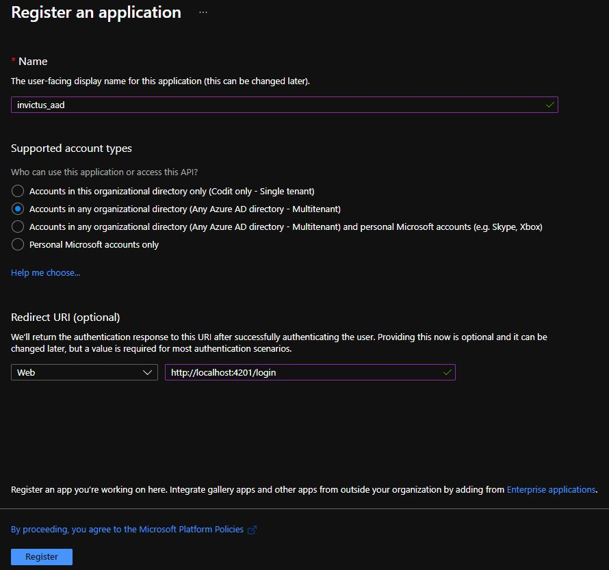

2. Provide a name for your app registration.
3. Choose **Accounts in any organizational directory (Any Azure AD directory - Multitenant)**.
4. The **Redirect URI** is the link to the front-end website of the dashboard (e.g., `https://invictus-dev-we-sft-invictusdashboard.azurewebsites.net/login`). This is required for the Single Sign-On process on the login page.
5. Click the **Register** button.

## Step 1: Grant Access Token Permissions

To grant Access Token Permissions, follow these steps:

1. Go to the **Authentication** page from the left side menu.
2. Check the checkbox for **Access Tokens**.
3. Click the **Save** button at the top.

   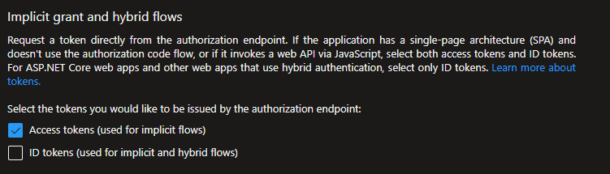

## Step 2: Certificates & Secrets

To manage Certificates & Secrets, follow these steps:

1. Go to **Certificates & Secrets** from the side menu.
2. Create a new secret by clicking the **New client secret** button, and copy the generated value. This secret must be provided during the release along with the tenant ID and client ID.

   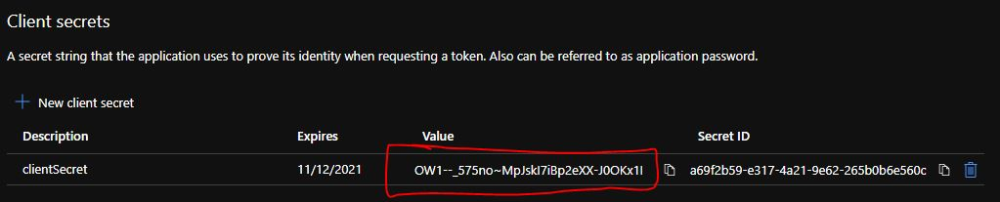

## Step 3: Expose an API

To expose an API, follow these steps:

1. Go to **Expose an API**.
2. Add the Application ID URI as `api://{client-id}` (also known as the application ID). You can find this in the **Overview** section.
3. Click **Add a scope**.

   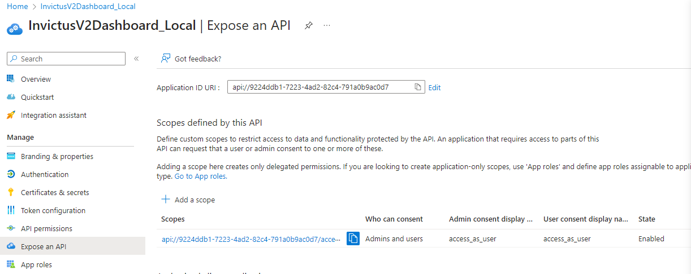

### Step 3.1: Add Scopes

Fill in the form with the information shown in the above image, using **access_as_user** for each of the textboxes. Once finished, click **Add scope**.

   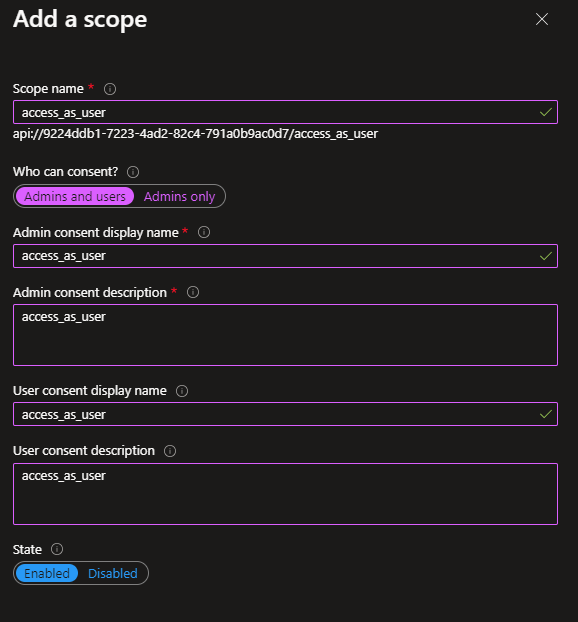

## Step 4: API Permissions

To manage API permissions, follow these steps:

1. Go to **API Permissions** from the left side menu.
2. Click the **Add a permission** button.
3. Select **Microsoft Graph** and choose **Delegated permissions**.
4. Search for **Directory** and choose **Directory.Read.All**.
5. Click **Add permissions**.
6. Click **Grant admin consent for Codit**. The status of the new permission should change to **Granted**.

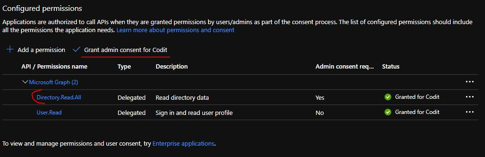

### Step 4: API Permissions - Group Management 

To Add Group Management APi Permissions follow these steps:

1. Go to **API Permissions** from the left side menu.
2. Click the **Add a permission** button.
3. For each of the permissions listed, insert the name in search box and the permission will be displayed. Click on the permission to add.
4. Click **Add permissions**.
5. Click **Grant admin consent for Codit**. The status of the new permission should change to **Granted**.

N.B - Some of the permissions requires Admin consent, this requires an admin privileged user to grant permissions.

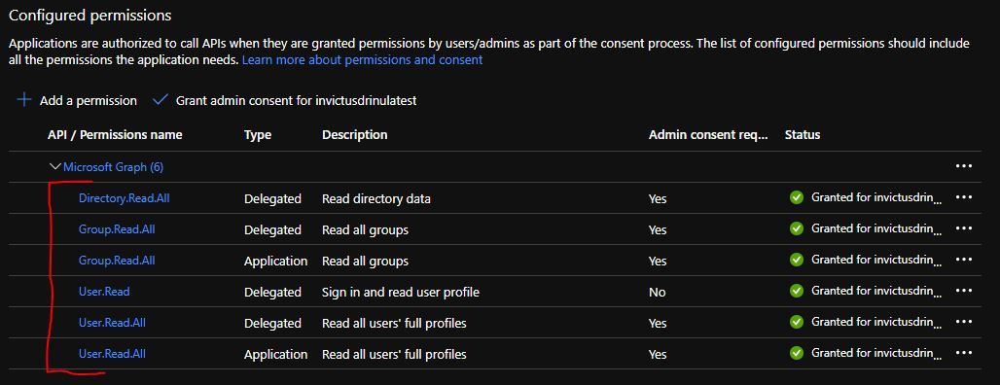

### API Permissions - Sending Mail Notifications for forgot password

1. Go to **API Permissions** from the left side menu.
2. Click the **Add a permission** button.
3. Select **Microsoft Graph** and choose **Application permissions**.
4. Search for **Mail** and choose **Mail.Send**.
5. Click **Add permissions**.
6. Click **Grant admin consent for Codit**. The status of the new permission should change to **Granted**.

N.B - This permission requires Admin consent, this requires an admin privileged user to grant permissions.

### API Permissions - Add Scope

Click **Add a permission** again.
1. Select **My APIs**.
2. Click on the app registration name you created.
3. Choose **access_as_user** from the permissions list.
4. Click **Add permissions**.

The image below shows the result of the above actions.

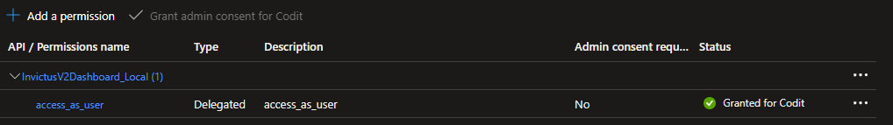

## Step 5: Enterprise Application Setup

To set up the enterprise application, follow these steps:

1. Go back to **Azure Active Directory** and select **Enterprise Application** from the left side menu.
2. Search for the application you just created and click on it.
3. Click on **Owners** from the left hand side.
4. Add yourself or the desired owner of the application.

   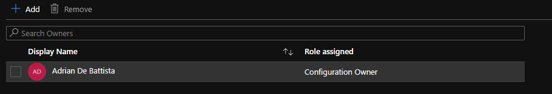

## Step 6: Enterprise Application Permissions

To manage enterprise application permissions, follow these steps:

1. Go to the **Permissions** page from the left side menu.
2. Click on the **Admin consent** or **User consent** tab.
3. Click the **Grant admin consent for Codit** button and follow the instructions.

   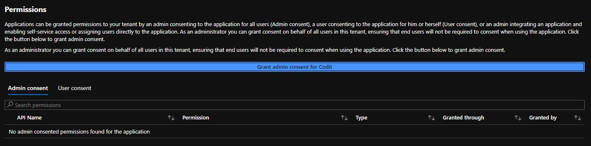

## Step 7: Configuration Information

Once you have completed the steps above, you will be able to log in from the Invictus Dashboard. Make sure to provide the Tenant ID, Client ID, and client secret to connect your dashboard with Azure Active Directory.

   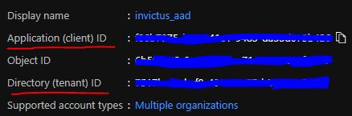