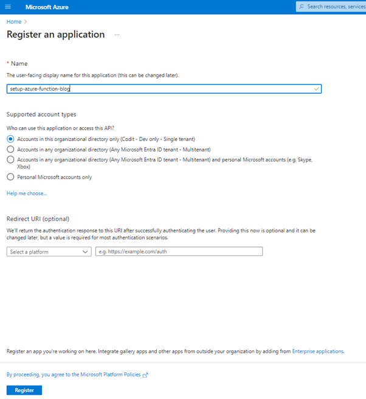
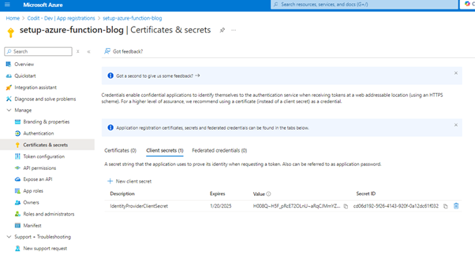

[Home](../README.md) | [Dashboard](dashboard.md) | [Container Authentication](containerAuthentication.md)

# Container App Authentication - App Registration Setup

## Purpose

This guide provides a quick setup for registering a Microsoft Entra ID application. It includes creating a client secret, setting up API permissions, and preparing variables for pipeline use. This will allow the container apps to authenticate the requests that are received.

### 1. **Create an App Registration**
1. In the [Azure portal](https://portal.azure.com), navigate to **Microsoft Entra ID** > **App registrations**.
2. Click on **New registration**.
3. Fill in:
   - **Name**: Enter a meaningful name for your app.
   - **Supported account types**: Choose **Accounts in this organizational directory only** (Single-tenant).
4. Click **Register** to create the app.



### 2. **Generate a Client Secret**
1. In your new App Registration, go to **Certificates & secrets**.
2. Under **Client secrets**, click **New client secret**.
3. Add a **Description** and set an **Expiration** period.
4. Click **Add**. 

> **Important**: Copy the **Client Secret Value** now, as you won't be able to see it again.

- **Save the following details somewhere safe**:
  - **Application (client) ID** (found on the Overview page)
  - **Client Secret Value**

These values will be used as environment variables in your pipeline.



### 3. **Set up API Permissions**
1. Go to the **Expose an API** tab.
2. Click **Add a scope**.
3. For **Scope name**, enter `user_impersonation`.
4. Set **Who can consent** to **Admins and Users**.
5. Provide a **Description** (e.g., "Allows the app to impersonate the user").
6. Click **Add scope** to save.


### 4. **Keep information saved for the next steps...**
Make sure to securely store the `Application ID` and `Client Secret` to apply to the parameters required in [dashboard release pipeline](../dashboard/installation/dashboard-releasepipeline.md)

---

# Communicating with an AAD App Registration to Obtain an Access Token

This section demonstrates how to use the `DefaultAzureCredential` class in C# to authenticate with an Azure Active Directory (AAD) app registration and retrieve an access token. The `api://<application-id>` format is used as the audience (scope).

---

### The following components will now require an access token with their requests:

#### Framework Components
- **Exception Handler**
- **PubSub V2**
- **Regex Translation**
- **Sequence Controller**
- **Time Sequencer**
- **Transco V2**
- **Xml to Json Converter**
- **XsdValidator**

#### Dashboard Components
- **HttpReceiver**

---

## C# Example: Obtain an Access Token

```csharp
using System;
using System.Threading.Tasks;
using Azure.Identity;
using Azure.Core;

namespace AADTokenExample
{
    class Program
    {
        static async Task Main(string[] args)
        {
            // Replace with your AAD App Registration's Application ID
            string applicationId = "<your-application-id>";
            string scope = $"api://{applicationId}/.default"; // Audience for the token

            try
            {
                // Use DefaultAzureCredential to authenticate
                var credential = new DefaultAzureCredential();

                // Request an access token
                var tokenRequestContext = new TokenRequestContext(new[] { scope });
                var accessToken = await credential.GetTokenAsync(tokenRequestContext);

                Console.WriteLine("Access Token: ");
                Console.WriteLine(accessToken.Token);
            }
            catch (Exception ex)
            {
                Console.WriteLine($"An error occurred: {ex.Message}");
            }
        }
    }
}


