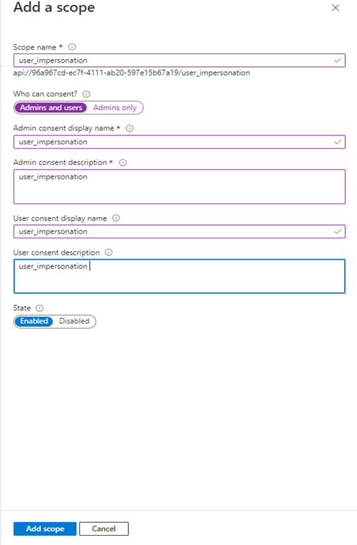

# Container App Authentication - App Registration Setup

## Motivation

The Invictus Framework and Dashboard run on Azure Container Apps, many of which require authentication with a Microsoft identity provider to be able to authenticate incoming requests. Therefore, an app registration is required to serve as the identity representation of the container apps within Azure Entra ID.

### App Registration Setup
- Follow the official [documentation](https://learn.microsoft.com/en-us/entra/identity-platform/quickstart-register-app?tabs=client-secret) to create an app registration.
> Supported account types may be set to `Accounts in this organizational directory only (Single-tenant)`
- Generate a client secret as explained [here](https://learn.microsoft.com/en-us/entra/identity-platform/quickstart-register-app?tabs=client-secret#tabpanel_1_client-secret), making sure to keep the value somewhere safe.
- Set up API Permissions:
   1. Go to the **Expose an API** tab.
   2. Click **Add a scope**.
   3. For **Scope name**, enter `user_impersonation`.
   4. Set **Who can consent** to **Admins and Users**.
   5. Provide a **Description** (e.g., "Allows the app to impersonate the user").
   6. Click **Add scope** to save.
      

- Make sure to securely store the `Application ID` and `Client Secret` as these values are required parameters in the [release pipeline](../dashboard/installation/dashboard-releasepipeline.md).
