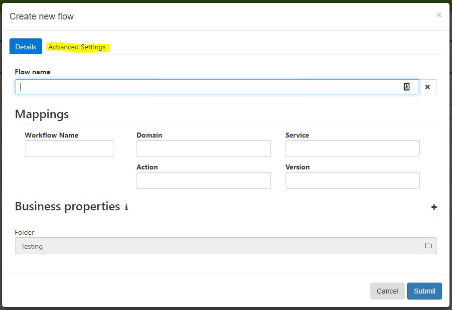

[home](../README.md) | [dashboard](dashboard.md) | [custom resume/resubmit](custom-resumeresubmit.md)

# Custom Resume And Resubmit

## How to use this feature

As you can see in this picture, when you create a new flow, now you can see that we have two tabs in this pop up.

1. Details: the details of the flow.
2. Advanced Settings: The custom resubmit and resume and the connected dashboard checkbox.

So, as you can see, we have the connected dashboard and the custom resume and resubmit.

When you tick the Custom Resubmit checkbox, the Custom Resubmit URL text box will become enabled and you can enter the correct URL. It needs to be with https, and you can press and the test button to check if you entered the correct URL.

To submit and save this flow, if you enter Custom Resubmit URL or Custom Resume URL, you need to have at least one http header. To do this, you need to press on the + icon and fill in the key and its value.

The keys need to be unique from the others so if you enter a duplicate key, it will validate and show you an error like this above. The value can be the same obviously.

This applies to the Custom Resume as well.

Once you are ready, you can submit and it’s done.
