[home](../README.md) | [dashboard](dashboard.md) | [custom resume/resubmit](custom-resumeresubmit.md)

# Custom Resume And Resubmit

## How to use this feature

From the Invictus dashboard, navigate to the sidebar, and create a new flow/edit a new flow as in the following images:

_Creating a new flow_

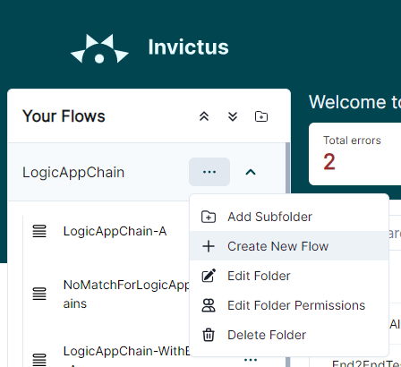

_Editing an existing flow_

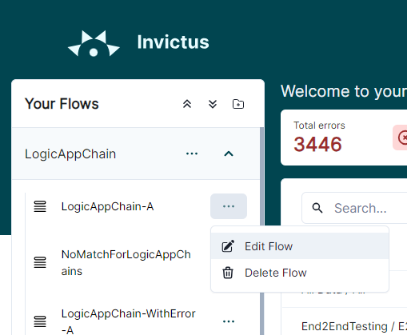

Clicking these buttons will redirect you to the create/edit flow page as per below:

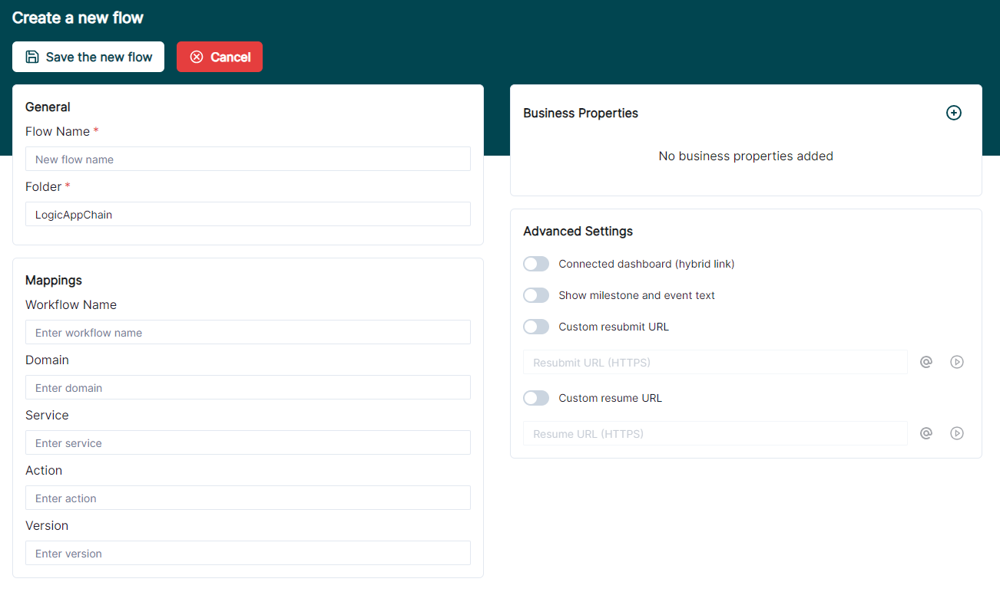

We will focus on the `Advanced Settings` part of the screen, located on the right side of the page. To enable custom resume and resubmit for a flow, simply click the radio buttons of `Custom resubmit URL` and `Custom resume URL` respectively:

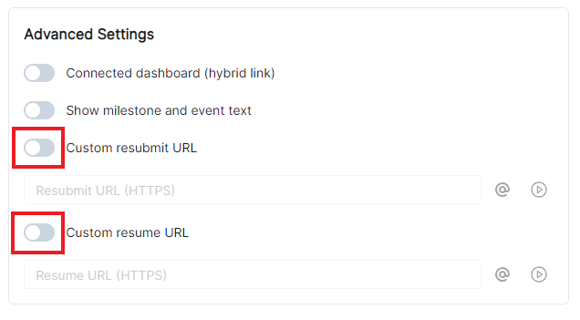

Once enabled, the `Resubmit URL (HTTPS)` and `Resume URL (HTTPS)` input fields become editable. Enter a URL in one of the fields to set a Resubmit/Resume URL. The  button can be clicked in order to test the entered URL:

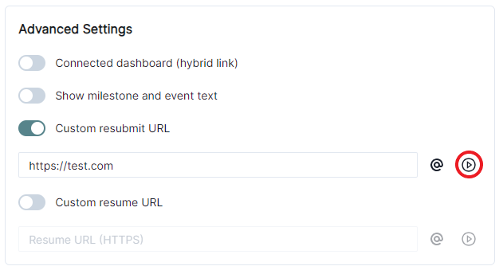

Clicking this button will test the URL to see if it is reachable. The URL needs to be an HTTPS URL. A message will be displayed on screen to indicate if the test failed or was successful.

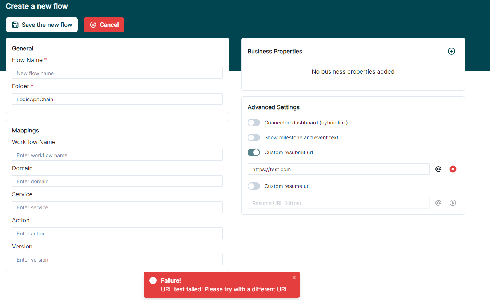

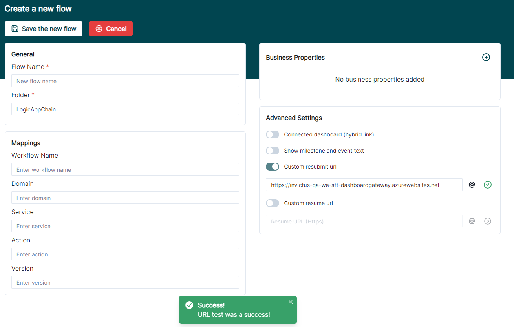

You may need to use custom HTTP Headers when making the custom resubmit/resume request. To edit the HTTP headers, click the  button to open the HTTP headers dialog box.

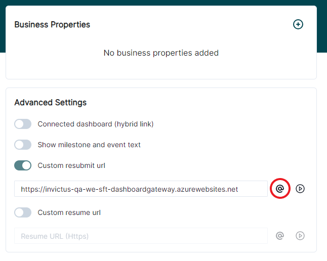

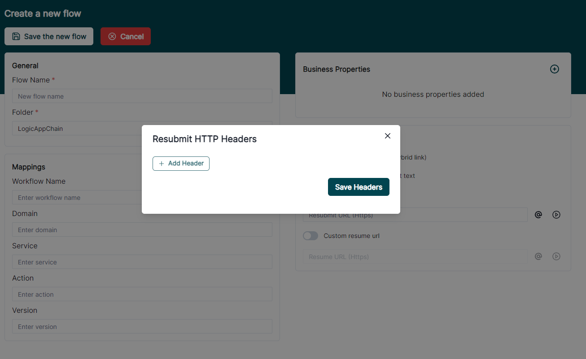

In this dialog, click the `Add Header` button to enter the HTTP headers. A header consists of a key and a value. Click the  button to delete a header. Click the `Save Headers` button to save the headers. Duplicate keys will automatically be removed when this button is clicked.

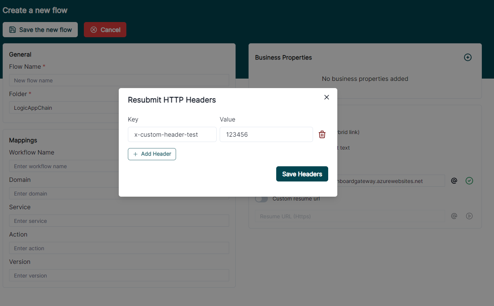

Here is an example of what is being sent when clicking the  button. Let's use the custom resubmit URL and Resubmit HTTP Headers as above. Clicking this button simply will send a `POST` request with no body to the URL, alongside the custom headers as specified.

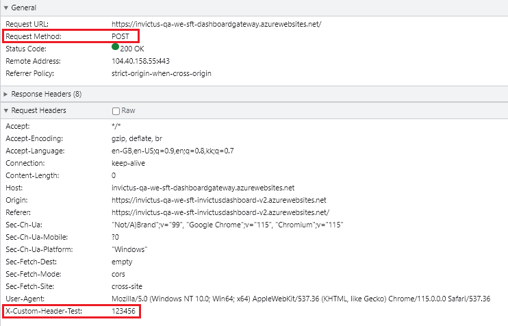

All this applies to the Custom Resume as well.

Once comfortable with the changes, do not forget to fill in the necessary inputs in the page and Save the flow.

## Resubmitting/Resuming a flow

Once a flow has been created, simply click a flow from the sidebar.

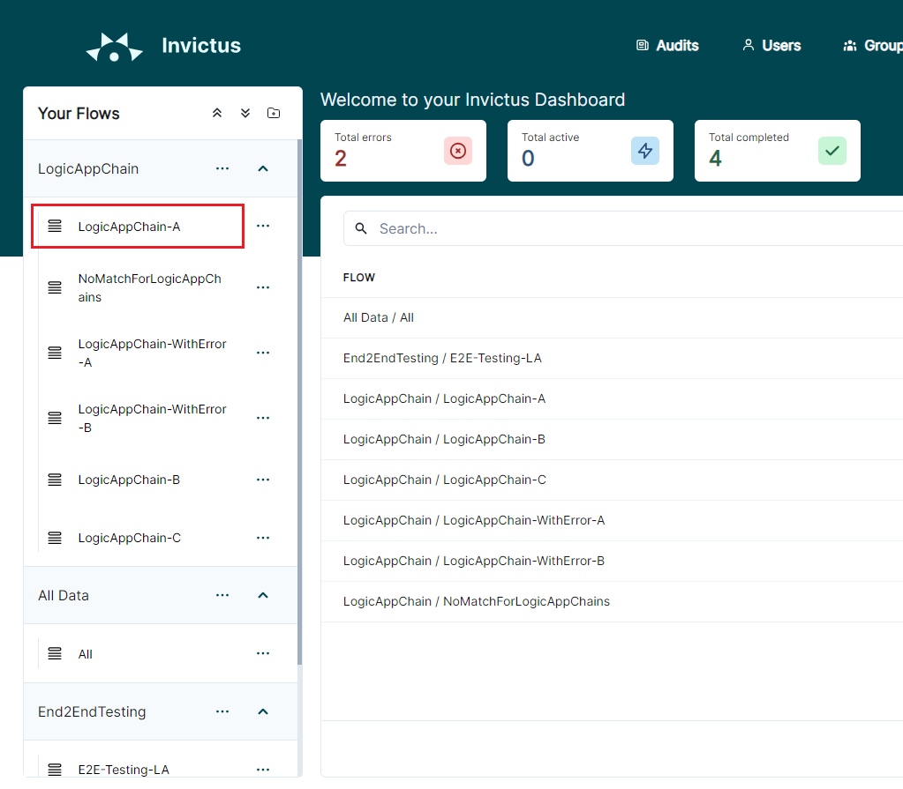

In order to resubmit/resume a flow, some flow data must be present. You may need to change some filters from the Advanced search menu and click the Search button in order to show some flow data:

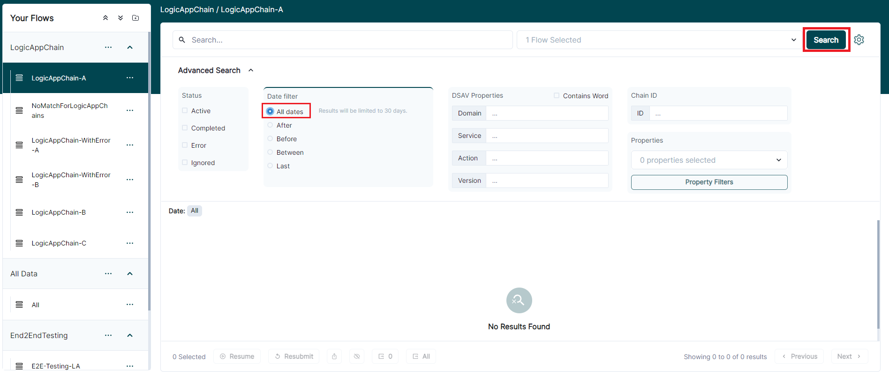

If some data is visible, click the Flow Actions button on a flow run, and click Resubmit:

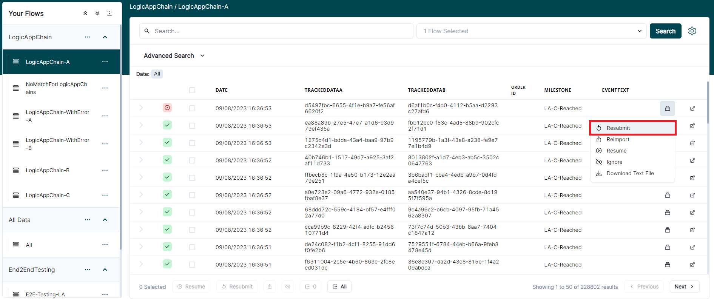

Confirm the resubmit by clicking the Resubmit button in the dialog that appears:

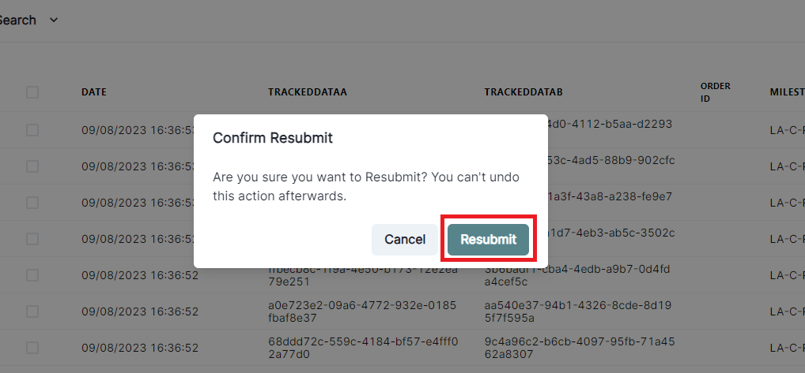

A `POST` request will be sent to the configured custom resubmit URL, with a body containing information about the flow run. Below is an example of the body:

```json
[
  {
    "id": "64d206051178624d80f70775",
    "workflowEventId": "1f8be9e8-dc61-41c5-9146-13ce087cbc08",
    "partitionKey": "02c1eacb-60a9-4fa9-937f-971b10f567d4",
    "workFlowRunId": "08585101213801371750243005842CU150",
    "dateInserted": "2023-08-07T09:08:21.028Z",
    "parentWorkFlowRunId": "",
    "chainId": "439f11e1-739e-461e-b785-f7adad7ff876",
    "executionTime": "2023-08-08T09:05:05.372Z",
    "appName": null,
    "workflowName": "someworkflow",
    "statusId": 2,
    "subscriptionId": "07459384-7900-43c9-b940-8f90d6ab3c7c",
    "resourceGroupName": "someresourcegroup",
    "triggerName": "manual",
    "userStatus": 1,
    "workFlowActionCount": 10,
    "errorInfo": "",
    "properties": {
      "x_iv_enqueued_time": "08/07/2023 09:07:06 +00:00",
      "x_iv_importjob_pickuptime": "08/07/2023 09:07:06",
      "Domain": "SomeDomain",
      "Service": "SomeService",
      "Action": "SomeAction",
      "Version": "1.0"
    },
    "source": "1",
    "eventText": "Some Event Text",
    "messageContentView": null,
    "actionName": null
  }
]
```
