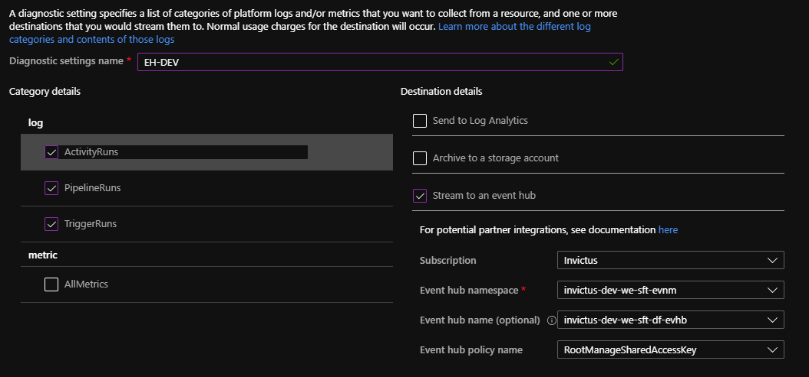

# DataFactory Receiver

To enable diagnostics and automatically stream all events from your DataFactory pipelines to event hub follow the steps below.

It is important to also target the EventHubNamespace and EventHubName created by the Invictus Resources ARM Template for datafactory, since the Import Job is set to listen on the mentioned Namespace and Hub. By default the eventhub name will contain "df-evhb" in it's name.

To start receiving data from DataFactory:

- Find the DataFactory in the resource group
- Click on the Diagnostic settings tab
- Click on the "+ Add diagnostic setting"
- Set the following Settings
  - Set the name for the Diagnostic Setting
  - Enable TriggerRuns, ActivityRuns and PipelineRuns
  - DO NOT enable AllMetrics
  - Enable Stream to an eventhub
  - Select the eventhub created by the Invictus deployment choose the one with "df-evhb" in it's name
  - Click Save

