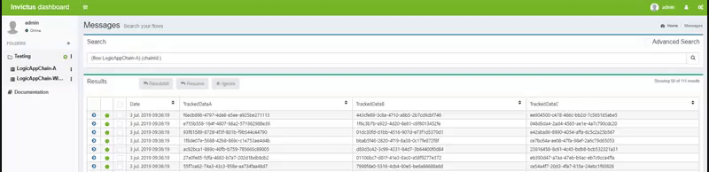
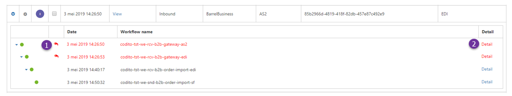
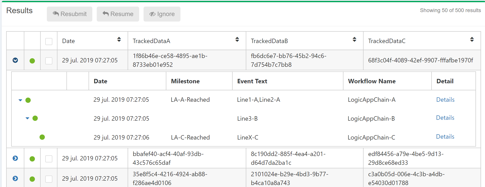
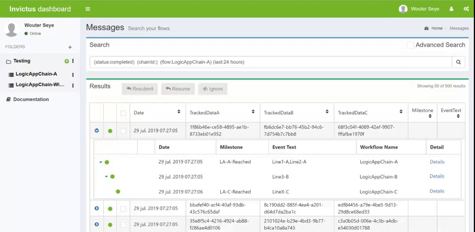
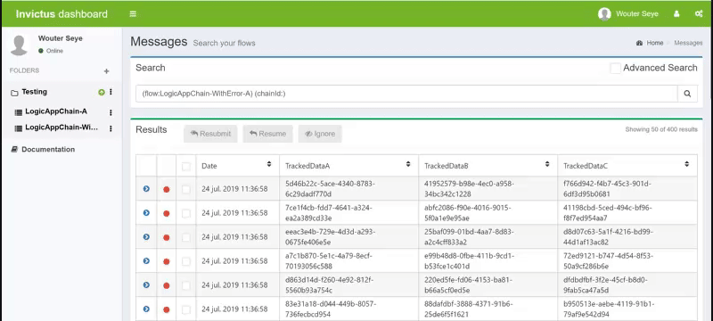
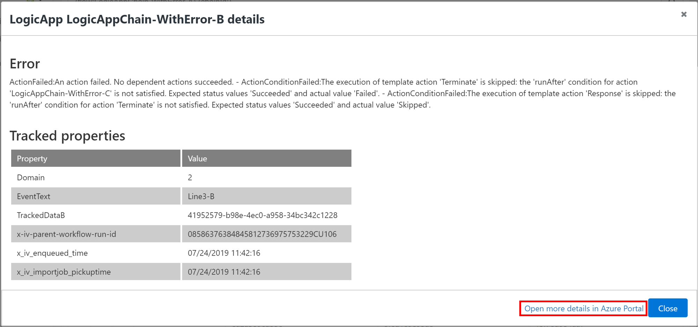

[home](../README.md) | [dashboard](dashboard.md)

# Dashboard Execution Tree

The Execution Tree or also commonly referred to as the "Clickthrough" corresponds to the detail of the execution followed by certain flow, which corresponds to all the executed Logic Apps inside the flow. 

To see the execution tree, choose any message and click on the blue icon to the left.

Within this view it is also possible:

* To see if a certain logic app execution was either successful, failed or was resumed/resubmitted (1).
* To see the tracked properties, errors on on logic app level and to navigate to the Azure portal (2). See Business audit trail for more details.

In this example, the first two logic apps (in red) were resubmitted and ended in error.  Opossite to the last two child logic apps (in black) which completed succesfully.

## Business Audit Trail

For every logic app executed inside a flow, it is possible to see its business tracked properties.  The following information is available for business users to easily track flow execution and data on the execution tree level.

### Milestone and Event Text

Milestone and EventText are properties set and displayed by default, they do not need to be set from the dashboard during the creation of a flow. For EventText if the value re-appears in several logic apps, instead of overwriting/updating its value, all data is appended as a single value, separated by comma.

### Tracked Properties

To see the tracked properties on execution tree level, click on the "Details" link. A popup opens showing all the tracked properties available on every logic app inside the flow.

> Please note that search capabilities do not apply to this feature.

### Errors on Logic App level

In the same popup that now displays the tracked properties on execution tree level,  it is possible to see the error description when an exception has ocurred on logic app level.

And for additional details and follow up on technical errors,  the link to navigate to Azure Portal can be used.

