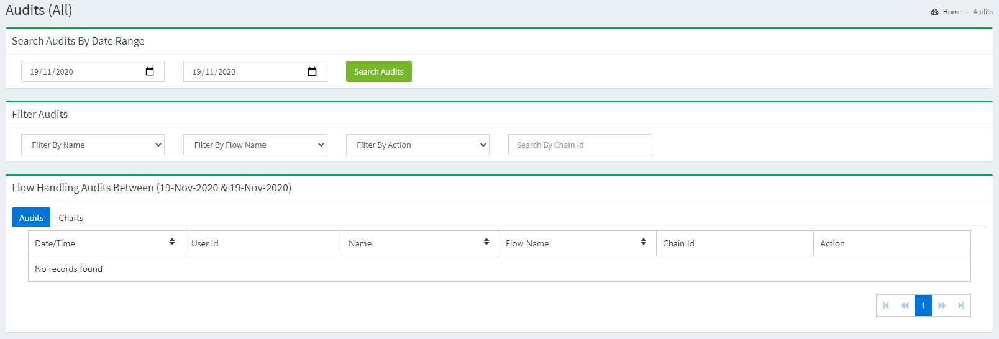
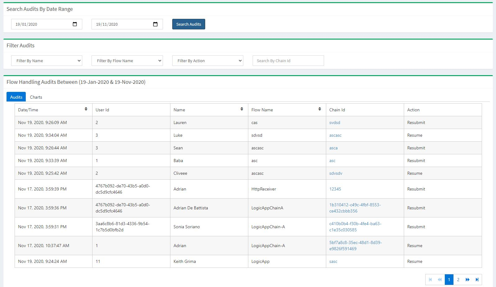
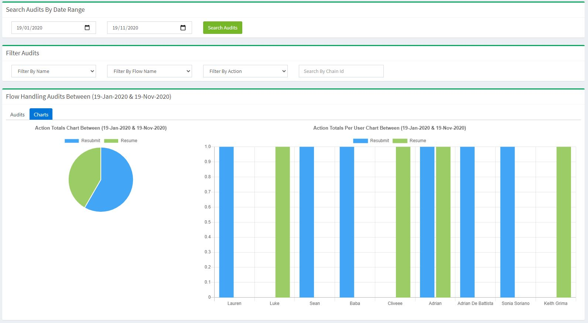
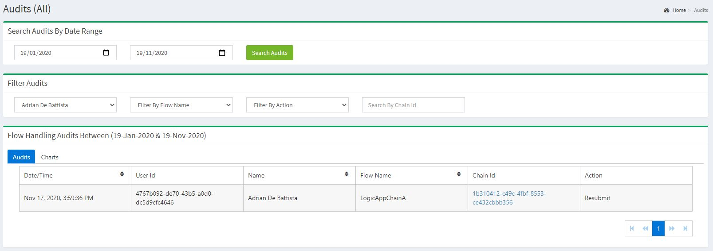
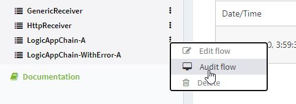

[home](../README.md) | [dashboard](dashboard.md) | [Flow Auditing](flowauditing.md)

# Flow Auditing

This is a step by step on how to use the Flow Auditing.

## How to see flow audits

First of all you need to be a system admin or a folder admin to see the audits. A system admin can see all the audits for every flow that exist. A folder admin can only see the audits for the flows he has permission to see.

If you are a system admin then you can see that now, on the top right of the header, you can see a small monitor icon. Click on that.

You will see this screen. This is the new Flow Audit page.

From here, you can search by date range. 

As soon as you search by dates, if there is any audits that are found within those dates you provided, you will see the data listed in the grid.

Now if you click on the Charts tab, you can see at first glance the totals of the actions. The pie chart shows the total amount of Resume and Resubmit within the date range you provided. The bar chart is the totals of Resume and Resubmit per user within the date range you provided.

You can filter by the username, flow name, action and chain id. As you can see, I searched by "Adrian De Battista" from the username drop down list. It will show you the actions the user did. The other filters are just the same. Pretty much straight forward.

Now, if you would like to see the audits of a specific flow only, you can click on the 3 little dots next to the flow you want to see it's audits and press the Audit Flow.

You can filter by the username, flow name, action and chain id. As you can see, I searched by "Adrian De Battista" from the username drop down list. It will show you the actions the user did. The other filters are just the same. Pretty much straight forward.