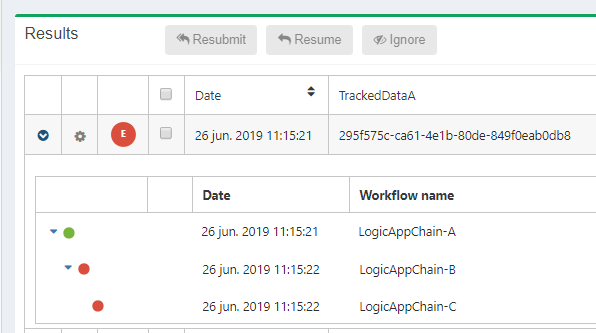
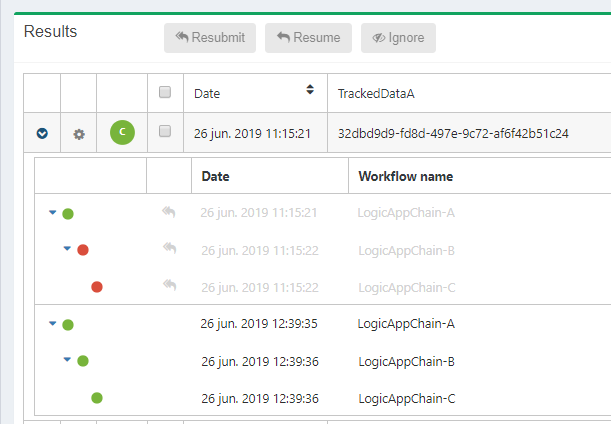
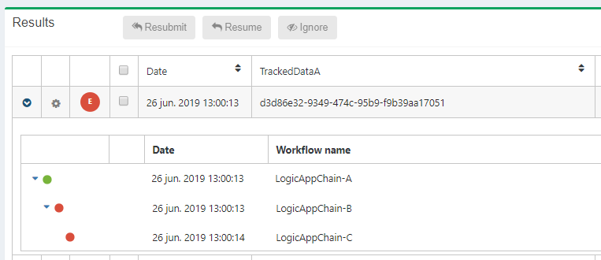
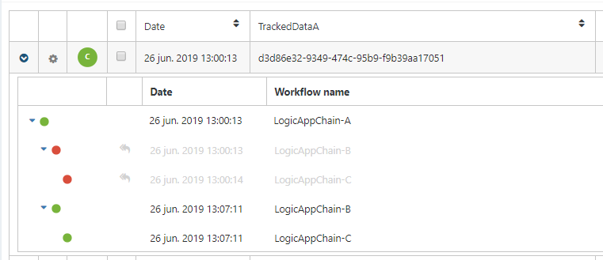

[home](../README.md) | [dashboard](dashboard.md)

# Flow Handler

The FlowHandlerJob's main purpose it to listen on Servicebus for any Resubmit/Resume/Ignore requests. The request can be triggered through the dashboard, either for a single message or in bulk.

Please note that after installing the packages that include the FlowHandlerJob or if you are installing for the first time, it is required to add the FlowHandlerJob as a Logic Apps Contributor to the subscription/resource group where the Logic Apps are located. The reason for this step is because the FlowHandlerJob uses MSI authentication which needs access rights to the LogicApps it Resubmits.

## Resubmit

The Resubmit functionality will always trigger an "Azure Resubmit" for the first LogicApp in the Chain.

If we had to take the above image as an example. If Resubmit is executed for this flow, "LogicAppChain-A" is Resubmitted on Azure. The below image is the outcome after "LogicAppChain-A" is re-executed through the resubmit.

## Resume

The Resume function executes an "Azure Resubmit" for each failed function in the chain. **The only exception is that if a Parent Logic App of a failed Logic App has also failed, then only the Parent is executed**.

To give an example, Resume was triggered on the above flow, notice in the image below that only B and C have been retried. Also, since C is the product of B, the Azure Resubmit was only triggered on B.

The below image is a more in-depth example of how the Resume functionality behaves with more than one scenario. Assume that each box is a LogicApp.

