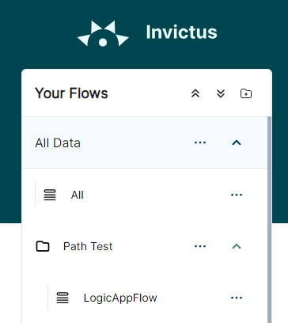

# Flow Path Redirect

When developing Invictus V2, the flow data page was written to accept the flow id and parent folder id in the URL. Example

`https://invictus-qa-we-sft-invictusdashboard-v2.azurewebsites.net/flow/f298c72d-5207-4627-93b7-40d8f01d865e?parentid=ff8f6fc1-b47a-4165-9ac6-6487d2bcb29c&advanced=%7B%22dateString%22%3A%22last%3A+24+hours%22%2C%22propertyFilters%22%3A%5B%5D%7D`

In cases where you are building a URL to the flow data page but do not have access to the required ID's, Invictus V2 includes functionality to convert the flows path into the correct URL via the `/flowpath/` route.

For example, if you need a URL to access the flow `LogicAppFlow`, the path to the flow `All Data/Path Test/LogicAppFlow` can be passed to the `/flowpath/` route. This URL becomes:

`https://invictus-qa-we-sft-invictusdashboard-v2.azurewebsites.net/flowpath/All%20Data/Path%20Test/LogicAppFlow`

Upon accessing this URL, you will be quickly redirected to the proper flow page. 

Advanced search query info can also be passed to the `/flowpath/` route.

Example: 

`https://invictus-qa-we-sft-invictusdashboard-v2.azurewebsites.net/flowpath/All%20Data/Path%20Test/LogicAppFlow?advanced=%7B%22dateString%22%3A%22last%3A+24+days%22%2C%22propertyFilters%22%3A%5B%5D%2C%22isHandled%22%3Afalse%2C%22statuses%22%3A%5B%22Error%22%5D%7D`

This will redirect to the flow page with all the required advanced queries applied.
