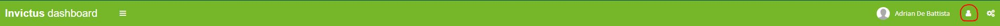
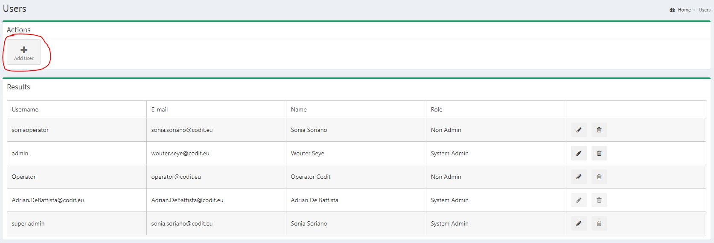
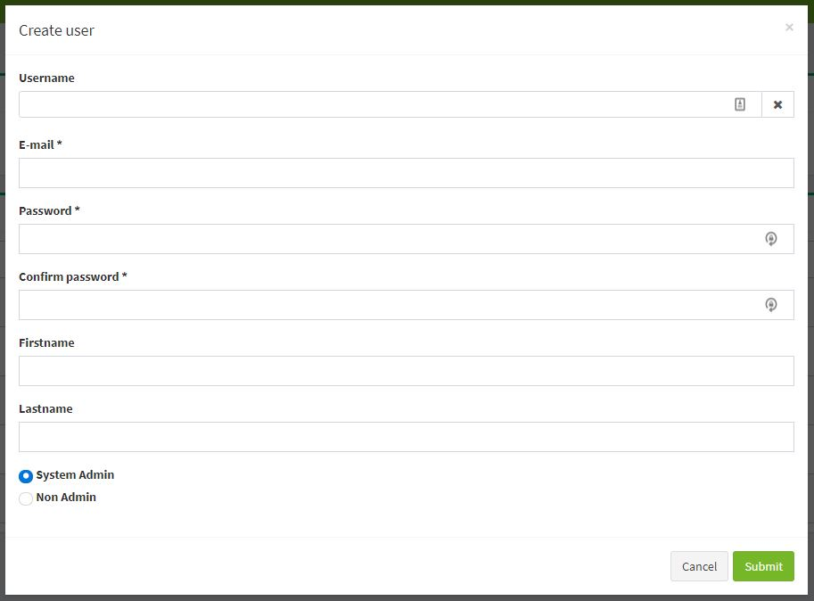
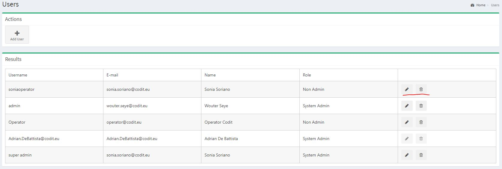
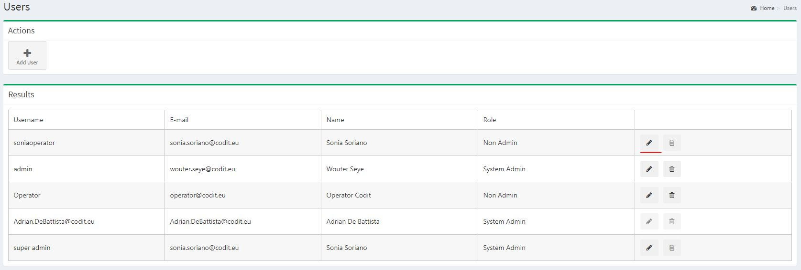

[home](../README.md) | [dashboard](dashboard.md)

# Dashboard Folder Permission Management

## Assign users to folder

**Note that user(s) should be created before assigning a folder.**

Click on the 3 dots next to the folder name.

Several option will pop-up. Choose 'Manage users'.

Click on the "Add Users" button.

Choose the user from the first drop down menu. And choose the role you want the user to have for that specific folder. You can see that you have 3 options. Folder Admin, Operator, Reader. The difference between these three are.

Folder Admin can assign users to specific folder, remove users from specific folder, create flows in specific folder, delete flows in specific folder, see messages from flows in specific folder, see flows from specific folder, resume/resubmit/ignore messages from specific folders, see flow statistics, edit flow in specific folder.

Operator can see messages from flows in specific folder, see flows from specific folder, resume/resubmit/ignore messages from specific folders, see flow statistics.

Reader can see messages from flows in specific folder, see flows from specific folder, see flow statistics.

## Delete users from a folder

Click on the delete icon button next to the user you want to delete.

