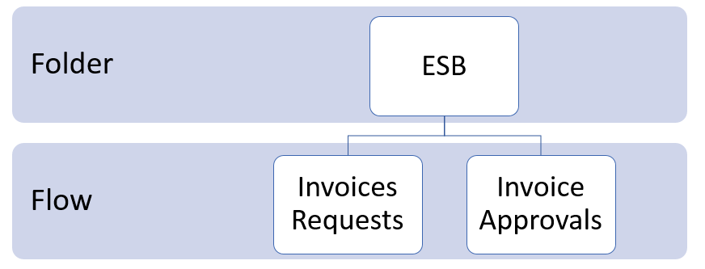
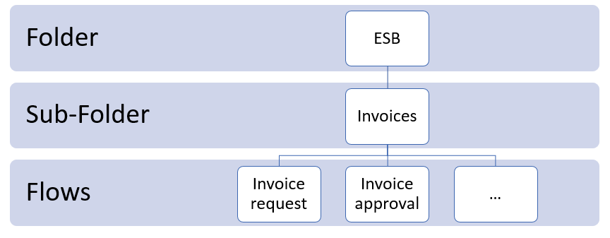

[home](../README.md) | [dashboard](dashboard.md)

# Dashboard Folders and Flows

## Structure

The functional structure of the dashboard is like a directory structure containing folders & flows

### Folder

A folder is a collection/hierarchy of flows. Each folder can exist of unlimited flows.

### Subfolder

Inside each folder, the user can create multiple subfolders which can exist of unlimited flows. **Each subfolder must have the folder as a parent, you cannot create a subfolder of a subfolder!**

### Flows

Flows (= message chain) are an aggregation of all the messages that can be linked to the same incoming message. Flows are the functional representation of the message with an optional context property name and / or optional context property value. Flows have a number of predefined properties where you are interested in that are shown in the results grid.

### Tree Structure

The following structures are possible:

Folder - Flow:

> 

Folder - Subfolder - Flow:

> 

## Folder Management

## Flow Management