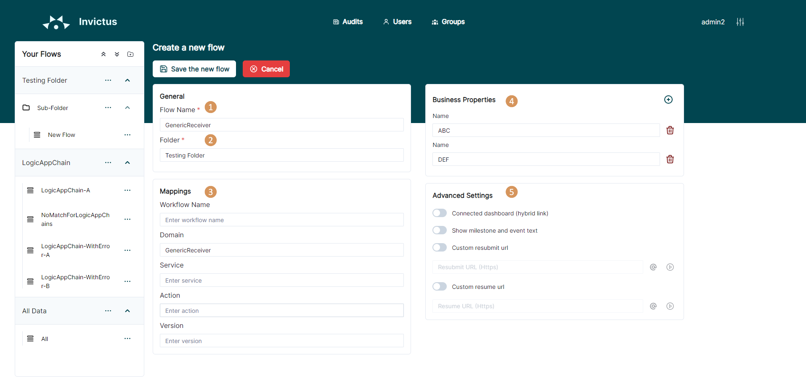

[home](../README.md) | [dashboard](dashboard.md)

# Dashboard Folders and Flows

## Structure

The functional structure of the dashboard is like a directory structure containing folders & flows

### Folder

A folder is a collection/hierarchy of flows. Each folder can contain an unlimited number of flows.

### Subfolder

Inside each folder, the user can create multiple subfolders which can can contain an unlimited number of flows. A subfolder may also host other subfolders to further subdivide your directory structure.

### Flows

Flows (= message chain) are an aggregation of all the messages that can be linked to the same incoming message. Flows are the functional representation of the message with an optional context property name and / or optional context property value. Flows have a number of predefined properties which you are interested in that are shown in the results grid.

### Tree Structure

The following structures are possible:

Folder - Flow:

> 

Folder - Subfolder - Flow:

> 

## Folder Management

Folder names or subfolder names should be minimum 3 characters!

### Create Folder

When creating a new folder the user will have to specify the following information:

* Folder name

When creating a subfolder the user will have to specify the following information

* Folder name
* Parent folder (refers to the directory above another directory)

### Update Folder

Depending on their rights, a user can edit the following information:

* Folder name
* Subfolder name
* Subfolder parent folder

### Delete Folder

Depending on their rights, a user can delete the following:

* Folders
* Subfolders

## Flow Management

### Create Flow

When creating a new flow the user will have to specify the following information:

* **Flow name**: case insensitive name of the flow (example: ex. invoice request, invoice approval, …)
* **Mapping**: define how a flow, and the messages it contains, are stored and indexed, using the following properties:
  * Workflow Name - The workflow name of the flow.
  * Domain - The domain of the flow.
  * Service - The service of the flow.
  * Action - The action of the flow.
  * Version - The version of the flow.
* **Business properties**: each mapping type contains a list of fields or properties pertinent to that type.
* **Settings**
  * Connected Dashboard: if the flow has multiple dashboards and it needs to connect to another dashboard then this needs to be checked.  For this setting to apply, the Connected Dashboard needs to be enabled by your Admin through the settings page of the dashboard in order to switch on this feature.
  * Show milestone and event text: Checking this option will enable the flow milestone and event text data to be displayed.
  * Custom resubmit/resume URLs: Check these options and provide the necessary URLs to use your own resume and resubmit logic.
* **Folder**: attach a flow to a specific folder

> 

### Update Flow

Depending on their rights, a user can edit the following information:

* Flow name
* Flow settings: mappings, properties, folder, connected dashboard, show milestone and event text, custom resume and resubmit URLs

### Delete Flow

Depending on their rights, a user can delete the following:

* Folders
* Subfolders
* Flows

### Moving a Flow to another Folder

A flow may be moved to another folder by entering the edit flow page and selecting the desired folder from the dropdown. Then save your changes.
