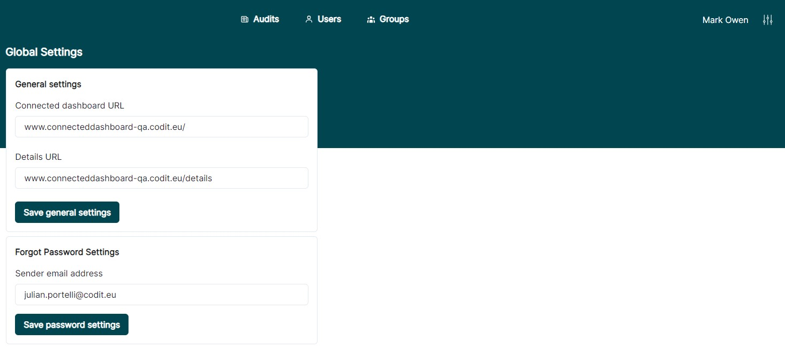
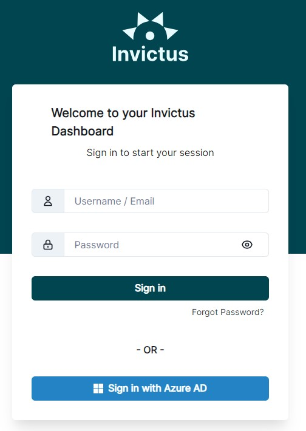
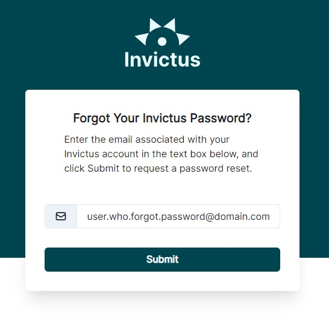
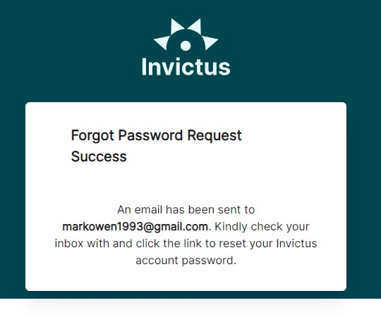
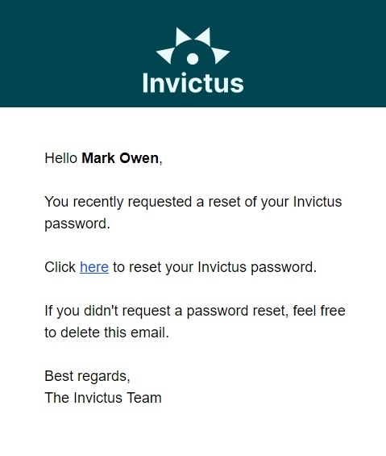
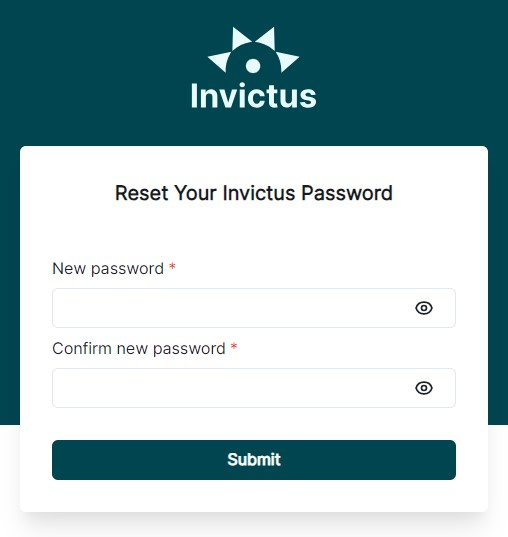

[Home](../README.md) | [Dashboard](dashboard.md) | [Forgot Password](forgotpassword.md)

# Forgot Password

Before you can use the forgot password feature, you need to create an Azure Active Directory application registration and set it up with the Mail.Send API permissions. This is required because emails can only be sent through an OAuth 2.0 flow. Previously, emails were sent using an SMTP client with a username, password, and SMTP connection. However, Microsoft and Google no longer allow this and are deprecating this service.

Please note that the permission granted allows any email address within the organization to be used as the sender.

To set up the Azure Active Directory application registration with the Mail.Send API permission, please follow the instructions [here](azureADSetup.md).

## Setup Email Address as the Sender

To set up the email address as the sender, follow these steps:

1. Log in with an administrator account or any user with the role of System Admin.
2. Navigate to the settings page by clicking the controls located at the top right next to the account name.
3. In the **Forgot Password Settings** section, enter the email address you want to use.
4. Click on **Save password settings** to save the email address being used.

## Forgot Your Password

To reset your password, follow these steps:

1. Click on **Forgot Password?** to initiate the password reset process.
2. The form will be displayed, and you need to enter the email address associated with your account.

3. After submitting the form, a confirmation message will be displayed, indicating that the reset password request has been sent to the provided email address.

4. Access your email inbox and look for the email containing the reset password instructions. The email will have a template like the one shown below.

5. In the email content, click on the **here** hyperlink. You will be redirected to the reset password form, where you can enter your new password.

6. Once you have successfully entered your new password, you can proceed to log in with the newly registered password.