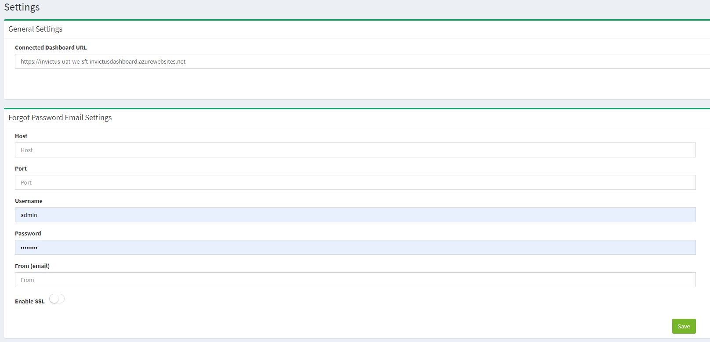
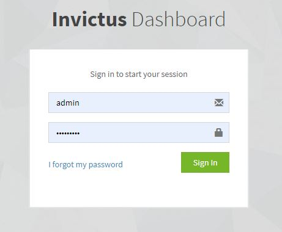
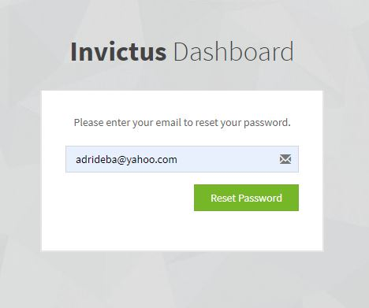
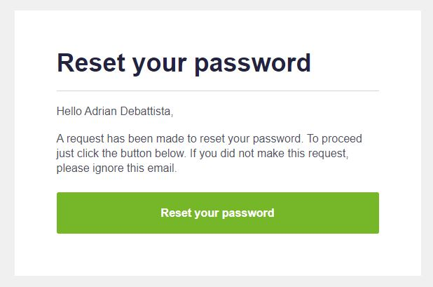
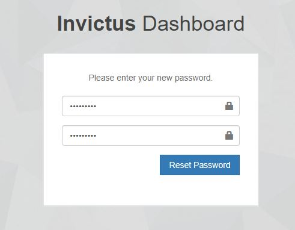

[home](../README.md) | [dashboard](dashboard.md) | [ForgotPassword](forgotpassword.md)

# Forgot Password

**Before you can use the forgot password, you need to create an email address with an open permission to apps. Like for example gmail, you can set it on for any app to use the account you are creating for the forgot password. This will give Invictus Dashboard access to use the email as a "sender" email.**

**When you create your email address you need to set it up in the dashboard.**

## Setting up the email details

First you need a system admin account to login in the dashboard and from the settings page you can find a new form with the details you need to fill in.

In here, you need to enter the host for example "smpt.gmail.com" if it's for a gmail email account. The port number, which by default is 587. The username and password for the email account to get access. The from is from which email you want to send it. If you want you can use "Invictus Dashboard <invictusdashboard@gmail.com>". The last thing is if it's ssl enabled or not. It's better to use enable ssl as the major email providers need this as to be checked. You can proceed by clicking the save button and you are done.

## Forgot your password

If for some reason you forgot your password for Invictus Dashboard, you can click on the Forgot Password link in the login dialog.

You will be taken to the forgot password page. Enter your email address that you registered with.

An email will be sent to you. The email is sent to the email that you registered with. Click on the button - Reset Password from the email.

A new page is opened where you can enter your new password. Enter your password and confirm password and you will be taken to the login page after few seconds.

You can login normally now.