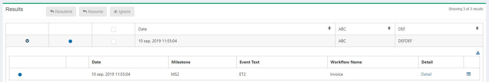
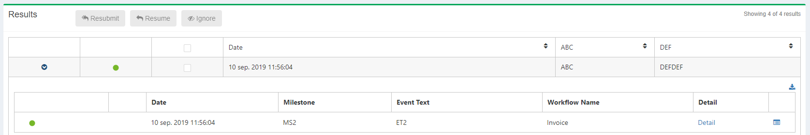
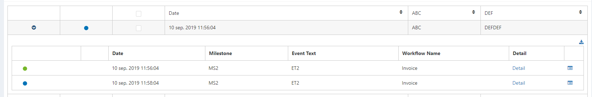

# Generic Receiver
 
The purpose of the Generic Receiver is to allow developers to add entries to the dashboard manually. The first version of IfA was specifically designed for LogicApps, which post Diagnostic Logs to EventHub, which are then processed by the ImportJob and inserted into the Database. This receiver will use the same technology but will be listening on a different eventhub.

## Json Schema

```
[{  
   "Id":"3e8e3fa4-b85a-4ee6-aaea-e0fd82008f8c",
   "Time":"2019-07-23 08:55:04.0500000 +00:00",
   "ChainId":"edbd5ddb-b206-4437-8ac3-5401b148c8cb",
   "Source":"Data Factory/Functions/Whatever",
   "ParentId":"",
   "Step":{  
      "Id":"8ecd1ea4-de94-4741-9c4a-a18477398299",
      "Name":"Invoice",
      "Status":"Started/Active/Cancelled/Completed/Failed"
   },
   "Mappings":{  
      "Domain":"D1",
      "Service":"S1",
      "Action":"A1",
      "Version":"V1"
   },
   "Properties":{  
      "Milestone":"MS",
      "EventText":"ET",
      "Data": {
            "Key1": "ABC",
            "Key2": "DEF"            
        }
   },
   "Azure":{  
      "ResourceId":"/subscriptions/308a4c53-eca0-42a4-b05f-c43bd25270e9/resourceGroups/invictus-dev-sft-invictusframework/providers/Microsoft.KeyVault/vaults/invictus-dev-we-sft-vlt",
      "PortalLink":"UniquelinktoseedetailsinAzure"
   },
   "Error":{  
      "Code":"CustomErrorCode",
      "Message":"CustomErrorMessage!"
   }
}]
```
## Inserting a Record 

Using the above JSON schema, create a message and fill in the required details. A message with the StepStatus "Started" is required for the row to be created in the Database. The reason behind this is that ideally, we always use the Time of the STARTED event when merging. Also, a message with the StepStatus "Completed" or "Failed" is required to set the final status of the merged event, without this, the message in the Flow will be stuck in an Active state. When merging, all messages will be grouped by the ChainId and ordered by EventTime ascending. 

Using the above JSON schema, send a request with the Status started. This is required since this event will be used to retrieve the start time.



To Complete the event send a request with either Completed or Failed Status



As you can see the above examples have only 1 entry in the execution tree, to insert multiple entries for the same event simply change the StepId.



Name | Description | Type | Default Values | IsRequired
-- | -- | -- | -- | --
Id | The unique ID assigned to an event, this should be UNIQUE per event. We suggest passing GUIDs as values. | String |   | True
ChainId | An ID used to link events togheter. We suggest passing GUIDS as values. Events with the same ChainId will be merged into a single row | String |   | True
Time | The time when the event was executing. We suggest passing the UTC time as a value | DateTime |   | True
Step | Step object which contains details for current step | Object |   | True
Step:Id | Used to group events belonging to the same step together. We suggest passing GUIDs as values. | String |   | True
Step:Name | The friendly name assigned to a Step | String |   | True
Step:Status | Used to specify what type of flow it is. | String | Started/Active/Completed/Failed/Cancelled | True
Step:ParentId | Used to link steps together in a Parent/Child format | String |   | False
Mappings | Mapping Object which contains the DSAV properties | Object |   | False
Mappings:Domain | Property used to map with Flows | String |   | False
Mappings:Service | Property used to map with Flows | String |   | False
Mappings:Action | Property used to map with Flows | String |   | False
Mappings:Version | Property used to map with Flows | String |   | False
Properties | Properties Object which will contain the custom properties set by the developers | Object |   | False
Properties:EventText | The EventText property | String |   | False
Properties:Milestone | The Milestone property | String |   | False
Properties:Data | Values passed in this Array as KeyValuePairs will be mapped to Business Properties in the Dashboard | Dictionary |   | False
Source | Used to identify the source of the event | String |   | True
Azure | The Azure object which will hold Azure related data | Object |   | False
Azure:ResouceId | The Subscription and Resource Ids for an event | String |   | False
Azure:PortalLink | A link to the azure resource | String |   | False
Error | Error object which will contain the code and message of the error being reported | Object |   | False
Error:Code | The code value within the Error Object | String |   | False
Error:Message | The message value within the Error Object | String |   | False

## Current backend architecture


