[home](../README.md) | [dashboard](dashboard.md) | [Group Management](groupmanagement.md)

# Group Permission Management

To setup permissions for Azure Active Directory groups on Invictus, there are three steps to follow:
- Step 1: Setup App Registration on Microsoft Azure
- Step 2: Add Secret Key to Invictus Configuration
- Step 3: Sync Groups on Invictus
- Step 4: Assign Groups to Folders

## Step 1: Setup App Registration on Microsoft Azure

Create a new App Registration:

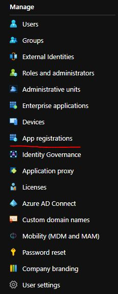

Register a new Application:

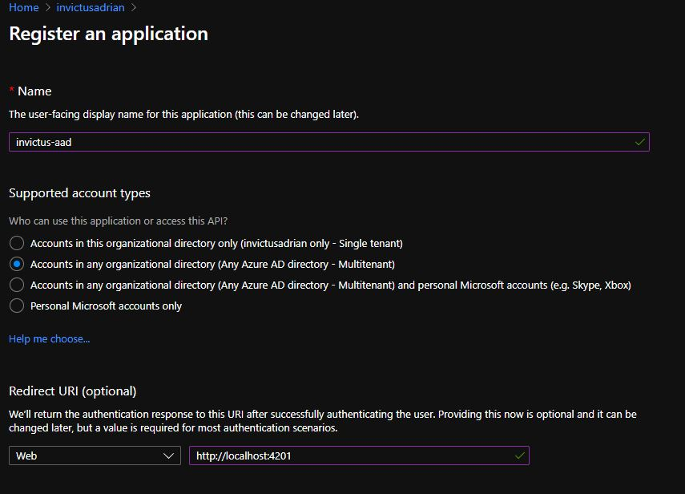

Once registered, go to Authentication from the side menu and add these two new links and tick the checkboxes:- Access Tokens and ID Tokens and press save.

-	{url-to-app}/login?returnUrl=%2Fdashboard%2Fsettings
-	{url-to-app}/login?returnUrl=%2Fdashboard%2Foverview

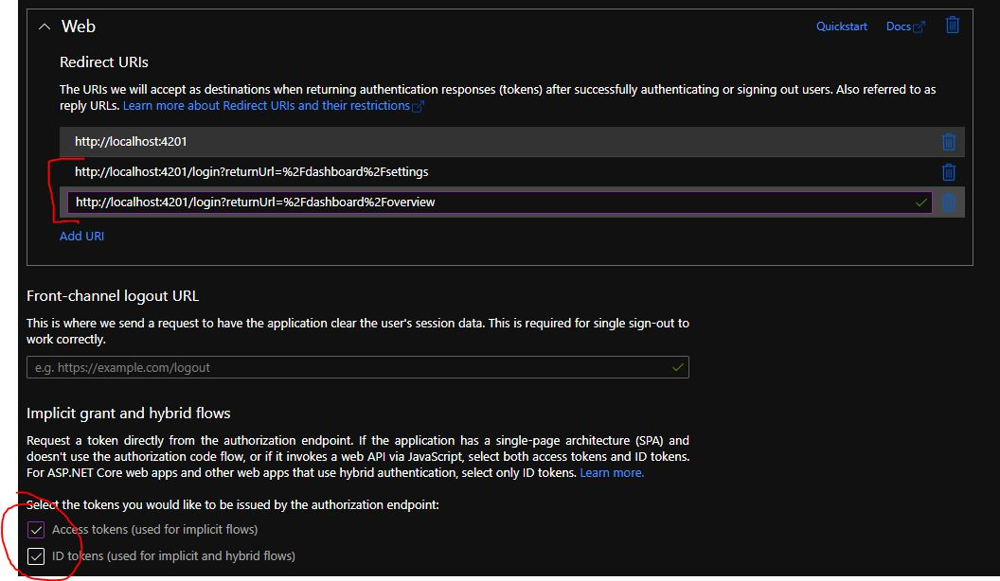

Go to API Permissions from the side menu and add all of these permissions and press the Grant admin consent for button.


Go to Certificates & secrets from the side menu and create a secret. Click on the New client secret button and copy the value. This must be pass when you do a release along with the tenant id and client id.

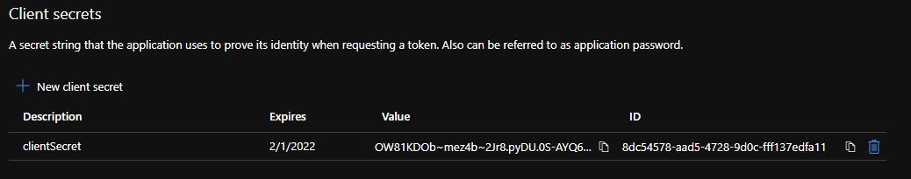

Now go to the manifest and change these:

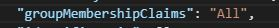
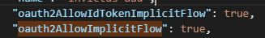

In the manifest add this wildcard like this:

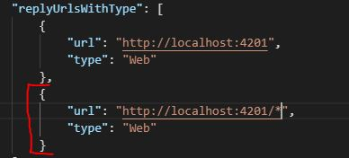

Now go to Enterprise Applications and go to Owners. Add an owner which have all rights.

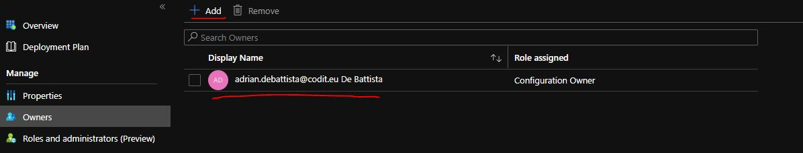

Go to users and groups and click on the Add user/group and add all the users that have access to login to the dashboard.

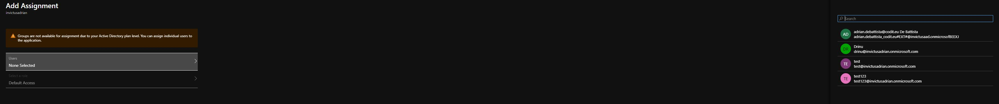

Now go to Permissions from the side menu and click on the Grant admin consent for button. You should login using a full access (permission wise) account.

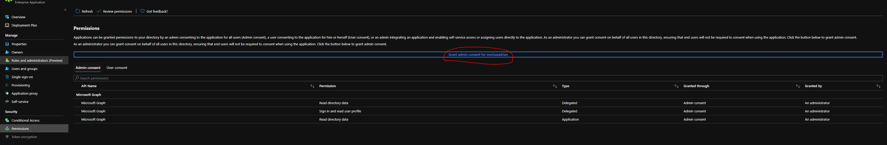

If you want to create a group. Go to Groups and click on New group button which will lead you to this screen. Enter a group name and use the owners and members to assign it to the AAD you just created.


If you want to add a new user, go to Users and click New user button and it will lead you to this screen. Enter all the input fields and don't forget to assign the Groups you want this user to be assigned to.

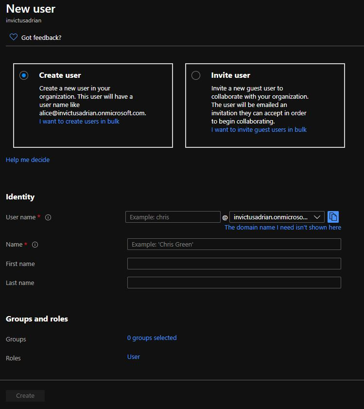
## Step 2: Add Secret Key to Invictus' Configuration

Copy the secret key created and pass the credentials as arguments to the Deploy.ps1 script (on release).

```
    -AzureActiveDirectoryTenantId "$(Invictus.Dashboard.AAD.TenantId)" -AzureActiveDirectoryClientId "$(Invictus.Dashboard.AAD.ClientId)" -AzureActiveDirectoryClientSecret "$(Invictus.Dashboard.AAD.ClientSecret)"
```
## Step 3: Sync Groups on Invictus

**Note that an app registration should be created before assigning group permissions**

Click on the Groups Icon on the top left:


Click the Sync Groups Icon on the Global Groups page:


Once Synced, set the required groups as enabled to be used for permissions, and click the Save Enabled button:


 
To add global roles to the groups, click the edit buttons and set the required role:


## Step 4: Assign Groups to Folders

**Note that an app registration should be created before assigning group permissions**

Click on the 3 dots next to the folder name:


Several options will pop-up. Click on the 'Manage permissions' link:


Click on the "Add Groups" button.


An Assign Group Popup will show up:


Choose the group from the first drop down menu. And choose the role you want the group users to have for that specific folder. You can see that you have 3 options:
- Folder Admin
- Operator
- Reader

**Folder Admin** can assign users to specific folder, remove users from specific folder, create flows in specific folder, delete flows in specific folder, see messages from flows in specific folder, see flows from specific folder, resume/resubmit/ignore messages from specific folders, see flow statistics, edit flow in specific folder.

**Operator** can see messages from flows in specific folder, see flows from specific folder, resume/resubmit/ignore messages from specific folders, see flow statistics.

**Reader** can see messages from flows in specific folder, see flows from specific folder, see flow statistics.


