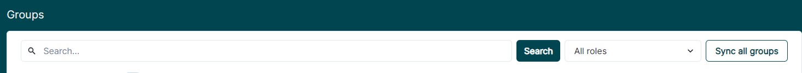
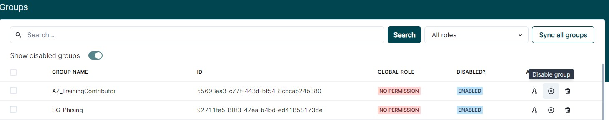
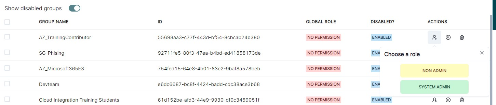
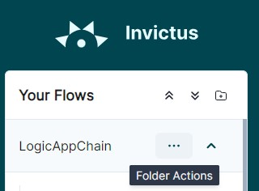
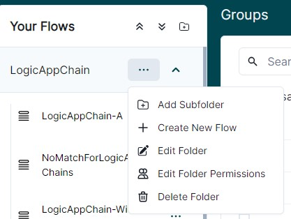
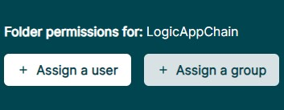
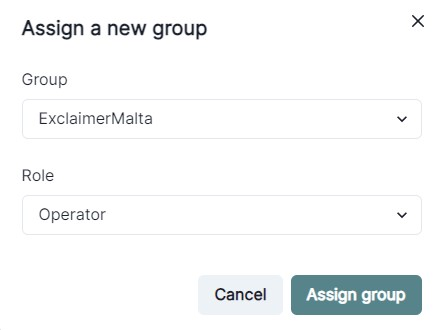
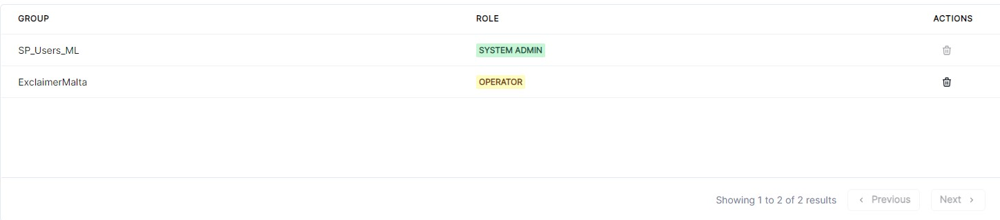

[home](../README.md) | [dashboard](dashboard.md) | [Group Management](groupmanagement.md)

# Group Permission Management

To setup permissions for Azure Active Directory groups on Invictus, there are three steps to follow:
- Step 1: Setup App Registration on Microsoft Azure
- Step 2: Add Secret Key to Invictus Configuration
- Step 3: Sync Groups on Invictus
- Step 4: Assign Groups to Folders

## Step 1: Setup App Registration on Microsoft Azure

First, go to "Azure Active Directory" and from the left side menu click on the "App Registrations" and click on the "New Registration" button on top of the page. 

1. Enter a name for your app registration.
2. Choose the "Accounts in any organizational directory (Any Azure AD directory - Multitenant)".
3. Now for the "Redirect URI" enter links that you are going to use from where you are going to login from. Such as "https://invictus-dev-we-sft-invictusdashboard.azurewebsites.net/login". This will ensure that from where you are loging is legit and no one can use your tenant id from another domain or so.
4. Click on Register button.


## Step 1.  Grant Access Token Permissions

Go to "Authentication" page from the left side menu and check the check box which is "Access Tokens" click on Save button from the top.


## Step 2.  Certificates & secrets

Go to Certificates & secrets from the side menu and create a secret. Click on the New client secret button and copy the value. This must be pass when you do a release along with the tenant id and client id.


## Step 3. Expose an API

Go To "Expose an API", Add the application ID URI: as the api://{client-id or also known as the application-id}, this can be found in the "Overview" section. Click on "Add a scope"


### Step 3.1. Add scopes

Fill in the form with the above image infromation. "access_as_user" for each of the textboxes, once finished click on "Add scope"


## Step 4. API permissions

Go to API Permissions from the side menu and add all of these permissions and press the Grant admin consent for button.


### Step 4.1 API Permissions - Add Scope

From the left hand side click again on "Add a permission" button. Click on "My APIs" and click on the app registration name that you have created currently. Choose "access_as_user" from the below permissions list and than click on "Add permissions"

The below image is the result of above actions


## Step 5. Enterprise application setup

Go back to "Azure Active Directory" and from the left side menu click on the "Enterprise Application" and search for the one you just created and click on it. Now from the left hand side, click on "Owners" and Add yourself or whoever you want to be the owner of the application.


Go to users and groups and click on the Add user/group and add all the users that have access to login to the dashboard.

# Group Management 


Now go to Permissions from the side menu and click on the Grant admin consent for button. You should login using a full access (permission wise) account.


If you want to create a group. Go to Groups and click on New group button which will lead you to this screen. Enter a group name and use the owners and members to assign it to the AAD you just created.


If you want to add a new user, go to Users and click New user button and it will lead you to this screen. Enter all the input fields and don't forget to assign the Groups you want this user to be assigned to.


## Step 2: Add Secret Key to Invictus' Configuration

Copy the secret key created and pass the credentials as arguments to the Deploy.ps1 script (on release).

```
    -AzureActiveDirectoryTenantId "$(Invictus.Dashboard.AAD.TenantId)" -AzureActiveDirectoryClientId "$(Invictus.Dashboard.AAD.ClientId)" -AzureActiveDirectoryClientSecret "$(Invictus.Dashboard.AAD.ClientSecret)"
```
## Step 3: Sync Groups on Invictus

**Note that an app registration should be created before assigning group permissions**

Click on the Groups Icon which is located at the top middle menu:


Click the Sync Groups Icon on the Global Groups page:



Once Synced, set the required groups as enabled to be used for permissions, and click the Save Enabled button:


 
To add global roles to the groups, click the edit buttons and set the required role:



## Step 4: Assign Groups to Folders

**Note that an app registration should be created before assigning group permissions**

Click on the 3 dots next to the folder name:



Several options will pop-up. Click on the 'Edit Folder Permissions' link:



Click on the "Assign a group" button.



An Assign Group Popup will show up:


Choose the group from the first drop down menu. And choose the role you want the group users to have for that specific folder. You can see that you have 3 options:
- Folder Admin
- Operator
- Reader

**Folder Admin** can assign users to specific folder, remove users from specific folder, create flows in specific folder, delete flows in specific folder, see messages from flows in specific folder, see flows from specific folder, resume/resubmit/ignore messages from specific folders, see flow statistics, edit flow in specific folder.

**Operator** can see messages from flows in specific folder, see flows from specific folder, resume/resubmit/ignore messages from specific folders, see flow statistics.

**Reader** can see messages from flows in specific folder, see flows from specific folder, see flow statistics.


