[home](../README.md) | [dashboard](dashboard.md) | [Folder Management](foldermanagement.md)

# Group Permission Management


## Setup App Registration on Microsoft Azure

Create a new App Registration:

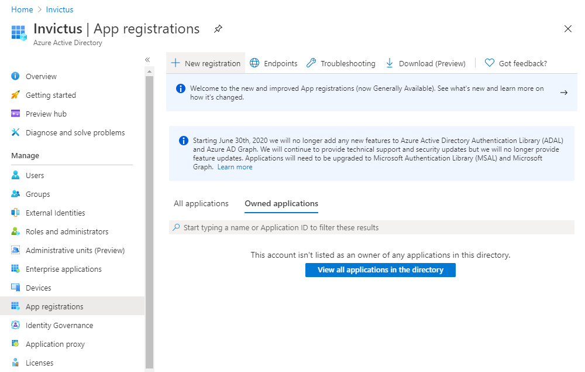

Register a new Application:

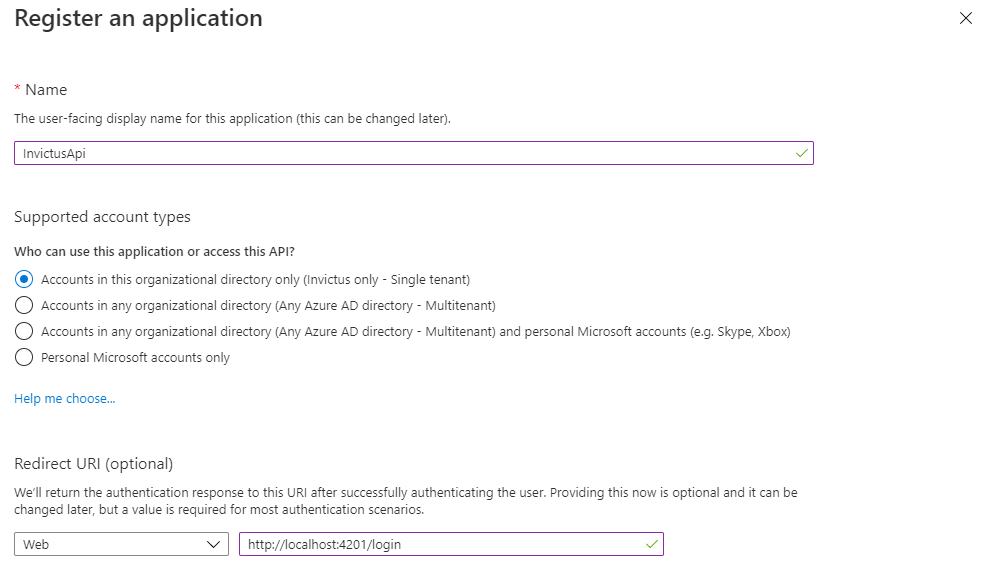

Register a new Application:

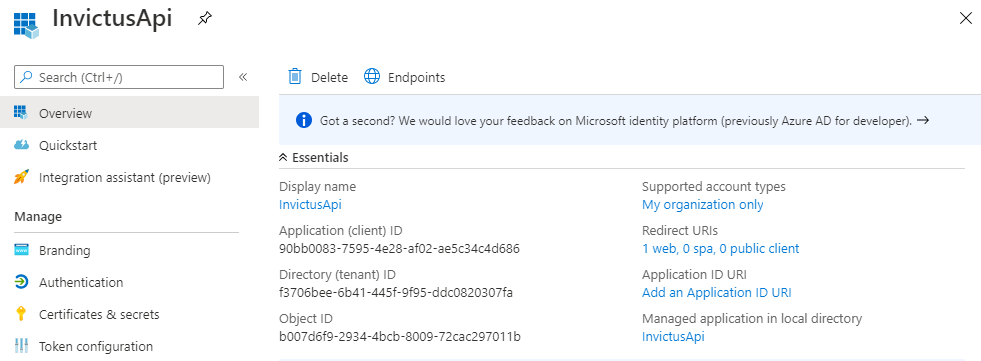

Setup the Redirect URIs according to the URL set by adding:
-	{url-to-app}/ login?returnUrl=%2Fdashboard%2Fsettings
-	{url-to-app}/ login?returnUrl=%2Fdashboard%2Foverview

Setup Redirect URIs in the Authentication tab:

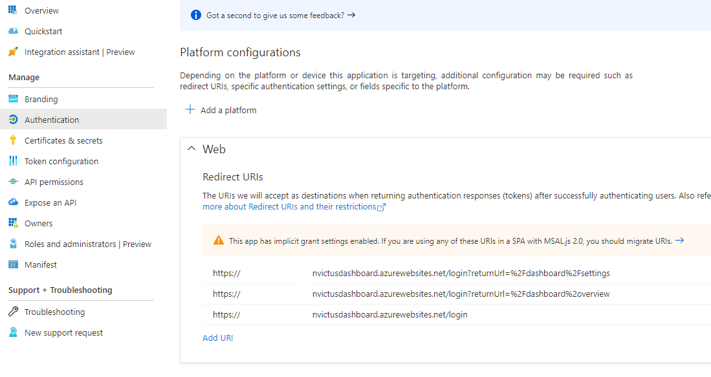

Create a New Secret Key:


Add API Permissions:

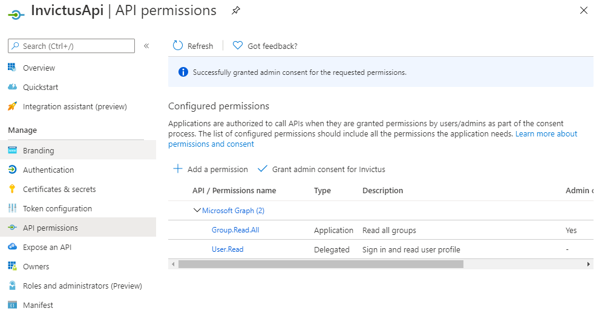

Grant Consent:

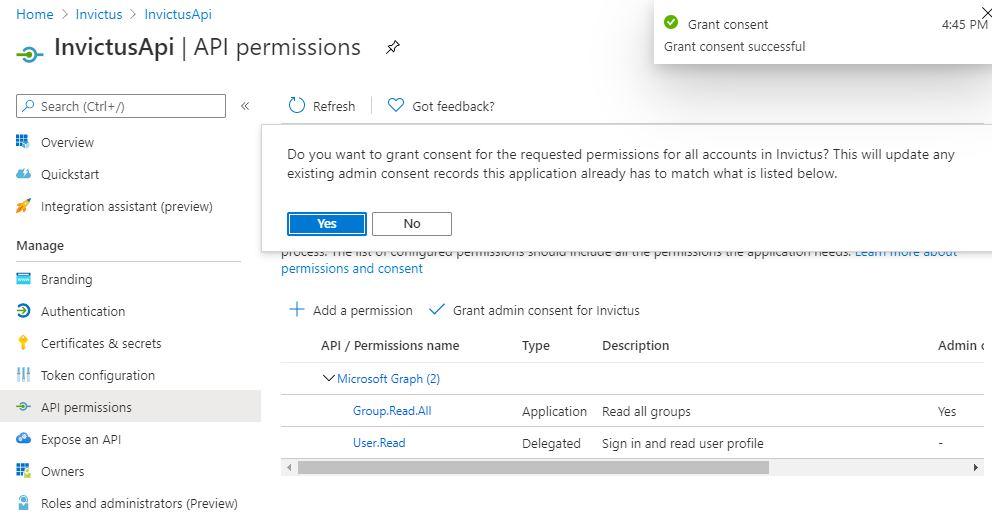

Open the Manifest link from the side menu and update the following properties:

```
    "groupMembershipClaims": "All",
    "oauth2AllowIdTokenImplicitFlow": true,
    "oauth2AllowImplicitFlow": true,
```

Once user is logged in, agree to the permissions request:


## Sync Groups

**Note that an app registration should be created before assigning group permissions**

Click on the Groups Icon on the top left:


 

Click the Sync Groups Icon on the Global Groups page:

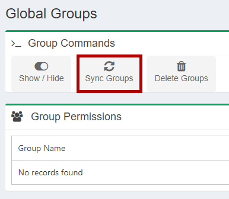
 

Once Synced, set the required groups as enabled to be used for permissions, and click the Save Enabled button:

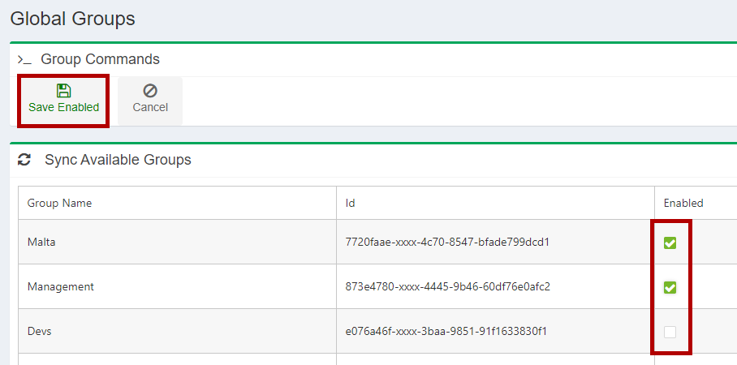

 
To add global roles to the groups, click the edit buttons and set the required role:

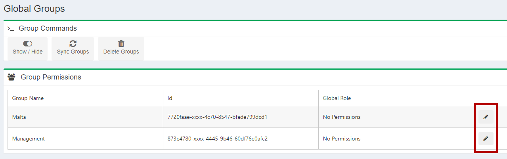


## Assign Groups to Folders

**Note that an app registration should be created before assigning group permissions**


Click on the 3 dots next to the folder name:

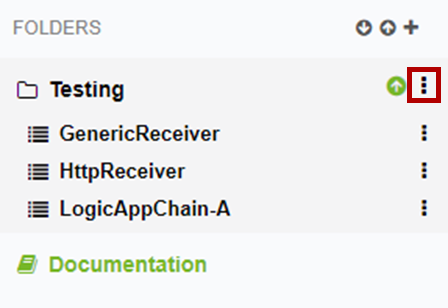

Several options will pop-up. Click on the 'Manage permissions' link:

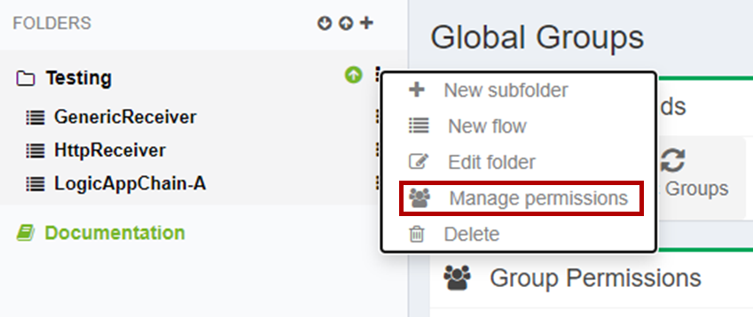

Click on the "Add Groups" button.

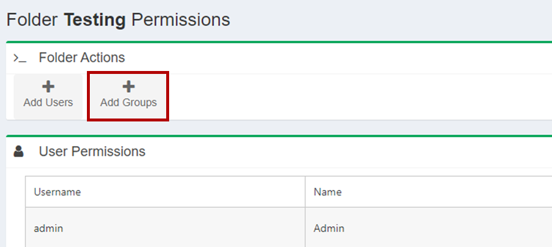

An Assign Group Popup will show up:
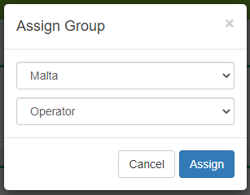

Choose the group from the first drop down menu. And choose the role you want the group users to have for that specific folder. You can see that you have 3 options:
- Folder Admin
- Operator
- Reader

**Folder Admin** can assign users to specific folder, remove users from specific folder, create flows in specific folder, delete flows in specific folder, see messages from flows in specific folder, see flows from specific folder, resume/resubmit/ignore messages from specific folders, see flow statistics, edit flow in specific folder.

**Operator** can see messages from flows in specific folder, see flows from specific folder, resume/resubmit/ignore messages from specific folders, see flow statistics.

**Reader** can see messages from flows in specific folder, see flows from specific folder, see flow statistics.

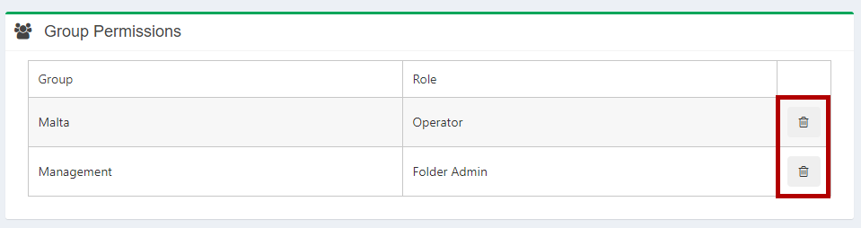