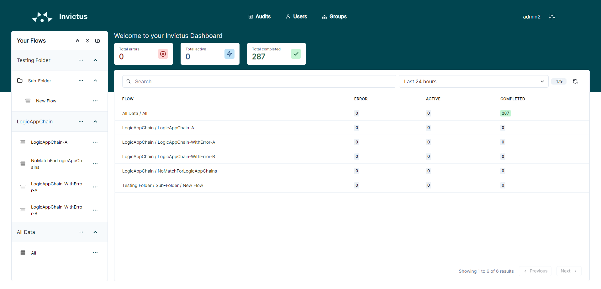

[home](../README.md) | [dashboard](dashboard.md)

# Dashboard Home Page

## Flow statistics

The dashboard will show you an overview of the status of all your flows. For each flow you will be able to see the status of the received messages.

A message can have the following status:

* **Active** - Shows all messages which are currently being processed.
* **Completed** - Shows all messages that are completed (processed successfully).
* **Error** - Shows all messages that are suspended, dehydrated or terminated.
