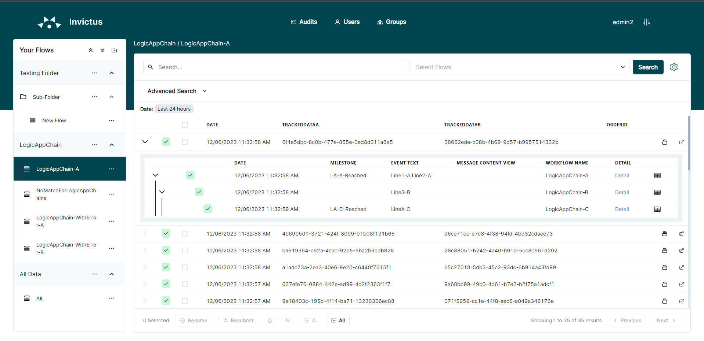
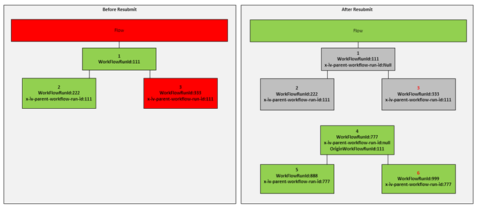

# Import flow traces via LogicApp workflows
Invictus is fully supported to import flows from LogicApps. It allows to keep track of the **execution tree** of the ran workflows, plus with **tracked properties** you can trace specific data for your needs besides the general **diagnostic settings**.

## Enable workflow diagnostics
For the Invictus Dashboard to know if messages went through your Logic App workflow correctly or not, diagnostic settings need to be configured on all Logic Apps that you want to include. These settings should stream their diagnostic traces to the Invictus EventHubs resource:

* `EventHubsNamespace`: `invictus-{env}-we-sft-evnm`
* `EventHubsName`:
  * `invictus-{env}-we-sft-evhb` (Logic Apps Consumption) 
  * `invictus-{env}-we-sft-evhb-v2` (Logic Apps Standard)

> ⚠️ Make sure that the `WorkflowRuntime` is **✅ checked**, but the `AllMetrics` is **❌ unchecked**. Otherwise you will send far too much events to the EventHubs.


> 🔗 See [Microsoft's documentation](https://learn.microsoft.com/en-us/azure/logic-apps/monitor-workflows-collect-diagnostic-data?tabs=consumption) on how this can be configured manually.

Alternatively, you can update your Bicep template to include them, using [AVM](https://github.com/Azure/bicep-registry-modules/tree/main/avm/res/logic/workflow#parameter-diagnosticsettings):

```bicep
{
  ...
  diagnosticSettings: [
      {
        name: settingName
        eventHubName: eventHubName
        eventHubAuthorizationRuleResourceId: resourceId(
          resourceGroupName,
          'Microsoft.EventHub/namespaces/authorizationRules',
          eventHubNamespace,
          'RootManageSharedAccessKey'
        )
        logCategoriesAndGroups: [
          {
            category: 'WorkflowRuntime'
            enabled: true
          }
        ]
      }
    ]
}
```

## Map Dashboard flows to LogicApp workflow runs
Make sure that any [tracked property](#tracked-properties-of-workflows) in the workflow matches these values in the [flow created via the Dashboard](./editflows.md):
* WorkflowName (if present)
* Domain (if present)
* Service (if present)
* Action (if present)
* Version (if present)

## Execution tree of sequentially ran workflows
When expanding the flows in the Dashboard you should be able to see what workflows have been executed sequentially to process the message.



To link one workflow with another the `x-iv-parent-workflow-run-id` [tracked property](#tracked-properties-of-workflows) needs to be set when designing the Logic App.

The value for the property needs to be the `WorkFlowRunId` that you wish to link the LogicApp to. The below logic app is using the following tracked property to promote the `WorkFlowRunId` of **LogicAppChain-A** as a tracked property in **LogicAppChain-B**.

| Key                           | Value                                                      |
| ----------------------------- | ---------------------------------------------------------- |
| `x-iv-parent-workflow-run-id` | `@{triggerOutputs()?['headers']?['x-ms-workflow-run-id']}` |


In the example above, the **x-iv-parent-workflow-run-id** was set in **LogicAppChain-B** linking it with **LogicAppChain-A**. **LogicAppChain-C** was not linked to **B** or **A** thus is not considered part of the chain.

> ⚠️ The **ClientTrackingId** is the identifier used to link transactional messages together, this ID is by default generated for every run in LogicApps, but can also be manually set by the developer. Since async flows might change their ClientTrackingId due to routing, the ClientTrackingId will need to be reset in the LogicApp as soon as possible.

## Tracked properties of workflows
The `Milestone` and `EventText` are properties set and displayed by default. For the `EventText`, if the value re-appears in several workflows, instead of overwriting/updating its value, all data is appended as a single value, separated by comma.


### LogicApp inputs/outputs
> 🛡️ For this feature to function properly some role assignments need to be set in your Invictus installation. Please see [Access Control Rights](accesscontrolrights.md) for more info.

The message content view allows the user to track the outputs and inputs of an action. The image below shows an example of the input and output of an action being tracked. These are visible per LogicApp in the workflow events table. 


The links in the above image are the friendly names set in the tracked properties of the "tracked" action. The links will point to their respectively input/output content.

To track the input and output of an action in a LogicApp the below tracked properties have to be set in an action.

| Property Name                    | Sample Value | Description |
| -------------------------------- | ------------ | ----------- |
| `x-iv-messagecontent-input-name` | `ActionInput`  | This is the friendly name displayed in the ClickThrough/ExecutionTree, the value can be anything you like. The value has to be a single word |
| `x-iv-messagecontent-input-content-type` | `application/json` |This should have the same content type as the data type when opening the input link for an action|
| `x-iv-messagecontent-output-name` | `ActionOutput` | This is the friendly name displayed in the ClickThrough/ExecutionTree, the value can be anything you like. The value has to be a single word|
| `x-iv-messagecontent-output-content-type` | `application/json` | This should have the same content type as the data type when opening the input link for an action |

> ⚠️ The inputs and outputs content views can be set up independently or together. The only requirement is that if the `-name` is present then the `-content-type` has to be also present for the desired output.

### Errors on LogicApp level
If the corresponding logic app has resulted in an error, the error information can be seen in the within the "Logic App Details" modal.


For any additional details or insights, the user can also navigate directly to the Azure Portal.

## Workflow operations via Dashboard
> ⚠️ Requires the `x-iv-parent-workflow-run-id` to be set on the workflows to run properly.

Flows linked to LogicApps workflows can be resubmitted and resumed via the Dashboard both separately (`Flow Actions button`) and in batch (`Selecting multiple flows`).

### Resubmit
The Resubmit functionality will always trigger an "Azure Resubmit" for the first LogicApp in the Chain. Resubmit will trigger the execution of any corresponding flow, even completed ones. When Resubmit is triggered, the first Logic App in the chain (execution tree) is resubmitted on Azure thus retriggering the whole flow.


If we had to take the above image as an example. If Resubmit is executed for this flow, "LogicAppChain-A" is Resubmitted on Azure. The below image is the outcome after "LogicAppChain-A" is re-executed through the resubmit.


### Resume
The Resume function executes an "Azure Resubmit" for each failed function in the chain. Resume only works on messages with the status Failed. Also, the Resume does not start from the first logic app within its flow, as with the Resubmit, but instead executes only the failed logic apps.

**The only exception is that if a Parent Logic App of a failed Logic App has also failed, then only the Parent is executed**.

### Ignore
Users can choose to ignore a message, normally this could be the case when a message is in failed status. The user can select one or multiple messages and choose to "Ignore" them.

When a message has been set to be ignore, its status will change and show as follows


> ⚡ It's possible to use a **custom resubmit and resume**, see [this page](custom-resumeresubmit.md) for more information.

### Example scenarios
The below examples are a representation of the Flow Row and the Execution tree with different Resume and Resubmit scenarios.


<details>
<summary>Scenario One: resubmit first in the chain</summary>

In this scenario, a resubmit was executed on Logic App 1. Since the LogicApp is the first one in the chain, which can be identified by the null x-iv-parent-workflow-run-id, this scenario will be handled as a **Resubmit**. As soon as we receive the events for 4, 5 and 6 we will link 4 with 1 through the OriginWorkFlowRunId which is supplied by the LogicAppRuntime and ignore all descendants of 1.


</details>

<details>
<summary>Scenario Two: resume further down the chain</summary>

In this scenario, the resubmitted logic app Is number 3. Since this is not the first LogicApp in the Chain, this will be handled as a **Resume**. As soon as we receive the events for number 4 we can immediately link it to number 1 since it will still have the same x-iv-parent-workflow-run-id. Through the OriginWorkFlowRunId of 333 LogicApp 4 is then treated as a resubmit of 3. In the case of a resume, only the resubmitted LogicApps and its descendants are ignored and not the whole chain.


</details>

<details>
<summary>Scenario Three: resubmit further down the chain</summary>

This will be similar to scenario two. In this case the developer decided to resubmit LogicApp 3. This can only be achieved through the azure portal as the Invictus Dashboard will only resubmit Failed LogicApps.


</details>

<details>
<summary>Scenario Four: resubmit multiple further down the chain</summary>

In this scenario the developer resubmitted LogicApp 2 and LogicApp 3.


</details>

