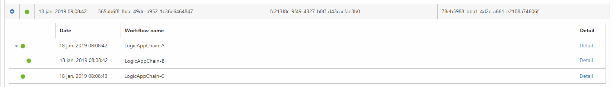
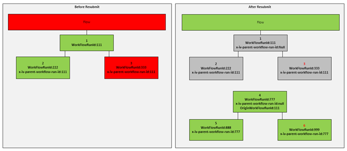
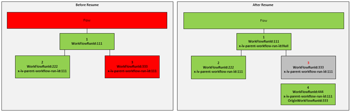
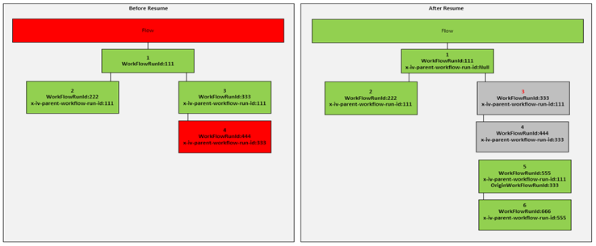
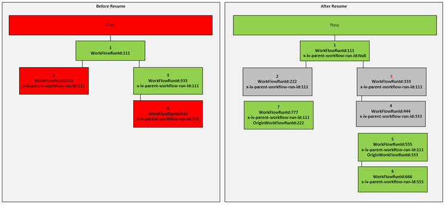

[home](../README.md) | [dashboard](dashboard.md)

# Import Job

The Invictus Import Job's main purpose it to listen on EventHub for any messages pushed by Logic Apps. After the messages are captured by the import job they are again pushed to the Invictus Gateway API, which will eventualy be saved to the database thus making them available in the dashboard.

The import job will parse each message and extract all relevant information such as: Timestamps, Tracked Properties, ErrorLogs, Statuses etc. After the messages are sucessfully parsed they will be merged based on their ClientTrackingId.

Also note that all merged messages are pushed to the Generic WorkFlow, even if no mapping match is found.

Regarding custom properties it is important to know that you will need to use **Tracked Properties in your Logic Apps** if you wish to track specific data. The name of the tracked property must always match the property set in the flow during creation in the dashboard. For documentation regarding tracked properties refer to the official documenation by Mictosoft. Note that objects are not yet supported as TrackedProperties.

## Execution tree

Another task handled by the Import job is storing the data for the Execution tree. When expanding the flows you should be able to see what workflows have been executed to process the message. To link one workflow with another the following TrackedProperty needs to be set when designing the Logic App.

### x-iv-parent-workflow-run-id

The value for the above property needs to be the WorkFlowRunId that you wish to link the LogicApp to. The below logic app is using the following tracked property to promote the WorkFlowRunId of LogicAppChain-A as a trackedProperty in LogicAppChain-B

|Key|Value|
| --- | --- |
|x-iv-parent-workflow-run-id|@{triggerOutputs()?['headers']?['x-ms-workflow-run-id']}|

In the example above, the **x-iv-parent-workflow-run-id** was set in LogicAppChain-B linking it with LogicAppChain-A. LogicAppChain-C was not linked to B or A thus is not considered part of the chain.

The PubSub component promotes the **x-ms-workflow-run-id** from the HTTP Headers which are passed by the LogicApp Runtime to the Message Context. This can be later retrieved in the Subscribe component from the Context of the message.

## Resubmit and Resume

This section will explain how the ImportJob will handle Resumes and Resubmits. **For the import job and the dashboard execution tree to work properly the x-iv-parent-workflow-run-id needs to be set in each logic app**. This is a very simple step as it can be easily set once as a tracked property (refer to the Execution Tree section).

This will ensure that the execution tree is built properly and will also eliminate a lot of edge cases which we have not foreseen if we had simply designed this using a time-based approach.

The below examples are a represenation of the Flow Row and the Execution tree with different Resume and Resubmit scenarios.

### Scenario One

In this scenario, a resubmit was executed on Logic App 1. Since the LogicApp is the first one in the chain, which can be identified by the null x-iv-parent-workflow-run-id, this scenario will be handled as a **Resubmit**. As soon as we receive the events for 4, 5 and 6 we will link 4 with 1 through the OriginWorkFlowRunId which is supplied by the LogicAppRuntime and ignore all descendants of 1.

### Scenario Two

In this scenario, the resubmitted logic app Is number 3. Since this is not the first LogicApp in the Chain, this will be handled as a **Resume**. As soon as we receive the events for number 4 we can immediately link it to number 1 since it will still have the same x-iv-parent-workflow-run-id. Through the OriginWorkFlowRunId of 333 LogicApp 4 is then treated as a resubmit of 3. In the case of a resume, only the resubmitted LogicApps and its descendants are ignored and not the whole chain.

### Scenario Three

This will be similar to scenario two. In this case the developer decided to resubmit LogicApp 3. This can only be achieved through the azure portal as the Invictus Dashboard will only resubmit Failed LogicApps.

### Scenario Four

In this scenario the developer resubmitted LogicApp 2 and LogicApp 3.

## Tracking

The ClientTrackingId is the identifier used to merge messages together, this ID is by default generated for every run in LogicApps, but can also be manually set by the developer when implementing the LogicApp. Since async flows might change their ClientTrackingId due to routing,  the ClientTrackingId will need to be reset in the LogicApp as soon as possible.

For PubSub the Publish API Action will pull the **x-ms-client-tracking-id** from the request header sent by LogicApps, it will then promote it to the context of the message. It will be the developers responsibility when setting up the Subscribe to pull the value from the context and manually set the ClientTrackingId.

## WorkflowName

WorkFlowName is one of the properties used by the import job to map messages to flows. Since this is an optional field in the Dashboard, it can be left blank and simply use the D,S,A,V properties. If using the WorkFlowName mapping, it is important to ensure that the value provided matches the name of the Logic App. To give an example: creating a Flow Mapping with just the WorkFlowName will map all events generated by the LogicApp(with the same workflowname) to the flow with the same WorkFlowName value.
