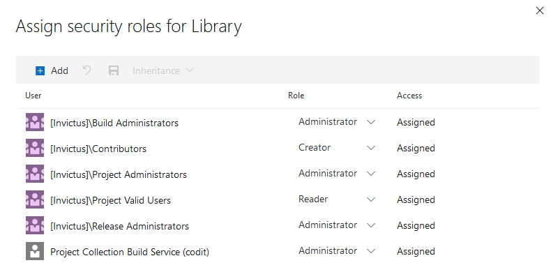

[home](../../README.md) | [dashboard](../dashboard.md) | [dashboard installation](dashboard-installation.md)

# Dashboard Release Pipeline

The release pipeline will use the artifacts created from the build pipeline and publish this to the stage(s) you define. Each stage will deploy the resources to the Azure subscription and resource group you specify in the deployment tasks.

The release uses variable groups and edits/adds variables to the groups, we will begin by creating a new variable group.

## Variable Group

Create a variable group named {prefix}.Invictus.{stage} for all the stages (environments) and add at least one variable (eg: Invictus.Secrets.ApiKey1.Name = apikey1).

Make sure the Project Collection Build Service has Administrator access to these variable groups (Pipelines > Library > Security)

> 

## YAML Release Pipeline
Add the files and folders from [this](https://github.com/invictus-integration/docs-ifa/tree/master/dashboard/installation/pipelines) location to your DevOps repo. 
This contains an example YAML pipeline to release the Invictus for Azure Dashboard, change the [dashboard.release.yaml](https://github.com/invictus-integration/docs-ifa/blob/master/dashboard/installation/pipelines/dashboard.release.yaml) file according to your needs, for example change the needed environments and change the name of the build pipeline trigger:
``` yaml
resources:
  pipelines:
    # Name of the pipeline resource inside this workflow. Used to reference the pipeline resources later on (e.g. download artifacts).
  - pipeline: _build
    # Name of the pipeline in Azure Pipelines
    source: 'customer.azure.invictus.dashboard.build' 
    trigger: true
```

**Make sure to replace the `azureSubscription` value with the name of your serviceconnection as this value cannot be parameterized**

Also make sure to change the Bicep template parameters. In these example files we are deploying to DEV, TST and ACC using a `B1` service plan SKU and a `P1V2` service plan SKU to PRD. Make sure to change and parameterize this according to your needs.

If you need to overwrite more Bicep Template parameters make sure to add this to the `deployScriptParameters`. A complete list of Bicep Template parameters can be found [here](#Bicep-Template-Parameters). 

Afterwards add the [dashboard.release.yaml](https://github.com/invictus-integration/docs-ifa/blob/master/dashboard/installation/pipelines/dashboard.release.yaml) in your DevOps environment as a pipeline.

## Classic Release Pipeline
Create a new release pipeline, starting with an empty template, with this naming: `{prefix}.Invictus.Dashboard`.

Configure the release name format (Options) as `{prefix}.Invictus.Dashboard $(Build.BuildNumber)_$(rev:r)`.

Use the Artifacts from the build pipeline as a source for the release. Name the Source alias: "InvictusDashboard".

Add a variable **ArtifactsPath** to the release with scope 'Release' and a value of `$(System.DefaultWorkingDirectory)/InvictusDashboard/dashboard-v2`.

Please Note that a current bug in the Az library might cause the release to fail for new installation. Simply re-deploy the failed release to resolve the issue.

#### Stages

Add a stage for each environment you wish to release to.

- Link the above variable groups to the stages you create.
- Don't forget to link the Infra variable group as well.
- Allow the agent to access the OAuth token

> 

Add an Azure PowerShell task to each stage. This task will take care of the following:

- Get the keyvault access policies, so they are preserved in consequent deployments.
- Stop any datafactory triggers related to the framework.
- Bicep deployment.
- Start any datafactory triggers.
- Deployment of the dashboard.
- Deployment of the import job.

Make sure the Azure Powershell task has the following properties:
- **Task version**: 4
- **Display name**: Deploy
- **Azure Subscription**: the subscription to deploy to
- **Script Path**: `$(ArtifactsPath)/Deploy.ps1`
- **Azure PowerShell Version**: Latest installed version
- Under the Advanced section: Ensure that **Use Powershell Core** is **disabled**.

## Deploy Script Arguments

The following script arguments are used in the deploy script:

- **Script Arguments**
  - ArtifactsPath (mandatory): `$(ArtifactsPath)`
  - ArtifactsPathScripts (optional): uses ArtifactsPath when not specified.
  - devOpsObjectId (mandatory): The **Enterprise Application** Object ID of the service principal thats connected to the DevOps service connection.
  - ResourcePrefix (mandatory): `$(Infra.Environment.ShortName)-$(Infra.Environment.Region.Primary.ShortName)-$(Infra.Environment.Customer.ShortName)`
  - ResourceGroupName (mandatory): name of the Azure Resource Group. Include the variable `$(Infra.Environment.ShortName)` to make this environment specific.
  - VariableGroupName (mandatory): The name of the variable group. Include the variable `$(Infra.Environment.ShortName)` to make this environment specific.
  - ResourceGroupLocation (optional): `$(Infra.Environment.Region.Primary)` or 'West Europe' when not specified.
  - KeyVaultName (optional): uses `invictus-$ResourcePrefix-vlt` when not specified.
  - KeyVaultAccessPoliciesVariableName (optional): uses _Infra.KeyVault.AccessPolicies_ when not specified.
  - AzureActiveDirectoryClientId (mandatory): Value can be obtained by following this guide: [Azure AD Setup](https://invictus-integration.github.io/docs-ifa/#/dashboard/azureADSetup). Leave empty if AD will be disabled. 
  - AzureActiveDirectoryTenantId (mandatory): Value can be obtained by following this guide: [Azure AD Setup](https://invictus-integration.github.io/docs-ifa/#/dashboard/azureADSetup). Leave empty if AD will be disabled.
  - AzureActiveDirectoryClientSecret (mandatory): Value can be obtained by following this guide: [Azure AD Setup](https://invictus-integration.github.io/docs-ifa/#/dashboard/azureADSetup). Leave empty if AD will be disabled. 
  - AzureActiveDirectoryAudience (mandatory): Value can be obtained by following this guide: [Azure AD Setup](https://invictus-integration.github.io/docs-ifa/#/dashboard/azureADSetup). Leave empty if AD will be disabled.
  - PerformSqlDataMigration (mandatory): If value is 1 the data migration process will run, migrating SQL data to Cosmos DB. If the value is 0, the process will be skipped. See the [migration guide](https://invictus-integration.github.io/docs-ifa/#/dashboard/installation/dashboard-migration) for more details. Once data migration has been performed and verified, it is recommended to then set this value to 0 so that the migration process is skipped for all subsequent releases.
  - FlowDataTTLInDays (mandatory): A positive integer value which represents the amount of days flow data can live in the database. More info [here](../flowdatatimetolive.md).
  - isProvisionedCosmos (optional): If the value is 1, a Cosmos DB with provisioned throughput will be deployed. If the value is 0, a serverless Cosmos DB will be deployed instead. See the [relevant section](#Provisoned-Throughput-vs-Serverless-Cosmos-DB) below for more details.
  - isAdDisabled (optional): If the value is 1, the option to log into the dashboard with AAD will be removed.
  - AdditionalTemplateParameters (optional): Additional named parameters for the arm template you wish to override. More on this below.


**NOTE:** When passing the ApiKey1 and ApiKey2 to the Deploy.ps as arguments, please remember to enclose them in single quotes ''. This prevents any operator characters from breaking the ps script.

The AdditionalTemplateParameters argument are named arguments you can use to override the default values used by the ARM template. You simply name the argument as the parameter. For example if you want to use a different servicePlanSku you would add `-servicePlanSkuName "S1"` to the arguments of the powershell script.

> Note that **resourcePrefix** and **accessPolicies** are overridden by the script, so no need to include that in the arguments.

Complete example of the arguments (note the use of -devOpsObjectId as an additional parameter):

```powershell
-ArtifactsPath "$(ArtifactsPath)" -ResourcePrefix "$(Infra.Environment.ResourcePrefix)" -ResourceGroupName "$(Infra.Environment.ResourceGroup)" -VariableGroupName "Software.Infra.$(Infra.Environment.ShortName)" -ResourceGroupLocation "$(Infra.Environment.Region.Primary)" -devOpsObjectId $(Infra.DevOps.Object.Id) -PerformSqlDataMigration 0 -isProvisionedCosmos 0 -AzureActiveDirectoryClientId "[YOUR_CLIENT_ID_HERE]" -AzureActiveDirectoryTenantId "[YOUR_TENANT_ID_HERE]" -AzureActiveDirectoryClientSecret "[YOUR_SECRET_HERE]" -AzureActiveDirectoryAudience "[YOUR_AUDIENCE_HERE]"
```

## Provisoned Throughput vs Serverless Cosmos DB

**Provisioned Throughput**: You specify a fixed amount of resources (RU/s) for your database, ensuring predictable performance. Best for steady workloads.

**Serverless**: Capacity scales automatically based on actual usage, paying only for resources used per request. Cost-effective for variable traffic (high / low usage) and infrequently accessed data.

## When to use Provisioned Throughput vs Serverless Cosmos DB


### Serverless in Production

- Cost-Efficiency for Variable Workloads: Suitable for scenarios with varying input volume loads, automatically scaling down during periods of low activity to optimize cost.
- Sporadic Traffic: Ideal for situations where the volume fluctuates or experiences occasional bursts of traffic, such as higher volume during specific hours and lower volume at other times.
- Agile and Scalable: Collections are auto-scaled, with FlowData and WorkFlowEvents being the most affected collections when data is inserted.

### Provisioned Throughput in Production

- Fixed RU/s Allocation: Collections are allocated a defined RU/s, requiring consistent usage to make the most of the provisioned capacity.
- Adjustable RU/s for High Volume Processing: RU/s can be increased to accommodate very high volume processing requirements, ensuring optimal performance.
- Predictable Costs: Costs are fixed based on the allocated RU/s. However, for FlowData and WorkFlowEvents, since they are set to autoscale, there is a minimum and maximum price based on usage.


Always evaluate your application's needs and monitor performance to ensure the chosen capacity model meets expectations in the production environment.

**Default Settings for Provisioned Throughput**

| Collection    | RU/s          | Autoscale  |
| ------------- | ------------- | ---------- |
|Audits|500|No|
|DashboardSettings|500|No|
|Users|500|No|
|Groups|500|No|
|Statistics|500|No|
|FolderFlows|500|No|
|FlowData| 2000|Yes|
|WorkflowEvent|2000|Yes|


## Bicep Template Parameters

The below table lists the parameters accepted by the Bicep template.

|Parameter Name|Required|Default Value|Description|
| --- | :---: | --- | --- |
|resourcePrefix|Yes||used as part of the default names for most resources.|
|azureActiveDirectoryClientId|Yes|&nbsp;|Client AAD ID required to enable AAD for dashboard|
|azureActiveDirectoryTenantId|Yes|&nbsp;|Tenant AAD ID required to enable AAD for dashboard|
|azureActiveDirectoryClientSecret|Yes||&nbsp;|Required for AD Login|
|AzureActiveDirectoryAudience|Yes||&nbsp;|Required for AD Login|
|devOpsObjectId|Yes||The object-id associated with the service principal of the enterprise application that's connected to the service connection on DevOps|
|FlowDataTTLInDays|Yes||A positive integer value which represents the amount of days flow data can live in the database|
|apiKey1|No|Generated value|The value used for basic authentication for the APIs|
|apiKey2|No|Generated value|The value used for basic authentication for the APIs|
|invictusDashboardWebAppName|No|invictus-{resourcePrefix}-invictusdashboard-v2|Name for the dashboard web application|
|cosmosAccountName|No|invictus-{resourcePrefix}-cosmos-serverless or invictus-{resourcePrefix}-cosmos-provisoned|Name for Cosmos account|
|cosmosDatabaseName|No|InvictusDashboard|Name for Cosmos database|
|isProvisionedCosmos|Yes|0|isProvisionedCosmos true or false|
|isAdDisabled|No|0|isAdDisabled true or false|
|JWTSecretToken|No|Random 40 character string|JWT Secret used for login|
|appInsightsName|No|invictus-{resourcePrefix}-appins|Name for the Application Insights resource|
|serviceBusNamespaceName|No|invictus-{resourcePrefix}-sbs|Name for the Service Bus Namespace resource|
|serviceBusSkuName|No|Standard or Premium if VNET enabled|Name for the Service Bus SKU|
|keyVaultName|No|invictus-{resourcePrefix}-vlt|Name for the Key Vault Service Namespace resource|
|keyVaultEnablePurgeProtection|No|null|If true, enables key vault purge protection. Once enabled, this property can never be disabled.|
|servicePlanName|No|invictus-{resourcePrefix}-appplan-linux|Name for the service plan which will host the APIs|
|storageAccountName|No|invictus{resourcePrefix}store|Name for the Azure Storage resource. Any dashes (-) will be removed from {resourcePrefix}|
|storageAccountType|No|Standard_LRS|The Storage account StorageAccountSkuType|
|servicePlanSkuName|No|S1|Size for the App Plan, the value of "I1" needs to be passed to install an isolated plan.|
|servicePlanSkuCapacity|No|1|The SKU capacity setting  for the App Plan|
|eventHubNamespaceName|No|invictus-{resourcePrefix}-evnm|Name for the Event Hub Namespace resource|
|eventHubName|No|invictus-{resourcePrefix}-evhb|Name for the Event Hub created on the Namespace|
|eventHubNameV2|No|invictus-{resourcePrefix}-evhb-v2|Name for the Event Hub for standard LA's created on the Namespace|
|autoscaleForPlanName|No|invictus-{resourcePrefix}-CPU-RAM-Autoscale-linux|Name of the autoscale rules for linux app plan|
|minPlanInstanceAutoScale|No|1|The minimum number of instances for the AutoScale function|
|maxPlanInstanceAutoScale|No|5|The maximum number of instances for the AutoScale function|
|consumptionPlanName|No|invictus-{resourcePrefix}-consumptionplan|Name of consumption app plan used for all functions|
|eventHubSkuName|No|Basic|The SKU name of the EventHub Namespace|
|eventHubSkuTier|No|Basic|The Tier name for the EventHub Namespace|
|eventHubSkuCapacity|No|1|The SKU capacity for the EventHub Namespace|
|eventHubAutoInflate|No|false|The EventHub setting to enable auto-inflate|
|eventHubMaxThroughputUnits|No|0|Max throughput setting for EventHub|
|eventHubMessageRetentionInDays |No|1|The number of days EventHub will retain messages. Note: `eventHubSkuName` and `eventHubSkuTier` must be set to `Standard` to exceed 1 day of retention.|
|mTriggerCpuTimeGrainAutoScaleIncrease|No|PT5M|Time evaluated when factoring enabling autoscale for CPU|
|mTriggerCpuTimeGrainAutoScaleDecrease|No|PT5M|Time evaluated when factoring enabling autoscale for CPU|
|mTriggerRamTimeGrainAutoScaleIncrease|No|PT5M|Time evaluated when factoring enabling autoscale for RAM|
|mTriggerRamTimeGrainAutoScaleDecrease|No|50|Percentage when rule is triggered|
|mTriggerCpuTimeWindowAutoScaleIncrease|No|PT5M|Time evaluated when factoring enabling autoscale for CPU|
|mTriggerCpuTimeWindowAutoScaleDecrease|No|PT5M|Time evaluated when factoring enabling autoscale for CPU|
|mTriggerCpuThresholdAutoScaleIncrease|No|70|Percentage when rule is triggered|
|mTriggerCpuThresholdAutoScaleDecrease|No|50|Percentage when rule is triggered|
|mTriggerRamTimeWindowAutoScaleIncrease|No|PT5M|Time evaluated when rule is triggered|
|mTriggerRamTimeWindowAutoScaleDecrease|No|PT5M|Time evaluated when rule is triggered|
|mTriggerRamThresholdAutoScaleIncrease|No|70|Percentage when rule is triggered|
|mTriggerRamThresholdAutoScaleDecrease|No|50|Percentage when rule is triggered|
|scaleActionCpuCooldownTimeAutoScaleIncrease|No|PT5M|Time evaluated when factoring enabling autoscale for CPU|
|scaleActionCpuCooldownTimeAutoScaleDecrease|No|PT5M|Time evaluated when factoring enabling autoscale for CPU|
|scaleActionRamCooldownTimeAutoScaleIncrease|No|PT5M|Time evaluated when factoring enabling autoscale for RAM|
|scaleActionRamCooldownTimeAutoScaleDecrease|No|PT5M|Time evaluated when factoring enabling autoscale for RAM|
|invictusImportJobFunctionName|No|invictus-{resourcePrefix}-invictusimportjob|Name for Azure Function|
|invictusCacheImportJobFunctionName|No|invictus-{resourcePrefix}-cacheimportjob|Name for Azure Function|
|invictusStoreImportJobFunctionName|No|invictus-{resourcePrefix}-storeimportjob|Name for Azure Function|
|importjobAppInsightsName|No|invictus-{resourcePrefix}-importjobappins|Name for Application Insights used by importjob|
|invictusFlowHandlerFunctionName|No|invictus-{resourcePrefix}-flowhandlerjob|Name for Azure Function|
|invictusGenericReceiverFunctionName|No|invictus-{resourcePrefix}-genericreceiver|Name for Azure Function|
|invictusHttpReceiverFunctionName|No|invictus-{resourcePrefix}-httpreceiver|Name for Azure Function|
|invictusDashboardGatewayFunctionName|No|invictus-{resourcePrefix}-dashboardgateway|Name for Azure Function|
|invictusDatabaseManagerFunctionName|No|invictus-{resourcePrefix}-database-storeimportjob|Name for Azure Function|
|workflowEventHubName|No|invictus-{resourcePrefix}-workflow-evhb|EventHub name for the import job|
|genericEventHubName|No|invictus-{resourcePrefix}-genericreceiver-evhb|EventHub name for the import job|
|workFlowCleanupJobIntervalInMinutes|No|180|Interval in minutes for the workflowevent cleanup job|
|dataWorkFlowCleanupMaxRetentionDays|No|90|Max number of days the WorkFlowEvent data is stored|
|cleanupJobIntervalInMinutes|No|1440|Interval in minutes for the cleanup job|
|reIndexIntervalInHours|No|24|Interval in hours for the re-indexing|
|reIndexStartTime|No|2019-05-30T02:00:00.000Z|Start time for the re-indexing|
|invictusDataFactoryName|No|invictus-{resourcePrefix}-datafactory|The name of the Data factory service.|
|dataCleanupMaxRetentionDays|No|90|Nr of days to keep the data|
|dataCleanupMaxProcessingRows|No|5000|Maximum nr of rows to cleanup|
|accessPolicies|No|[]|A list of Azure Key vault access policies|
|logicAppsImportJobErrorFilters|No|actionfailed|error filter for the import job|
|invictusDataFactoryReceiverFunctionName|No|invictus-{resourcePrefix}-datafactoryreceiver|Name for Azure Function|
|use32BitWorkerProcess|No|false|If set to true, webapps are deployed as 32bit|
|maxHttpHeaderSizeInBytes|No|24576|Maximum allowed HTTP header size for dashboard requests (in bytes)|

### VNET Specific Parameters

|Parameter Name|Required for VNET|Default Value|Description|
| --- | :---: | --- | --- |
|enableVnetSupport|Yes|false|Used to toggle VNET functionality on or off|
|vnetResourceGroupName|Yes|&nbsp;|The name of the resource group on Azure where the VNET is located|
|vnetName|Yes|&nbsp;|The name of the VNET resource|
|keyVaultSubnets|Yes|[]|An array of string. The values need to match the subnet names on the VNET|
|storageAccountSubnets|Yes|[]|An array of string. The values need to match the subnet names on the VNET|
|serviceBusSubnets|Yes|[]|An array of string. The values need to match the subnet names on the VNET|
|cosmosDbSubnets|Yes|[]|An array of string. The values need to match the subnet names on the VNET|
|eventHubSubnets|Yes|[]|An array of string. The values need to match the subnet names on the VNET|
|dashboardSubnetName|Yes||The name of the subnet to be used to connect the dashboard resource|
|functionsSubnetName|Yes||The name of the subnet to be used to connect the azure function resources|
|privateEndpointSubnetName|Yes||The name of the subnet to be used to connect the private endpoint resources|
|windowsPlanName|No|invictus-{resourcePrefix}-appplan|The name for the windows plan which the azure functions will run on instead of a consumption plan|
|serviceWindowsPlanSkuName|No|S1|Name of the Windows App Plan size|
|serviceWindowsPlanSkuCapacity|No|1|The SKU capacity setting  for the Windows App Plan|
|autoscaleForPlanWindows|No|invictus-{resourcePrefix}-CPU-RAM-Autoscale|Name of the autoscale rules for windows app plan|
|isPrivateDashboardVnet|No|false|If true, the Dashboard and DashboardGateway resources will be connected to a private endpoint and not be accessible from a public network.|
|disableStorageAccountPublicNetworkAccess|No|false|If true, the Invictus storage account will not be accessible from a public network.|
|storageAccountMinimumTLSVersion |No|TLS1_2|Set the required TLS value for the storage account. Accepted values: TLS1_0, TLS1_1, TLS1_2|
|dnsZoneSubscriptionId|No|Subscription ID of scope|The subscription ID of the private DNS zones.|
|dnsZoneResourceGroupName|No|VNET RG name|The resource group name of where the private DNS zones are located.|
