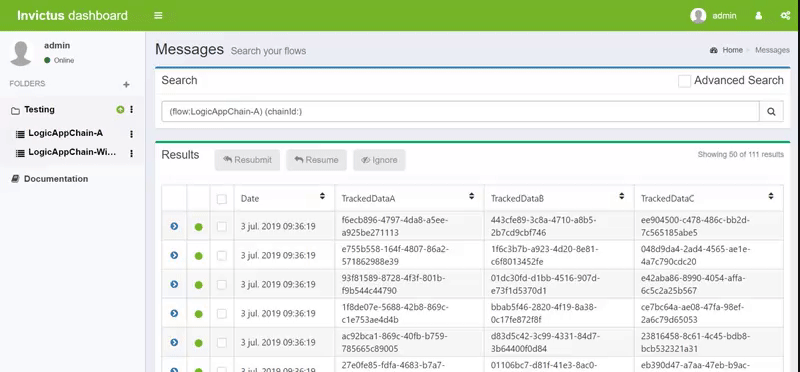
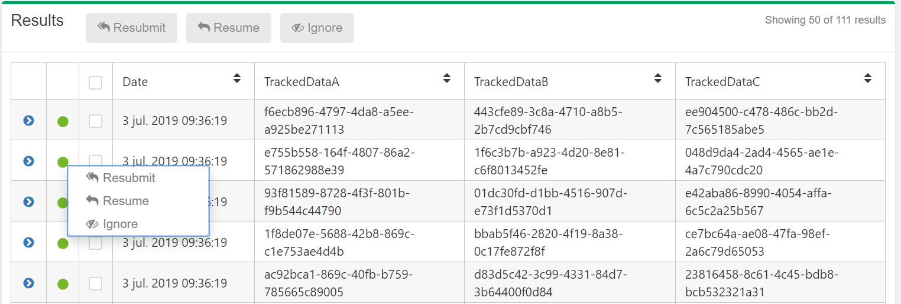
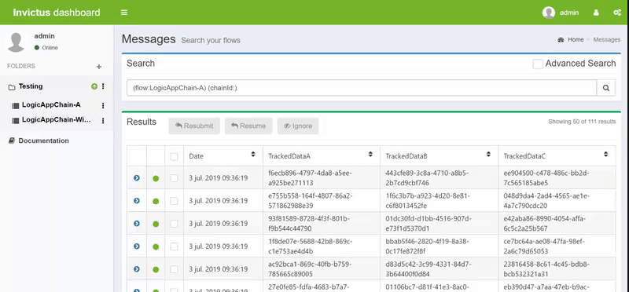
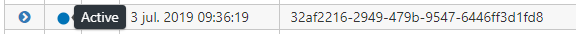
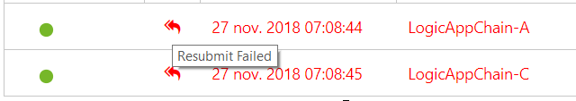
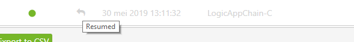
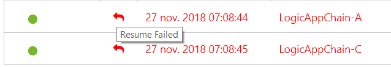
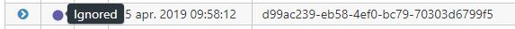

[home](../README.md) | [dashboard](dashboard.md)

# Dashboard Message Handling

It is possible to select one or multiple messages and handle them to either  resubmit, resume, reimport or ignore them.

As you may notice, in the messages page you will see 3 buttons that are disabled on load.

These buttons are enabled when one or multiple messages are selected.

To resubmit, resume, reimport or handle a message, you can either select the message or messages and click on the corresponding button or you can also right click on the status of the message where a context menu will appear with the same actions as well. This is to make an action on single flows.

If you want to perform a mass action on all messages at once, then you can check the top checkbox.

## Custom Resume and Resubmit and Reimport

It's possible to use a custom resubmit and resume, see [this page](custom-resumeresubmit.md) for more infromation.

## Resubmit

Resubmit will trigger the execution of any corresponding flow, even completed ones. When Resubmit is triggered, the first Logic App in the chain(execution tree) is resubmitted on Azure thus retriggering the whole flow.

When the user clicks on the Resubmit, the message starts processing and shows as Active.

When all the logic apps within the flow have completed their execution, the status of the messages will turn into Completed or Failed, whichever case would apply.

The logicapps that were resubmitted successfully will show greyed out and with an icon  that represents that the logicapp is resubmitted. When a message is done resubmitting and all its child logic apps completed execution,  you can see the status of the child logic apps inside the execution tree.

When a message is done resubmitting and any of its child logic apps failed, they will be shown like this.

## Resume

Resume only works on messages with the status Failed. Also, the Resume does not start from the first logic app within its flow, as with the Resubmit, but instead executes only the failed logic apps.

Now for the resume, it’s similar logic as with resubmit, only that in this case resume only works on Error state. When a message in error state is selected to be resumed, its status will become Active and all its failed logic apps will resume.

When the failed logic apps within the message flow completed its execution, the state will turn into Completed.

If any of the logic apps failed to do the resume, then the state will be Failed.

The logic apps that were resumed successfully will show greyed out and with an icon  that represents that the logicapp was resumed.

The logicapps that failed to resume will show like this.

## Reimport

Basically re triggers the merging process from Storage to SQL Server. This should only be used in cases where some messages are stuck in an incomplete state. Lately we never had these issues but if SQL server reaches 100% DTUs you might endup with data not fully updated.

## Handle

Users can choose to handle (ignore) a message, normally this could be the case when a message is in failed status. The user can select one or multiple messages and choose to "Ignore" them.

When a message has been set to be ignore, its status will change and show as follows

## Export

Users can select and export any of the messages to a CSV file. There are two options to export the messages, either exporting the selected properties or all the properties.

When Users click the "Export All to CSV", all the available properties for their messages will be exported.

On the other hand, if the users click the "Export Selected to CSV", only the selected properties from the properties dropdown at the top of the messages list will be exported.
