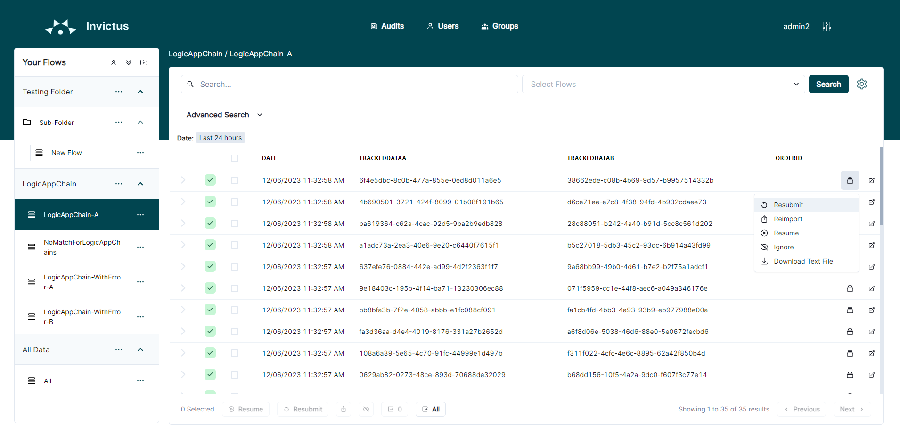
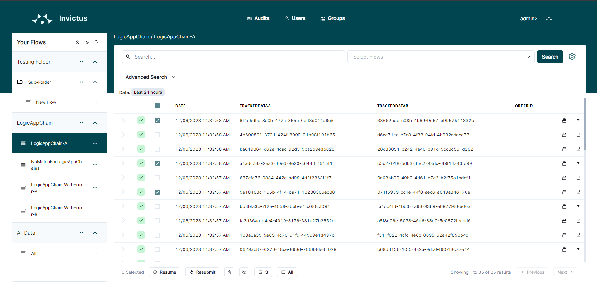
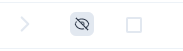

# Dashboard Message Handling

Users have to option to resubmit, resume and ignore one or many messages.

This can be done in one of two ways: 

* Handling a specific message
Click on the "Flow Actions" button which is present on each row in the messages table. Do this for the desired message. In the pop up menu, there are the available flow actions.

* Handling one or messages at once
Select the desired messages via their respective checkbox. At the bottom of the table there are buttons for each flow action. Clicking on the button will perform that action for all selected messages.

## Custom Resume and Resubmit

It's possible to use a custom resubmit and resume, see [this page](custom-resumeresubmit.md) for more information.

## Resubmit

The Resubmit functionality will always trigger an "Azure Resubmit" for the first LogicApp in the Chain. Resubmit will trigger the execution of any corresponding flow, even completed ones. When Resubmit is triggered, the first Logic App in the chain (execution tree) is resubmitted on Azure thus retriggering the whole flow.

If we had to take the above image as an example. If Resubmit is executed for this flow, "LogicAppChain-A" is Resubmitted on Azure. The below image is the outcome after "LogicAppChain-A" is re-executed through the resubmit.

## Resume

The Resume function executes an "Azure Resubmit" for each failed function in the chain. Resume only works on messages with the status Failed. Also, the Resume does not start from the first logic app within its flow, as with the Resubmit, but instead executes only the failed logic apps.

**The only exception is that if a Parent Logic App of a failed Logic App has also failed, then only the Parent is executed**.

## Ignore

Users can choose to ignore a message, normally this could be the case when a message is in failed status. The user can select one or multiple messages and choose to "Ignore" them.

When a message has been set to be ignore, its status will change and show as follows

## Export

Users can select and export any of the messages to a CSV file. There are two options. One will export all rows of the table whereas the other option will only exported any selected rows.
