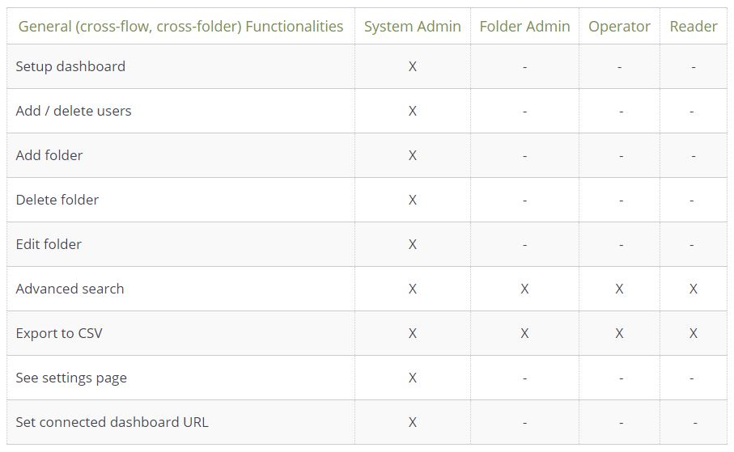
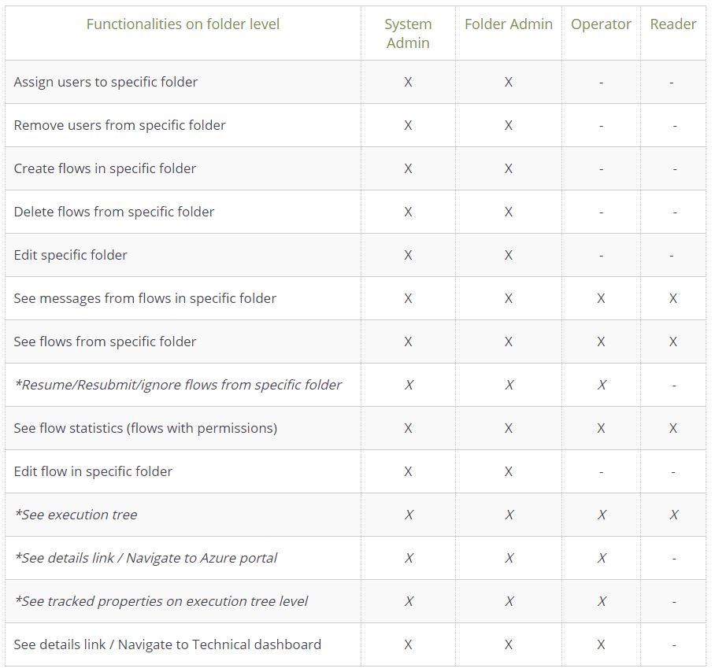

[home](../README.md) | [dashboard](dashboard.md) | [Role Management](role-management.md)

# Role Management

There are four roles to control the user access to folders and flows and perform certain tasks whithin the dashboard:

### System Admin
Automatically has all rights and access to all flows and folders, users with this role can also manage users and grant/deny access on folder level to other users. This role is assigned from the user management page on the Dashboard when either adding or editing a user by indicating if such user is System Admin or not. When a user is not System Admin, the user will be assigned the role and permissions on folder level. 

### Folder Admin
Does not have access to any folder/flow by default. This role is assigned to users on folder level by a System Admin user by selecting the users that will have Folder Admin privileges. This role can perform certain administrative tasks only within the folder where he/she is assigned to, and cannot manage users on the dashboard in general. 

### Operator
Does not have access to any folder/flow by default.  This role is assigned on folder level by selecting the users that need to have operator privileges on the folder.  Users with this role can perform certain tasks within the folder and its flows.

### Reader
Does not have access to any folder/flow by default. This role is assgned on folder level by selecting the users that need to have reader privileges on the folder. Users with this role can only see certain information and perform limited tasks within the folders and its flows. 

The following tables contain the list of functionalities and the differences regarding privileges between the four roles:

