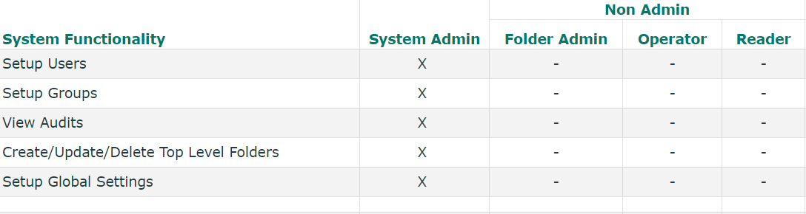
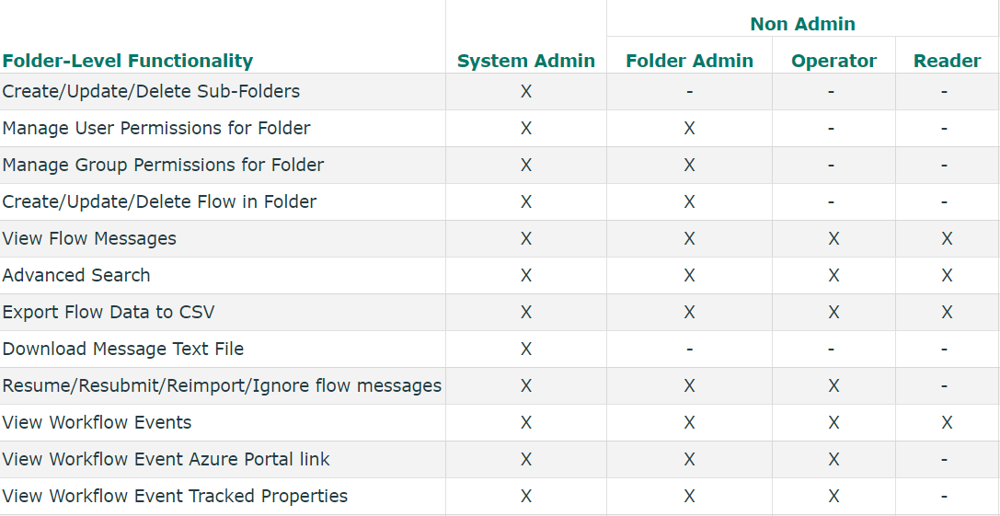

[home](../README.md) | [dashboard](dashboard.md) | [Role Management](role-management.md)

# Role Management

Roles in the invictus dashboard are separated into two categories: Global roles and folder level roles.

## Global Roles

### System Admin
A user with this role automatically has all rights and access to all flows and folders. Users with this role can also manage users and grant/deny access on folder level to other users. System admins may also setup group permissions, view audits and set up dashboard settings. 

### Non Admin
A user with the non-admin role will have not have access to any folder or flow by default and cannot perform any system wide operations. However, these users may then be granted folder level roles per folder.

## Folder Level Roles

### Folder Admin
Does not have access to any folder/flow by default. This role is assigned to non-admin users at a folder level by a System Admin. This role can perform certain administrative tasks only within the folder where they are assigned to but cannot manage users on the dashboard in general. 

### Operator
Does not have access to any folder/flow by default.  This role is assigned to non-admin users at folder level.  Users with this role have access to perform certain tasks within the folder and its flows.

### Reader
Does not have access to any folder/flow by default. This role is assigned to non-admin users at folder level. Users with this role only have permission to view flow data but cannot perform any operations. 

## Permissions per role

### System Wide Functionality Permissions

### Folder-Level Functionality Permissions

