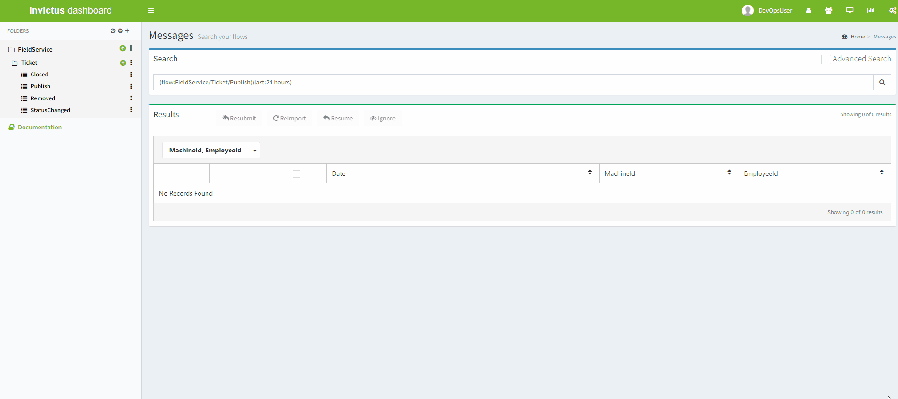

[home](../README.md) | [dashboard](dashboard.md)

# Dashboard Search

## Basic Search

The user is able to search through the search bar on top of the message screen. If no filters are selected, the search will be performed query wide.

## Advanced Search

There are 2 ways a user can make his/her search results more precise:

1. Using the search bar
2. Using the "Advanced Search" tab

### Using the search bar

You can use symbols or words in the search bar. For example put `invoice:` in front of your search term (`invoice:173` would mean that you are searching for invoice number 173).

The symbols or words in the search bar should match the flow property names (column title names).

### Using the advanced search tab

When you click the advanced search tab you can select the following filter options.

* **Date filter**: A user will have 4 options to choose from:

  * is after (start state)
  * is before (end date)
  * is in between (start date - end date)
  * is in the last (minute(s) - hour(s) - day(s) - week(s) - month(s)) |
* **Flow filter**: A user will be able to select the flow he/she wants to search on.
* **Flow property filter**: Once a user selected a flow, he/she will be able to select the properties he/she wants to search on.
  
  * "Contains" - search within the specified business property that contains a specific word.
  * "Starts With" - search within the specified business property that starts with a specific word.
  * "Ends With" - search within the specified business property that ends with a specific word.
  * "Equal To" - search within the specified business property that matches exactly the specific word.
  * "Not Equal To" - search within the specified business property that doesn't match the specific word.
  * "Regex" - search within the specified business property by using regex pattern. You can use these patterns below.
  
* **Chain ID**: A user can search by the chain id.
* **Status filter**: A user can select the following statuses:
  * Active - Shows all messages which are being processed as active, resubmit request, resubmitted, resume request, resumed.
  * Completed - Shows all messages that are completed (processed successfully).
  * Error - Shows all messages that are suspended, dehydrated or terminated or request failed and resume failed.
  * Ignored -  Shows all messages that are ignored.
