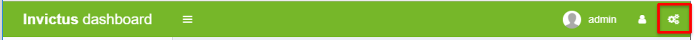
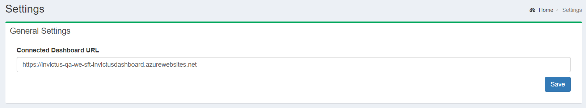
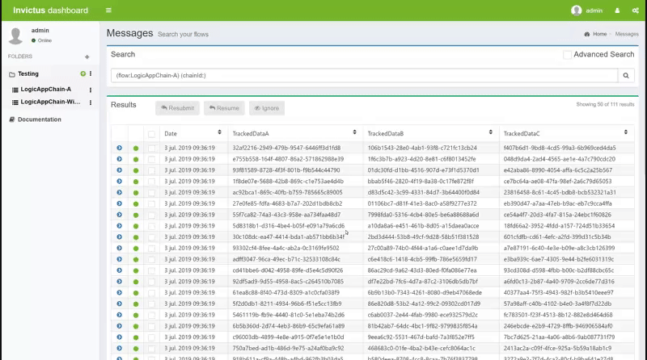
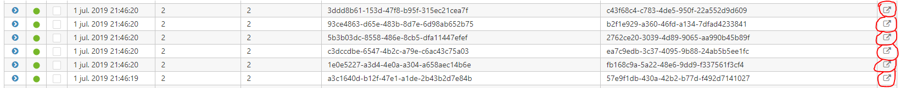

[home](../README.md) | [dashboard](dashboard.md)

# Dashboard Settings

From the top navigation bar, you can navigate to the Settings page, where you can find different available options to be set by the administrators.

As of now, there is only one configuration setting available which corresponds to the Connected Dashboard URL (hybrid link).

## Connected Dashboard

In a hybrid (BizTalk + Azure) setup, it is needed to have a link from one dashboard (BizTalk) to the other dashboard (Azure) for hybrid flows.  With the introduction of the claimcheck component, it is now possible to have one flow starting in the cloud and being continued on prem (and vice versa). With this feature it is allowed a click-through experience between the two different dashboards.

You will find the option to enter the Connected Dashboard URL which is the base url of the other dashboard which you want to connect to. The url must be the base url and then the dashboard will take care of the flow name, chain id etc.

After you enter the url, click on Save button so your changes are saved.

Now you need to enable the Connected Dashboard from the [Flow Management](foldersflows.md#Flow&#32;Management) section when either creating a new flow or editing an existing one. In this screen shot below, we are showing the Edit Flow example.

Now if you go in the flow messages page, you can see a new icon  at the right side.

When you click on the icon, you will be sent to the other dashboard with the flow name and chain id that you chose. If you are not logged in the other dashboard, it will direct you to the login page but with a return url. Once logged in, you will be redirected to the actual link.
