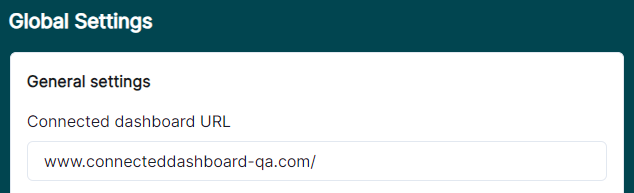
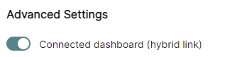
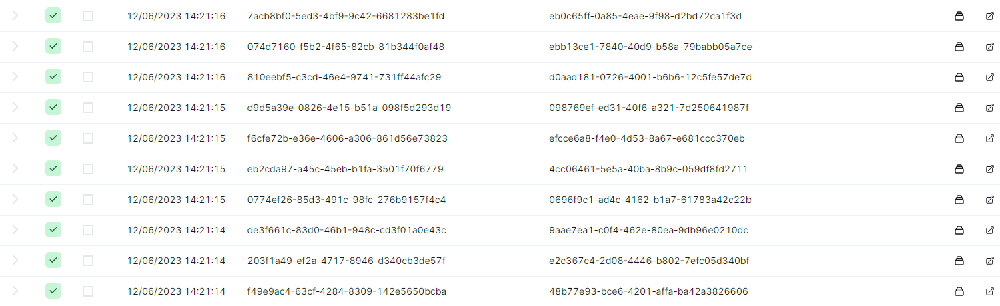

[home](../README.md) | [dashboard](dashboard.md)

# Dashboard Settings

In the top navbar, click on the settings icon button then click on Settings to navigate to the page.

## Connected Dashboard

In a hybrid (BizTalk + Azure) setup, it is necessary to have a link from one dashboard (BizTalk) to the other dashboard (Azure) for hybrid flows.  With the introduction of the claimcheck component, it is now possible to have one flow starting in the cloud and being continued on prem (and vice versa). With this feature it is possible to have a click-through experience between the two different dashboards.

You will find the option to enter the Connected Dashboard URL which is the base url of the other dashboard which you want to connect to.

Click on Save General Settings button to save your changes.

Now you need to enable the Connected Dashboard for the required flow. This can be done when either creating a new flow or editing an existing one. In this screen shot below, we are showing the Edit Flow example.

If you navigate to the page for that flow, a new button will be added at the right-hand side for each table row. Clicking on this button will navigate you to your specified Connected Dashboard URL for that message chain.

If you are not logged in the other dashboard, it will direct you to the login page but with a return url. Once logged in, you will be redirected to the actual link.
