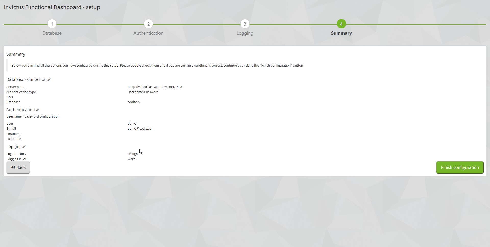

[home](../README.md) | [dashboard](dashboard.md)

# Dashboard Setup

To begin the one time setup of the dashboard, browse to `https://{yourdashboardurl}/setup`.

## Step 1 - Select Database

|Field|Description|
|--- |--- |
|Server name|The name of your database server instance. If the database is an Azure SQL database make sure the servername is entered as follows: tcp:servername.database.windows.net,1433|
|Username|The name of the user account to use for database authentication. If using default Username from ARM template use: InvictusFrameworkAdmin|
|Password|The password for the user account to use for database authentication.|
|Database|Select the database you want to connect to. By default coditcip will be selected, in a default setup you can leave this value|

## Step 2 - Authentication

|Field|Description|
|--- |--- |
|Username|The name of the user to use to login. This can be an e-mail address.|
|E-mail|The e-mail address of the user.|
|First name|The first name of the user.|
|Last name|The last name of the user.|
|Password|The password for the user. Should consist of minimum 8 characters, which should include 1 uppercase, 1 number and 1 special character.|

## Step 3 - Logging

|Field| Description |
|--- |--- |
|Logging directory|A directory that is available to write log files to. As default use: d:\home\site\wwwroot\logs|
|Logging levels|There are 6 pre-defined logging levels available.|

### Log levels

|Level|Description|
|--- |--- |
|Fatal|Highest level: important stuff down|
|Error|For example application crashes / exceptions.|
|Warn|Incorrect behavior but the application can continue|
|Info|Normal behavior like mail sent, user updated profile etc.|
|Debug|Executed queries, user authenticated, session expired|
|Trace|Begin method X, end method X etc|

Logging targets: More information [here](https://github.com/nlog/nlog/wiki/Targets)

Levels can be customized: More information [here](https://github.com/NLog/NLog/wiki/Configuration-file)

## Step 4 - Summary

Click 'Finish configuration' to complete the setup and start initializing the dashboard, once the initialization is complete you will be redirected to the login page where you then can login with the user you created in step 2.
