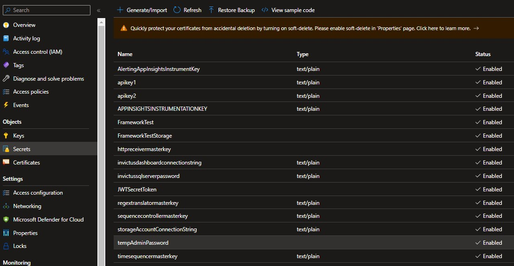
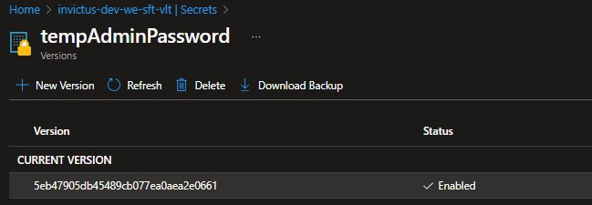
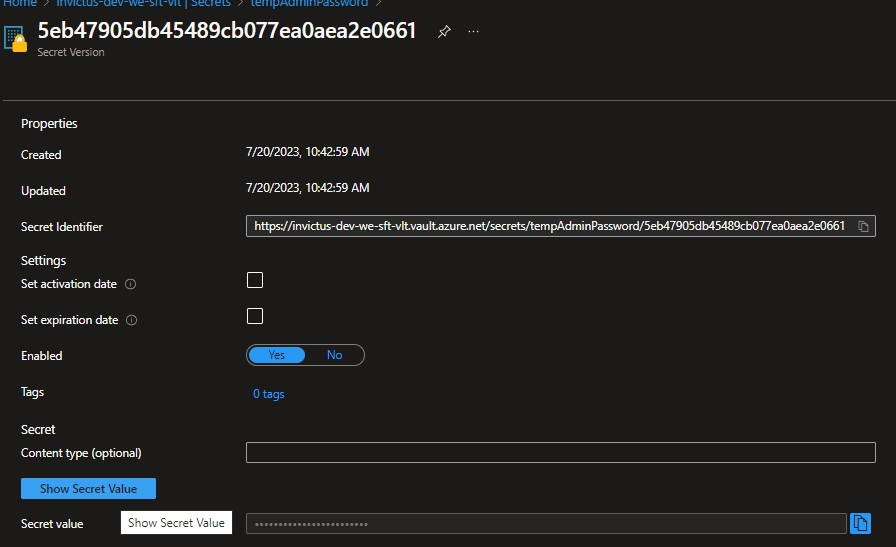
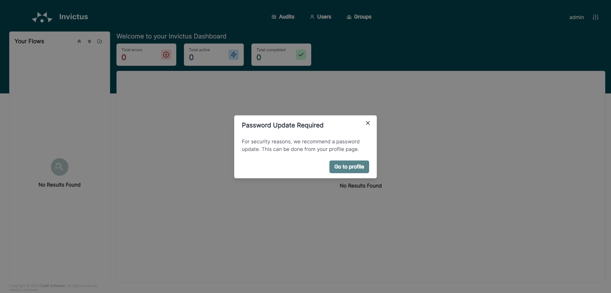

[home](../README.md) | [dashboard](dashboard.md)

# Administrator Account Setup Guide

Welcome, administrators! This guide is intended for those who are logging in for the first time on a new fresh installation of the system using this version.Please note that this guide is not applicable to administrators who are migrating from version 1 to version 2.

## Administrator Account Credentials

During the deployment of the system, an administrator account has been generated for your initial login to the dashboard.

### Credentials

- **Username**: admin

To obtain the password for the administrator account, follow these steps:

1. Go to the Azure Key Vault "secrets" page, where the password is stored.

   

2. Locate and click on the "tempAdminPassword" field, then select the current version.

   

3. Scroll to the bottom of the page and click on "Show Secret Value" to reveal the password.

   

4. Copy the password to use it for logging in with the administrator account.

Now that you have the necessary credentials, follow the steps below to log in to the dashboard:

1. Navigate to the dashboard by visiting `https://{yourdashboardurl}` in your web browser.

2. Enter the following credentials:
   - **Username**: admin (as provided above)
   - **Password**: (the password you copied from the Azure Key Vault)

   

3. After successfully logging in, you will be prompted to reset your password to one of your choice.

   

4. Congratulations! You can now continue using the system with your new password.

