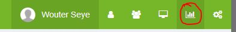
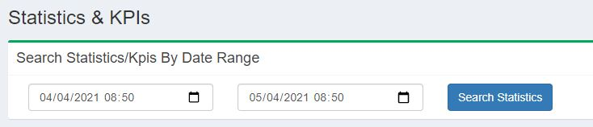
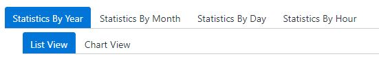
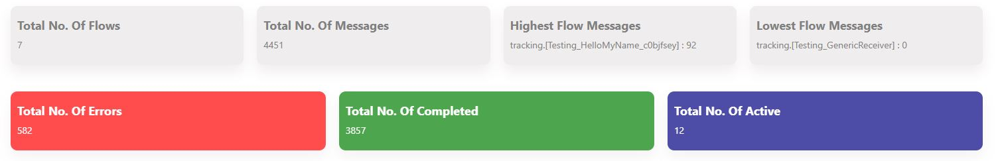
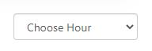
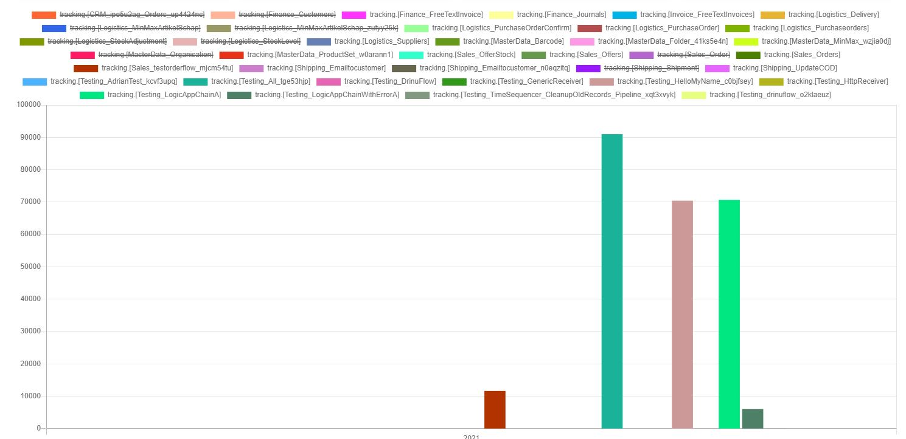
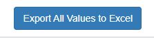
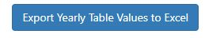

[home](../README.md) | [dashboard](dashboard.md) | [Statistics](stats.md)

# Statistics

This is a step by step on how to use the Statistics page.

To enable the KPIs function you will need to pass the following argument during your deploy task: **-enableStatisticsFunction "true"**

First of all you need to be a system admin to see the statistics page. A system admin can see all the statistics for every flow that exist.

If you are a system admin then you can see that now, on the top right of the header, you can see a small graph icon. Click on that.

From the top, you can filter by dates of what statistics you want to see.

As you can see, you can see statistics per Hour, Daily, Monthly and Yearly. You can as well see the data as a graph or as data in a grid view.

When you search for data, you notice that on chart view, on the top you see some quick stats. Total number of flows that exist from the date period you are searching with, total number of messages, the highest flow with messages and lowest. On the Hour tab, you will notice there is 3 other quick stats. Total number of messages with error status and completed and active.

In the hour tab, you can filter by hour using the drop down list.

On every graph, you can filter out the bar you don't want to include in the graph. You can just click on the name of the flow from the graph's legend.

You can export all the data to excel sheet by clicking on the Export All Values to Excel button from the filter section on the right.

If you don't want to export all the data, you can always go to the specific tab you want to export data from, go to List view tab and at the bottom you can see an export button.

