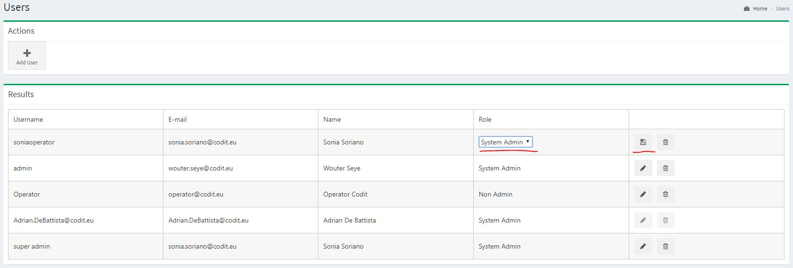

[home](../README.md) | [dashboard](dashboard.md) | [User Management](usermanagement.md)

# User Management

## Access user management page

Only users with System Admin privileges can access this feature.

1. To access the user management screen you have to click on the icon in the upper right corner.

2. You will now see an overview of all the Invictus Integration Dashboard users. You will also see the options to Add, edit or delete users. 

### Create a user

1. Click on the "Add User" button.

By default, the only available user after installing the dashboard is the user that configured it . By default, this user is a System Admin.

2. Specify all the user information + user role (System Admin or Non admin). Non admin users will be assigned a specific role on folder level.

### Delete a user

1. To delete a user click on the delete icon next to the user in the user list

### Edit a user role

1. To edit a user click on the edit icon next to the user in the user list

2. You can change the role of the user and save the changes. 

