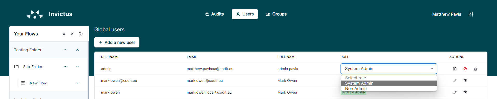

[home](../README.md) | [dashboard](dashboard.md) | [User Management](usermanagement.md)

# User Management

## Access user management page

In the top navbar, click on the Users button. Only users with the System Admin role may access this page.

This page displays an overview of all the Invictus Dashboard users. There is the option to Add, edit or delete users. 

### Create a user

1. Click on the "Add a new user" button.

2. Specify all the user information and the user role (System Admin or Non admin). Non Admin users can later be assigned a specific role at a folder level.

### Delete a user

1. To delete a user click on the delete icon next to the user in the user list. Confirm your decision in the confirmation box.

### Edit a user role

1. To edit a user click on the pencil edit icon next to the user in the user list

2. You can change the role of the user and save the changes. 

