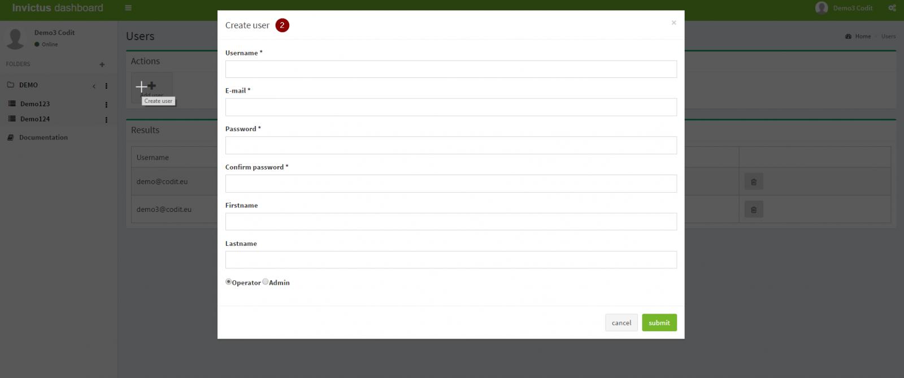

[home](../README.md) | [dashboard](dashboard.md)

# Dashboard User Management

## Manage Users

To access the user management screen you have to click on the icon in the upper right corner.

### Create a user

By default, the only available user after installing the dashboard is the user that installed it, this user is an admin.

Click on the "Add user" button.

Specify all the user information + user role (operator or admin)

### Delete a user

To delete a user click on the delete icon next to the user in the user list.

## Assign users to folders

**Note that user(s) should be created before assigning a folder.**

1. Click on the 3 dots next to the folder name.

   

2. Several option will pop-up. Choose 'assign users'.

   

3. Search and select the users that you want to assign to that folder.

   

4. Click "Assign users"
