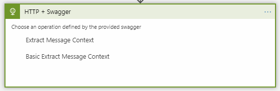
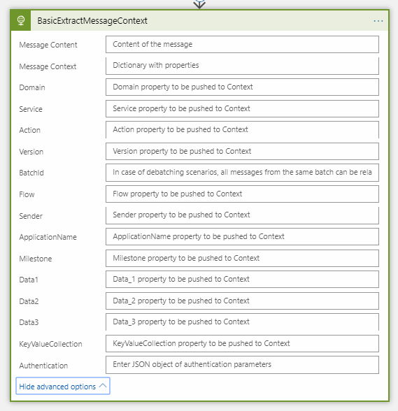
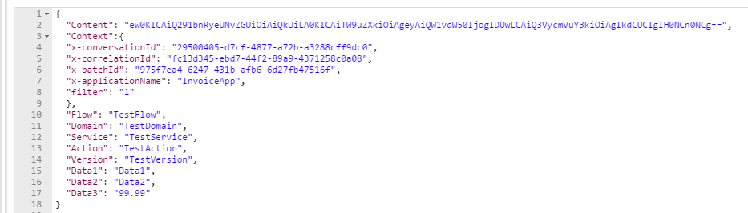
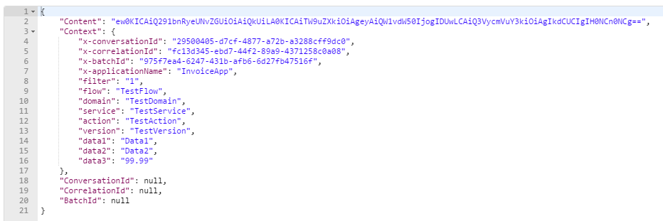

# Matrix - Basic Promotion

> ## ⚠️ Attention
> This is the V1 version of the Matrix, which is deprecated and will thus no longer be extended.
> 
> Maximum supported .NET version is .NET Framework 4.7.1
> 
> For the supported version, please see [Transco Matrix V2](../transcoV2-Matrix.md)

## Introduction

The basic promote is a simplified version of the Matrix component. This version does not accept a config it just simple accept a list of parameters and promotes them to the Context. Values are not mandatory, any values not supplied will not be present in the response object and will be ignored

List of data objects supported:

* KeyValueCollection: Key-Value collection
* Flow: string
* Service: string
* Action: string
* Version: string
* Sender: string
* ApplicationName: string
* Milestone: string
* ConversationId: string
* CorrelationId: string
* BatchId: string
* Data1: string
* Data2: string
* Data3: string

## Setup

1. To setup this component follow the same steps as in the [Matrix Promotion](matrix-promote.md). The only difference is that when choosing the function, this time choose Basic Extract Message Context.

   

2. After choosing Basic Extract Message Context, you will notice the difference from the normal extract function. This one has more parameters but is limited to those only. Any value passed in the parameter boxes will be now automatically pushed to the Context. All new parameters added except an object value, anything passed here will be promoted to the Context as a KeyValue. **The only exception is the KeyValueCollection**.  This works exactly like the current Message Context property, it accepts a list of KeyValue items, but instead of promoting the object as a whole, it pushes each item within KeyValueCollection to the Message Context. Refer to section below for more information.

   

## KeyValueCollection

As stated above the KeyValue collection acts exactly like the Context. It takes a key value pair collection and promotes each item to the context. In the images below notice how all the items in KeyValueCollection have individually been pushed to the Context. **Do keep in mind that no Key collisions can occur since internally this is using a Dictionary**.

Request:


Response:


## Testing

After setting up your logic app use the below request to test this action. Notice how all properties are pushed to the context. Refer to Extract Message Context - User Guide Test section if you need more information how this can be setup.

Sample request:

```json
{
       "Content": "ew0KICAiQ291bnRyeUNvZGUiOiAiQkUiLA0KICAiTW9uZXkiOiAgeyAiQW1vdW50IjogIDUwLCAiQ3VycmVuY3kiOiAgIkdCUCIgIH0NCn0NCg==",
       "Context": {
        "x-conversationId": "29500405-d7cf-4877-a72b-a3288cff9dc0",
        "x-correlationId": "fc13d345-ebd7-44f2-89a9-4371258c0a08",
        "x-batchId": "975f7ea4-6247-431b-afb6-6d27fb47516f",
        "x-applicationName": "InvoiceApp",
        "filter": "endtoendintegrationtests"
     },
     "KeyValueCollection": {
        "w": 3,
        "l": 10.2,
        "h": 1,
        "w": 200,
    },
      "Flow": "fl1",
      "Service": "sr1",
      "Action": "Ac",
      "Version": "Vs",
      "Sender": "Snd",
      "ApplicationName": "Snd",
      "Milestone": "2018",
      "ConversationId": "29500405-d7cf-4877-a72b-a3288cff9dc0",
      "CorrelationId": "29500405-d7cf-4877-a72b-a3288cff9dc0",
      "BatchId": "29500405-d7cf-4877-a72b-a3288cff9dc0",
      "Data1": "d1",
     "Data2": "d2",
      "Data3": "d3"
}
```

Expected Response:

```json
{
    "Content": "ew0KICAiQ291bnRyeUNvZGUiOiAiQkUiLA0KICAiTW9uZXkiOiAgeyAiQW1vdW50IjogIDUwLCAiQ3VycmVuY3kiOiAgIkdCUCIgIH0NCn0NCg==",
    "Context": {
        "x-conversationId": "29500405-d7cf-4877-a72b-a3288cff9dc0",
        "x-correlationId": "fc13d345-ebd7-44f2-89a9-4371258c0a08",
        "x-batchId": "975f7ea4-6247-431b-afb6-6d27fb47516f",
        "x-applicationName": "InvoiceApp",
        "filter": "endtoendintegrationtests",
        "flow": "fl1",
        "service": "sr1",
        "action": "Ac",
        "version": "Vs",
        "ApplicationName": "Snd",
        "Milestone": "2018",
        "data1": "d1",
        "data2": "d2",
        "data3": "d3",
        "sender": "Snd",
        "w": 3,
        "l": 10.2,
        "h": 1,
        "w": 200
    },
    "ConversationId": "29500405-d7cf-4877-a72b-a3288cff9dc0",
    "CorrelationId": "29500405-d7cf-4877-a72b-a3288cff9dc0",
    "BatchId": "29500405-d7cf-4877-a72b-a3288cff9dc0"
}
```
