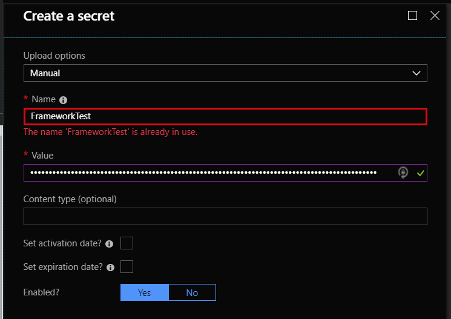

# Transco

> ## ⚠️ Attention
> This is the V1 version of the Transco, which is deprecated and will thus no longer be extended.
> 
> Maximum supported .NET version is .NET Framework 4.7.1
> 
> For the supported version, please see [Transco V2](../transcoV2.md)
>
> For the migration guide from v1 to v2 see [here](../transcoV2.md#Migrating-Transco-v1-to-v2)

## Introduction

The Transco connector will be mainly used to promote properties from the database, it will use the content or the context to form the query and retrieve the data from the specified tables. The Transco now also support JSON content and will promote any key & value to the specified JPath. All configs are to be stored in the storage container setup by the Resources ARM Template. The container which will house all configs is named: `transcoconfigsstore`.

This container will be made available on Startup of the Transco API. All Logic apps using this connector will have a dropdown available which loads all configs located in the storage blob container.

All technical logs are pushed to Application Insights, the setting for this can be found in the AppSettings of the API and can be switched to any other AppInsights. Authentication between the API and Key Vault will be handled using Managed Service Identity. This is all setup through the ARM template release.

For more information about the matrix functionality, follow the guides in the below pages:

* [Transco Extraction](transco-extraction.md)
* [Transco Custom Assemblies](transco-assemblies.md)

## DbAlias

The Transco component for IfA uses KeyVault to retrieve the DBAlias connection string. All Database connection strings are stored as secrets.

1. Get the DBAlias name from the Transco config.
2. Create a connection string pointing to the Database you wish to connect to : `Server='[SERVERNAME]';Database='[DATABASENAME]';User Id='[USERLOGINID]';Password='[PASSWORD]';`
3. Go to KeyVault that is located in the IfA setup in Azure
4. Go to Secrets and Add a secret: Remember to use the DbAlias property value as the Name and the configured connection string as the Value.

> 
