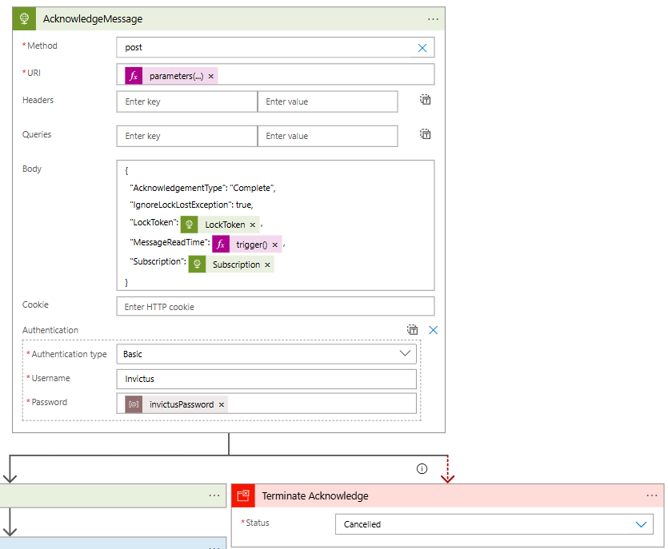

[home](../../README.md) | [framework](../framework.md)

# Publish / Subscribe

## Introduction

This documentation will give you an overview of the PubSub and will help you setup a Logic app and use all 3 PubSub Connectors.

1. Publish  
2. Subscribe
3. Acknowledge

The PubSub connector will be mainly used to push messages to service bus using the Publish connector and then Route messages to different subscriptions using the Subscribe connector along with the Filter functionality it exposes. The acknowledge is then used to flag a message that it has been received, stopping it from being picked up again and re processed.

## General Information

* ConversationId, BatchId, CorrelationId will be available as inputs in Publish and Outputs in Subscribe
* Basic Authentication is used for API Authentication, this will require authentication for each connector
* Passwords for API authentication - ApiKey1 and ApiKey2 will be stored in KeyVault
* Each request can have a max size of 100mb
* Delete on Receive is only there in case anyone really needs it. By default the connector will use PeekLock.
* Topic name used by PubSub API will be "PubSubRouter"
* Servicebus Rule name will use the follwing pattern: `$"{subscriptionName}-{DateTime.Now:yyyyMMddHHmm}"` ex: PublishLogicApp-201803211534
* Timeout for Subscribe is set to 75 seconds by default
* Blob Storage will only be used when message is greater than 256kb. This is configurable at API level.
* Connectors can both be added using Http+Swagger and Azure App Services connector 
* Subscribe should always use the LogicAppName as the subscription property. This can be done when using ARM deployments or typed manually 
* Message time to live will be set to 3 months

### x-ms-workflow-run-id

The **x-ms-workflow-run-id** HTTP header is passed by the LogicApp runtime to the Publish function. The Publish function then **promotes** this value to the **Message Context** which is then available for the developer within the subscribing logic app. This is mainly used for the execution tree to chain logic apps/workflows together.

### Message Id

The MessageId property in the Publish will be used for duplicate detection. This property is not required and can be left empty, if left empty the property will be randomly generated thus treating all messages as new messages. If the property is set, the MessageId supplied will be set as the ID before publishing to ServiceBus. By default, all topics are created with a 1hr duplicate detection policy.

## Creating a new Logic App & Using PubSub Connectors

### Publish Connector

1. Start by creating a new Blank Logic App From Azure Portal
2. Click on Edit to open the LogicApp Designer, if asked what type of template you want, choose blank

   

3. The first step when starting a new Logic app is to add a **Trigger.** A logic app must always start with a Trigger connector.
4. Since the publish is **not** a **trigger** but an action we will need to choose a trigger from the list available. For this example we will add a **Request** trigger
5. Setup the HTTP Request as seen in the image below. The Request Body is basically the schema of the json you will be Posting to this connector

   

6. After setting up the above trigger, we will now add an action connector. We will now use the Publish connector which uses the InvictusFramework API. All this is abstracted but in reality, all calls act exactly like API calls
7. Click on **New Step** and select **Add an action**
8. Choose Http+Swagger

   

9. Enter the swagger url (eg: for PubSub <https://invictus-dev-we-sft-pubsubapp.azurewebsites.net/swagger/docs/v1>).

   

10. Then choose the function you wish to use as a connector. For this example choose **Publish**.
11. Populate the fields with the parameters you wish to pass to Publish.

    

12. Notice that Content was wrapped in base64. The reason this needs to be done is because Publish takes a byte\[\] as input for **Message Content**. The Context object is simply passed without modification, this is expected to be a key value pair list.

    

13. By clicking **Show advanced options**, you will get to see more properties which most of the time are not required.

    

14. Although Authentication can be found under advanced, since the API which is exposing the custom connectors is using Basic Authentication, this has to always be populated. Use the below Json structure to setup Basic Auth for the connector. **More info can be found with the official documentation of logic apps.**

    

15. The password for the API can be retrieved from AzureKeyVault by using either ApiKey1 or ApiKey2.

    

16. At this point you can continue adding more actions if required. For this example this will conclude the use of the Publish Connector.
17. Click Save.

### Subscribe & Acknowledge

1. Start by creating a new Blank Logic App From Azure Portal
2. Click on Edit to Open the LogicApp Designer, if asked what type of template you want, choose blank.

   

3. We will now add the Subscribe Trigger
4. Search for Http+Swagger
5. Enter the swagger url.
6. Then choose the function you wish to use as a connector. For this example choose **Subscribe**.
7. Setup the connector
    * The subscription name ideally should be set the same as the logic app name, this is then used by servicebus
    * Filter is used to filter on the context properties
    * Receive timeout is optional and is set to 75000 by default and can be left blank
    * Batch size is defaulted to 10 and can be left blank
    * Delete On Receive can also be ignored and is set to No by default, thus using PeekLock
    * Authentication needs to be set since the connector API uses basic authentication
    * The Interval frequency is used by the LogicApp Runtime to indicate the frequency the Logic App is triggered.

      

8. After this connector is set click on **New Step** again and add the **Acknowledge** function, repeating the same steps used for **Publish/Subscribe**
    * The previous Subscribe connector returns the subscription value supplied as a parameter, as output, use that in the acknowledge connector to avoid typing the wrong subscription value
    * Lock token is also supplied with the data returned by the Subscribe Connector
    * Choose the AcknowledgeType, normally it would always be Complete
    * Set IgnoreLockLostException if you do not want to throw an error if the lock is not found. For example in case of a Resubmit of the Logic App.
    * Set the MessageReadTime to @trigger()['startTime'] when IgnoreLockLost=true and you want to avoid duplicate messages. Invictus will resend the message when it has not received an Acknowledgement within the lock timeout. By setting this parameter, the Acknowledge will not ignore the LockLostException if this startTime is more than the set lock timeout on the message (default 1 minute). The exception should be catched and handled.
    * Set the authentication the same as you did in the previous connectors 

      

9. Click Save

## Test

To test the above functions, you can use Postman. Before doing this part ensure that both Logic Apps have been setup as described. It is also important to have Subscribe setup before attempting to Post a request, as this will create both the topic and subscription on service bus. Without the Topic and Subscription, it is guaranteed that the first message posted will fail and no messages will be available.

1. Get the url exposed by the **Publish Request trigger**

   

2. Send a POST request using the below Json or anything that matches the schema which you setup when creating the HTTP request trigger.

   

3. You should receive 202 if request was Accepted

To confirm that both Logic apps are now working and handling the messages as expected go to each Logic App on Azure. Review the Run History for Both Logic Apps.

It is important to confirm that the Data sent in Publish is what is being outputted in the Subscribe. This can be achieved by clicked on any of the rows in the table shown below.

You will be taken to another screen where you will be able to view all input and outputs.

