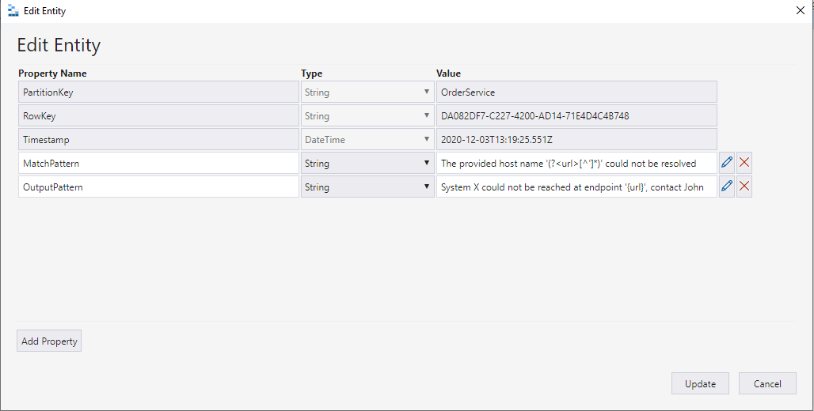
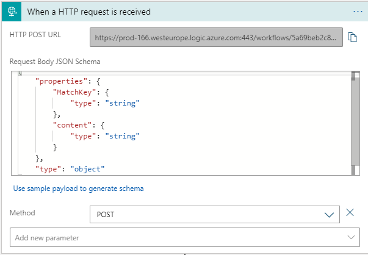
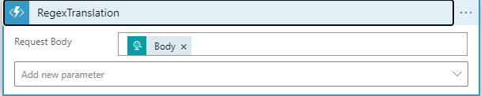
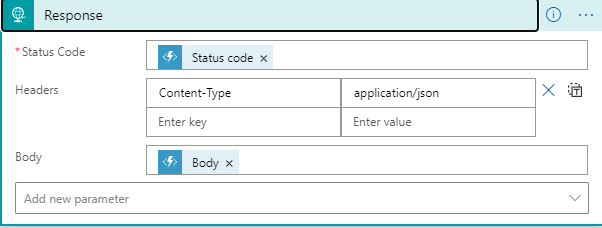

# Regex Transalation

## Introduction

This documentation will give you an overview of the Regex Translation component and will help you use it. The following function will be exposed by this component:

- RegexTranslation

### Overview

The scope of the Regex Translator is to translate a given message using regex and based on the **MacthKey** provided an entity will be retrieved from an Azure Table Storage with the associated translation of the message.

### Parameters

|Name|Required|Description|
|--- |--- |--- |
|Content|Yes|A base64 string that will be used in the translation|
|MatchKey|Yes|An array of type string|

## Azure Table Storage Config

Create a table called RegexTranslator within a dedicated Storage Account. 

By default the table will consist of 3 properties.

- PartitionKey
- RowKey
- Timetamp

Within the table 2 properties of type string have to be added when creating a new entity:

- MatchPattern
- OutputPattern

**Note: Upon startup the application will check if a table called RegexTranslator exists. If the table does not exist a table with that name will be created. The newly created table will not have any properties these will have to be added manually.**

## Input

### Sample Request Schema

`{
  "Content": "The provided host name 'asdfasdfaasdfasdfasdfasdfasdfasdfsdf.com' could not be resolved",
  "MatchKey": ["OrderService", "InvoiceService"]
}`

When setting up your Logic App, the HttpRequest is to be setup as follows:

The request is then followed by the execution of the function **RegexTranslation** as follows:

## Output

After the message is translated, the result for a successful translation returns the translated message:

`{
    "content": "System X could not be reached at endpoint 'asdfasdfaasdfasdfasdfasdfasdfasdfsdf.com', contact John"
}`

If the translation is unsuccessful, the output returned will either be the original message or specific error message:

`{
    "content": "The provided host name asdfasdfaasdfasdfasdfasdfasdfasdfsdf.com could not be resolved"
}`

The response to the function **RegexTranslation** is to be setup as follows:

