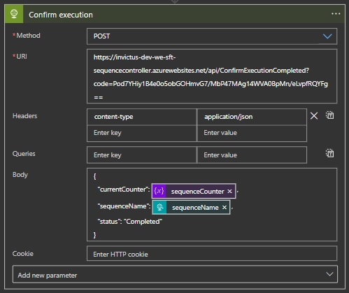

# Sequence Controller

## Overview

The Sequence controller will be mainly used to process LogicApp runs in order. The Sequence Controller exposes 3 actions:

- GetSequenceNumber
- WaitForExecution
- CompleteExecution

### GetSequenceNumber

This call is not required but we do request that it is used if possible. This call will basically check with the Database what sequence number is next in line. So assuming the process is going upwards starting from 1, if the sequence has reached number 6, then as expected the number 7 will be returned as the next sequence number. This call eliminates the need for the user to track/manage the sequence.

|Name|Required|Sample Value|Description|
| --- | :---: | --- | --- |
|sequenceName|Yes|SampleSequence1|This is the name given to a sequence, this has to be unique per sequence when processing a chain of requests|
|sequenceStart|Yes|1|This is the starting value of the sequence, this in reality is only required on the very first call to GetSequenceNumber but has no effect and should still be passed on subsequent calls|

> 

### WaitForExecution

This call will check if the request should be processed or if it should be queued. This is done by checking if the counter assigned to the request is within sequence and by also checking if the previous counter in the sequence was processed. As stated earlier, you are not required to use GetSequenceNumber and can directly use WaitForExecution by managing the counter yourself, although this is not suggested.

|Name|Required|Sample Value|Description|
| --- | :---: | --- | --- |
|sequenceName|Yes|SampleSequence1|This is the name given to a sequence, this has to be unique per sequence when processing a chain of requests|
|counter|Yes|1|This is the value assigned to the call, this has to be also unique per call|
|callBackUri|Yes|1|This is the callbackUrl available for the Webhook via logicapps|

> 

### CompleteExecution

This call will mark the "currentCounter" as completed. This will then trigger a process to check if any other sequence item is queued. If the next item in the sequence is found and is in a queued state, the action will trigger it to be processed. 

|Name|Required|Sample Value|Description|
| --- | :---: | --- | --- |
|sequenceName|Yes|SampleSequence1|This is the name given to a sequence, this has to be unique per sequence when processing a chain of requests|
|currentCounter|Yes|1|This is the counter value that has been processed|
|status|Yes|Completed|This value marks the item as Completed, although no other values are currently present, this has been included in case other statuses are requested in the future, as of now just pass "Completed". A "Processing" status is also used in the background but should never be passed.|

> 

### ResetSequenceFunction

This call will reset the sequence and delete all form of data related to it. This should only be used by admins and should not be part of any flow unless you are completely aware of its repercussions.

|Name|Required|Sample Value|Description|
| --- | :---: | --- | --- |
|sequenceName|Yes|SampleSequence1|This is the name given to a sequence, this has to be unique per sequence when processing a chain of requests|
