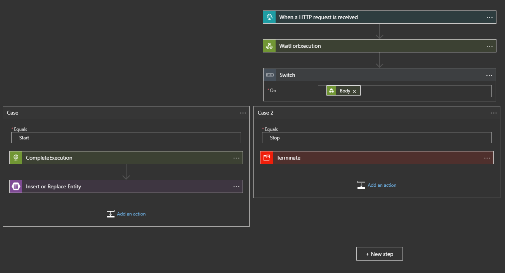
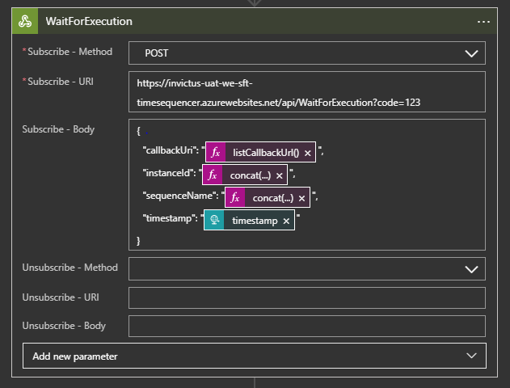
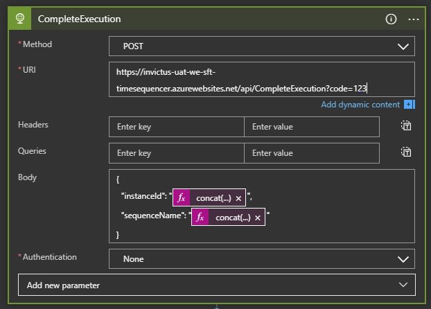

[home](../../README.md) | [framework](../framework.md)

# Timesequencer

## Introduction

Timesequencer is a component that ensures that old entity updates will never overwrite newer updates to the same entity.  This is done, based on the timestamp that originates from the source system.

The Timesequencer uses Function authorization, so the URL will contain all the authentication details, no Authentication is to be passed when calling the Function. Internally the timesequencer uses SQL Server to manage and queue all it's requests. A cleanup job is also added to DataFactory to cleanup the tables used by the function.

### Functions

The Timesequencer Azure Function exposes four functions:

The below two are used by the developers when setting up their flows:

* WaitForExecution [POST]
* CompleteExecution [POST]

The below two are used internally the Azure Function and should be ignored:

* PerformCallbackAction
* PerformCallbackOrchestrator

### WaitForExecution

WaitForExecution should be used by a Webhook action in a LogicApp. This function will queue your request and check if processing should continue, stop or wait. This is determined by checking if a current request with the SameSequence name is already being processed. The logic will skip the request and return a Stopped result if it finds a more recent request queued in the database.

POST Request Object:

```
{
  "callbackUri": "@{listCallbackUrl()}", //This property is exposed by the Webhook LogicApp action, this value should be supplied to the Timesequencer
  "instanceId": "[STRING]", //The ID assosited to the request. SequenceName and InstanceId form the PrimaryKey for the request
  "sequenceName": "[STRING]", //The ID used to group requests togheter, //SequenceName and InstanceId form the PrimaryKey for the request
  "timestamp": "[DATETIME]" //The time the request was generated ex: file last update time
}
```

### CompleteExecution

CompleteExecution is used to complete a request and to trigger any pending webhook callbacks.

POST Request Object:

```
{
 "instanceId": "[STRING]", //The ID assosited to the request. SequenceName and InstanceId form the PrimaryKey for the request
 "sequenceName": "[STRING]"The ID used to group requests togheter, //SequenceName and InstanceId form the PrimaryKey for the request
}
```

### Logic App Timesequencer Sample Diagram

> 

As can be seen in the image above, the Webhook executes WaitForExecution to register the request and also check if it should proceed with the execution, wait for the callback to be called or if the process should terminate. If a Stop command is returned then the Terminate case will be executed. If the result is Start then the LA will proceed to executing CompleteExecution which will mark the request as Processed and also trigger any callbacks related to the current SequenceName.

> 

> 
