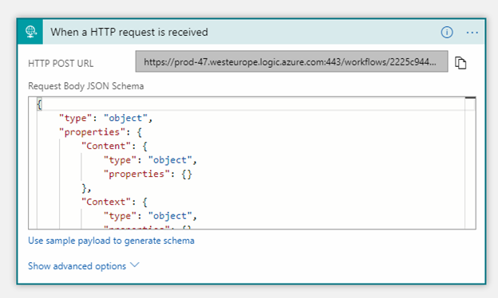
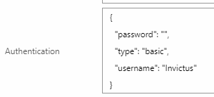

[home](../../README.md) | [framework](../framework.md) | [transco](transco.md)

# Transco - Extraction

> ## ⚠️ Attention
> This is the V1 version of the Transco, which is deprecated and will thus no longer be extended.
> 
> Maximum supported .NET version is .NET Framework 4.7.1
> 
> For the supported version, please see [Transco V2](transcoV2.md)

## Introduction

This documentation will give you an overview of the Transo component and will help you setup a Logic app and use the Transco Action.

### ID default Behavior

The below table applied to: ConversationId, CorrelationId, BatchId

|Provided in Context|Provided in Textbox|Result|
|--- |--- |--- |
|Yes|Yes|Value of Logic App Textbox input|
|Yes|No|Value of Context|
|No|Yes|Value of Textbox input|
|No|No|Auto Generated|

## Creating a new Logic App & Using Transco Connectors

1. Start by creating a new Blank Logic App From Azure Portal
2. Click on Edit to open the LogicApp Designer, if asked what type of template you want, choose blank

   

3. The first step when starting a new Logic app is to add a **Trigger.** A logic app must always start with a Trigger connector.
4. Since the publish is **not** a **trigger** but an action we will need to choose a trigger from the list available. For this example we will add a **Request** trigger
5. Setup the HTTP Request as seen in the image below. The Request Body is basically the schema of the json you will be Posting to this connector

   

6. After setting up the above trigger, we will now add an action connector. We will now use the Publish connector which uses the InvictusFramework API. All this is abstracted but in reality, all calls act exactly like API calls
7. Click on **New Step** and select **Add an action**
8. Choose Http+Swagger and enter the swagger url for the Transco API.

   

9. Then choose the function you wish to use as a connector. For this example choose **TranscoExecution**
10. Populate the fields with the parameters you wish to pass to Transco Extract Function.

    

11. Notice that Content was wrapped in base64. The reason this needs to be done is because Publish takes a byte\[\] as input for **Message Content**. The Context object is simply passed without modification, this is expected to be a key value pair list.

    

12. Also set the **Transco Config**. This list is loaded from the Azure Blob Storage container **transcoconfigsstore**. If no items are present in the list simply import the desired configs to the container. Make sure that the configs are valid Transco Config xml files. Enter custom value is also possible if the selection of the file is dynamic, but you must ensure that this value matches the name of the desired blob.
13. By clicking _Show advanced options_, you will get to see more properties which most of the time are not required.

    

14. Although Authentication can be found under advanced, since the API which is exposing the custom connectors is using Basic Authentication, this has to always be populated. Use the below Json structure to setup Basic Auth for the connector.

     

15. The password for the API can be retrieved from AzureKeyVault by using either ApiKey1 or ApiKey2

     

16. At this point you can continue adding more actions if required. For this example this will conclude the use of the Transco Connector.
17. Click Save.

## XSL Transform

The XSLT transform is also included in the logic app version. XSLT files should be stored in the same location as the config files: **transcoconfigsstore**.

> 

The file displayed in the image above will the be retrieved and the transformation is then applied on the message.

## BeforeMapping and AfterMapping

You can apply a transformation to the document using a lookup in a SQL database. This can be done before or after the XSLT is applied, hence the name BeforeMapping and AfterMapping.
The following information applies to both BeforeMapping and AfterMapping.

### Basic Table Mapping

The easiest way to update a field in a document is when you have a table where 1 or more columns contain the source values and 1 column the destination value.
This case, specify the table name in the Table attribute and the column names in the FieldName.
Transco will search for a row which matches the source columns and return the value of the column specified in Dest/@FieldName.

```xml
    <Transco DBAlias="FrameworkTest" Table="CustomerRequests" Mandatory="true" Active="true" DisableCaching="false" SQLCommand="" Scope_prefix="tst" Scope_xmlns="http://schemas.codit.eu/framework/tests" Scope="/tst:CustomerList/tst:Customer">
      <Source FieldName="CustomerId" Source="Message" xPathValue="@Id" />
      <Source FieldName="CountryCode" Source="Message" xPathValue="@Country" />
      <Dest FieldName="CreationDate" Optional="true" DefaultValue="DEFAULT" xPathValue="." />
    </Transco>
```

### Scope, Scope_prefix and Scope_xmlns
Scope is an xpath expression which points to a section in the document.
The xpath expressions in Source and Dest are relative to this scope.
In Scope_prefix you specify the prefix which can be used in the Scope and xPathValue fields.
Scope_xmlns must contain the namespace of the xml document.

### Context Properties
As the source field, you can also use a context property instead of a value from the message.
You can access a context property by an xpath expression as shown in the following example:

```xml
<Source FieldName="" xPathValue="//MessageInfo/ContextInfo/Property[@Name='ContextPropertyName']/@Value" Source="Context" />
```

### SQL Query
You can also specify an SQL query instead of a table.
Placeholders enclosed by brackets are replaced by the Source values in the specified order.
The following example does the same as the basic table mapping.
```xml
    <Transco DBAlias="FrameworkTest" Table="" Mandatory="true" Active="true" DisableCaching="false" SQLCommand="SELECT CreationDate WHERE CustomerId = '{0}' AND CountryCode = '{1}'" Scope_prefix="tst" Scope_xmlns="http://schemas.codit.eu/framework/tests" Scope="/tst:CustomerList/tst:Customer">
      <Source FieldName="" Source="Message" xPathValue="@Id" />
      <Source FieldName="" Source="Message" xPathValue="@Country" />
      <Dest FieldName="" Optional="true" DefaultValue="DEFAULT" xPathValue="." />
    </Transco>
```

### Stored Procedure
You can also call a stored procedure instead of a SELECT statement.
In the SQLCommand attribute, specify EXEC followed by the stored procedure name and the parameters of the stored procedure.
For example:

```
EXEC MyStoredProcedure '{0}', '{1}', '{2}', '{3}', {4}, {5}
```

### JSON Support

JSON support has also been added to the Transco Component. The Message content can now be in **JSON** format. Do keep in mind that the config still needs to remain in XML Format, the new change is that now you can switch xPathValue to jPathValue. The Scope must also match the type of the content, if using JPath, the value supplied in the scope must also be a JPath, the same applies for XML.

> 

## Encoding

The encoding for the content of the message can be specified to the Transco Extract by passing the Code page along with the request. If not supplied the default UTF8 encoding will be used when parsing the message. https://docs.microsoft.com/en-us/dotnet/api/system.text.encoding?view=netcore-3.1

## Database Setup

The Transco component needs an SQL Database setup. Since the properties retrieved are cells from a database everything needs to be setup prior to testing or using the component.

Please refer to the [DbAlias section](transco.md) for more information.

## Testing

This section will explain how to setup the Codit.FrameworkTests database. _You can skip this part if you are not planning to do the Test section as this is just for demonstration purposes only_.

After creating the new database on your SQL Server make sure to add the DBAlias to the keyvault as mentioned in the previous section. Before moving on make sure that the credentials are correct.

Execute the following script on the newly created database:

```sql
USE [Codit.FrameworkTests]
GO
/****** Object:  Table [dbo].[CustomerRequests]    Script Date: 13-Jul-18 10:35:21 ******/
SET ANSI_NULLS ON
GO
SET QUOTED_IDENTIFIER ON
GO
CREATE TABLE [dbo].[CustomerRequests](
[CustomerId] [int] NOT NULL,
[CountryCode] [varchar](5) NOT NULL,
[CustomerName] [varchar](100) NOT NULL,
[CustomerStatus] [varchar](100) NOT NULL,
[RequestCount] [int] NOT NULL,
[StatusRequestCount] [int] NOT NULL,
[DateRequestCount] [int] NOT NULL,
[CreationDate] [datetime] NULL
) ON [PRIMARY]
GO
INSERT [dbo].[CustomerRequests] ([CustomerId], [CountryCode], [CustomerName], [CustomerStatus], [RequestCount], [StatusRequestCount], [DateRequestCount], [CreationDate]) VALUES (100, N'BE', N'Domo', N'Gold', 0, 1, 0, CAST(N'2018-05-30T00:00:00.000' AS DateTime))
GO
INSERT [dbo].[CustomerRequests] ([CustomerId], [CountryCode], [CustomerName], [CustomerStatus], [RequestCount], [StatusRequestCount], [DateRequestCount], [CreationDate]) VALUES (100, N'FR', N'Domo', N'Gold', 0, 0, 0, CAST(N'2018-05-30T00:00:00.000' AS DateTime))
GO
INSERT [dbo].[CustomerRequests] ([CustomerId], [CountryCode], [CustomerName], [CustomerStatus], [RequestCount], [StatusRequestCount], [DateRequestCount], [CreationDate]) VALUES (100, N'US', N'Domo', N'Gold', 0, 0, 0, CAST(N'2018-05-30T00:00:00.000' AS DateTime))
GO
INSERT [dbo].[CustomerRequests] ([CustomerId], [CountryCode], [CustomerName], [CustomerStatus], [RequestCount], [StatusRequestCount], [DateRequestCount], [CreationDate]) VALUES (100, N'UK', N'Domo', N'Gold', 0, 0, 0, CAST(N'2018-05-30T00:00:00.000' AS DateTime))
GO
INSERT [dbo].[CustomerRequests] ([CustomerId], [CountryCode], [CustomerName], [CustomerStatus], [RequestCount], [StatusRequestCount], [DateRequestCount], [CreationDate]) VALUES (110, N'BE', N'Domo', N'Gold', 0, 0, 0, CAST(N'2018-05-30T00:00:00.000' AS DateTime))
GO
```

To test this Logic App and ensure your API is functioning

1. Start Postman
2. Get the url from the Http Trigger and set it in your postman url section
3. Set your action as POST
4. Select Body, choose RAW and set type to application/json
5. Upload the below config section to the container mentioned above - Save it to an .xml file
6. Ensure that the below config is selected in your Logic App
7. Post the Sample request below to your Logic App
8. You should get the response below, notice that "CountryName":"GBP" has been added to your context

default.xml:

```xml
<?xml version="1.0"?>
<TranscoConfig xmlns:xsi="http://www.w3.org/2001/XMLSchema-instance" xmlns:xsd="http://www.w3.org/2001/XMLSchema" xmlns="http://www.codit.be/Schemas/Transco">

  <BeforeMapping>
    <Transco DBAlias="FrameworkTest" Table="CustomerRequests" Mandatory="true" Active="true" DisableCaching="false" SQLCommand="" Scope_prefix="tst" Scope_xmlns="http://schemas.codit.eu/framework/tests" Scope="/tst:CustomerList/tst:Customer">
      <Source FieldName="CustomerId" Source="Message" xPathValue="@Id" />
      <Source FieldName="CountryCode" Source="Message" xPathValue="@Country" />
      <Dest FieldName="CreationDate" Optional="true" DefaultValue="DEFAULT" xPathValue="." />
    </Transco>
  </BeforeMapping>

  <AfterMapping />

  <Mapping Assembly="" BTM="" />
  
  <Options>
    <Caching CachingType="Default" CachingDuration="0" />
    <Streaming UseStreaming="false" />
  </Options>
</TranscoConfig>
```

Sample Request:

```json
{
      "Content": "PHRzdDpDdXN0b21lckxpc3QgeG1sbnM6dHN0PSJodHRwOi8vc2NoZW1hcy5jb2RpdC5ldS9mcmFtZXdvcmsvdGVzdHMiPg0KCTx0c3Q6Q3VzdG9tZXIgSWQ9IjEwMCIgQ291bnRyeT0iQkUiPg0KCSAgPEN1c3RvbWVyTmFtZT5Eb21vPC9DdXN0b21lck5hbWU+DQoJICA8Q3VzdG9tZXJTdGF0dXM+R29sZDwvQ3VzdG9tZXJTdGF0dXM+DQoJPC90c3Q6Q3VzdG9tZXI+DQogPC90c3Q6Q3VzdG9tZXJMaXN0Pg==",
       "Context": {
            "filter": "1"
    }
}
```

Expected Response:

```json
{
    "Content": "PHRzdDpDdXN0b21lckxpc3QgeG1sbnM6dHN0PSJodHRwOi8vc2NoZW1hcy5jb2RpdC5ldS9mcmFtZXdvcmsvdGVzdHMiPjx0c3Q6Q3VzdG9tZXIgSWQ9IjEwMCIgQ291bnRyeT0iQkUiIENyZWF0aW9uRGF0ZT0iNS8zMC8yMDE4IDEyOjAwOjAwIEFNIj48Q3VzdG9tZXJOYW1lPkRvbW88L0N1c3RvbWVyTmFtZT48Q3VzdG9tZXJTdGF0dXM+R29sZDwvQ3VzdG9tZXJTdGF0dXM+PC90c3Q6Q3VzdG9tZXI+PC90c3Q6Q3VzdG9tZXJMaXN0Pg==",
    "Context": {
        "filter": "1"
    },
    "ConversationId": "",
    "CorrelationId": "",
    "BatchId": ""
}
```
