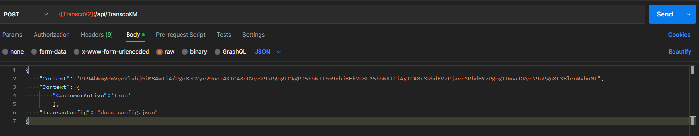

# Full Transco V2 Example

The following is a full example which demonstrates the usage of Transco V2.

**Example DB Setup**

In your DB of choice execute the following script:

    CREATE TABLE [dbo].[Customers]
    (
    	[CustomerId] int NOT NULL,
    	[CustomerName] nvarchar(100) NOT NULL,
    	[CustomerAge] int NOT NULL,
    	[CustomerStatus] nvarchar(100) NOT NULL,
    	[Active] bit NOT NULL
    )
    GO
    INSERT INTO [dbo].[Customers] (CustomerId, CustomerName, CustomerAge, CustomerStatus, Active)
    VALUES (1, 'John Doe', 35, 'Member', 1)
    GO
    INSERT INTO [dbo].[Customers] (CustomerId, CustomerName, CustomerAge, CustomerStatus, Active)
    VALUES (2, 'Mary Smith', 56, 'Member', 1)
    GO
    INSERT INTO [dbo].[Customers] (CustomerId, CustomerName, CustomerAge, CustomerStatus, Active)
    VALUES (3, 'Mike Brown', 29, 'Non-Member', 0)
    GO

**Transco Request**

The below Transco config is used to obtain the Customer Status from the DB and insert it into the XML Content. Then the content is transformed according to the defined XSLT file.

*XML Content (decoded)*

    <?xml version="1.0" ?>
    <persons>
      <person>
        <name>John Doe</name>
        <status></status>
      </person>
    </persons>

*docs_config.json*

    {
    	"instructions": [
    		{   			
    			"scopePath": "/persons",
    			"destinationPath": "//status",
    			"command": {
    				"databaseKeyVaultName": "transcoV2LocalDB",
    				"commandValue": "SELECT CustomerStatus FROM dbo.Customers WHERE CustomerName = @Name AND Active = @Active",
    				"isMandatory": true,
    				"defaultValue": "0",
    				"parameters": [
    					{
    						"paramName": "Name",
    						"value": "/name",
    						"type": "nvarchar",
    						"valueType": "path"
    					},
    					{
    						"paramName": "Active",
    						"value": "CustomerActive",
    						"type": "bit",
    						"valueType": "context"
    					}
    				],
    				"cache": {
    					"useCaching": true,
    					"cachingTimeout": "01:30:15"
    				}
    			}
    		},
    		{
    			"xsltTransform": "docs_transform.xslt",
    			"extensions": []
    		}
    	],
    	"options": {
    		"configCache": {
    			"useCaching": true,
    			"cachingTimeout": "01:30:00"
    		}
    	}
    }

*docs_transform.xslt*

    <?xml version="1.0" encoding="UTF-8"?>
    <xsl:stylesheet xmlns:xsl="http://www.w3.org/1999/XSL/Transform" version="1.0">
      <xsl:output method="xml" indent="yes"/>
    
      <xsl:template match="/persons">
        <root>
          <xsl:apply-templates select="person"/>
        </root>
      </xsl:template>
    
      <xsl:template match="person">
        <name status="{status}">
          <xsl:value-of select="name" />
        </name>
      </xsl:template>
    
    </xsl:stylesheet>

A POST request is sent to the Transco function URL and endpoint */api/TranscoXML* with the following Body. An application such as Postman can be used for this.

    { 
	    "Content":  "PD94bWwgdmVyc2lvbj0iMS4wIiBlbmNvZGluZz0idXRmLTE2Ij8+PHJvb3Q+PG5hbWUgc3RhdHVzPSJNZW1iZXIiPkpvaG4gRG9lPC9uYW1lPjwvcm9vdD4=",  
	    "Context":  { 
		    "CustomerActive":  "true"   
	    },   
	    "TranscoConfig":  "docs_config.json"    
    }

Expected Response:

    {
    	"Content":  "PD94bWwgdmVyc2lvbj0iMS4wIiBlbmNvZGluZz0idXRmLTE2Ij8+PHJvb3Q+PG5hbWUgc3RhdHVzPSJNZW1iZXIiPkpvaG4gRG9lPC9uYW1lPjwvcm9vdD4=",
    	"Context":  {
    		"CustomerActive":  "true"
    	},
    	"TranscoConfig":  "docs_config.json"
    }
Decoded Response Content:

    <?xml version="1.0" encoding="utf-16"?>
    <root>
	    <name status="Member">John Doe</name>
    </root>
