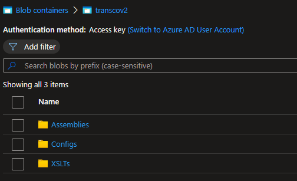
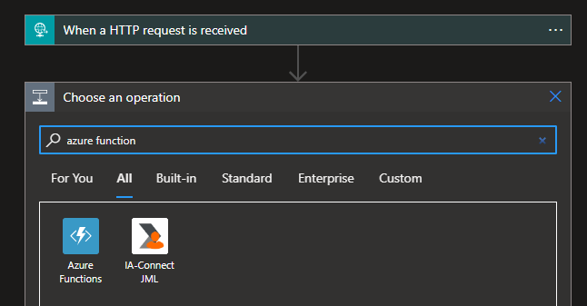
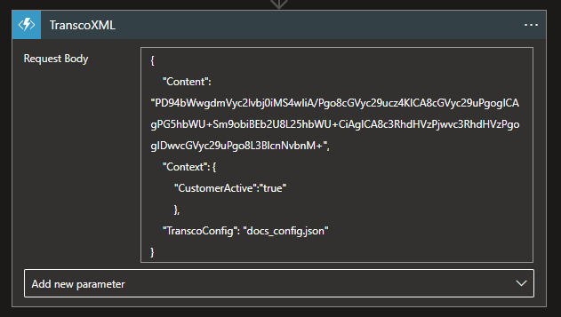

# Transco V2

Transco has been rewritten from scratch in .NET 6.0 to modernize and broaden its capabilities while offering a friendlier and convenient experience.

The Transco function is used to promote properties from the database, by using the content or context to create the SQL query which will be executed against the specified table. Transco can also perform transformations on XML content by simply specifying the XSLT file from storage.

## Transco Capabilities

**SQL Commands**

Transco can execute SQL commands to promote properties from a specified database and table. The connection to the database can be achieved via either a raw connection string or the name of an Azure Key Vault secret.

The parameters of the SQL query can be populated from 3 sources:

 - XML or JSON request content via XPath or JPath
 - Request context
 - Fixed value

**XML Transformation**

Transformations can be performed on XML content. The name of the XSLT file in the storage account is required for this operation.  Any required assemblies and dependencies used by the transformation can also be specfied, while the respective DLL files are to be in the storage account.

## Transco Config File

A JSON Transco config file is required to specify details about the instruction which will be performed. Instructions are executed in the order in which they appear. The name of the config file should be specified in the request so that it can be retrieved from the storage account.

**Config File Full Specification:**

    {
    	"instructions": [
    		{
    			"scopePath": [XPath/JPath of content scope],
    			"namespaces": [
					{
						"namespace": [XML Namespace],
						"prefix": [XML Namespace prefix]
					}
				],
    			"destinationPath": [XPath/JPath of the results destination],
    			"command": {
	    			"databaseConnectionString":[Raw connection string to DB],
    				"databaseKeyVaultName": [Name of DB connection string secret in Key Vault],
    				"commandValue": [SQL query to be executed],
    				"isMandatory": [If true, will throw error when result is null],
    				"defaultValue": [Default value of result],
    				"parameters": [
    					{
    						"paramName": [Name of param in query],
    						"value": [Type dependent. XPath or JPath if valueType = "path"],
    						"type": [SQL DB type. See: https://learn.microsoft.com/en-us/dotnet/api/system.data.sqldbtype],
    						"valueType": ["path" or "fixedValue" or "context"]
    					},
    					{
    						"paramName": [Name of param in query],
    						"value": [Type dependent. Any string value if valueType = "fixedValue"],
    						"type": [SQL DB type. See: https://learn.microsoft.com/en-us/dotnet/api/system.data.sqldbtype],
    						"valueType": ["path" or "fixedValue" or "context"]
    					},
    					{
    						"paramName": [Name of param in query],
    						"value": [Type dependent. Key to value in context if valueType = "context"],
    						"type": [SQL DB type. See: https://learn.microsoft.com/en-us/dotnet/api/system.data.sqldbtype],
    						"valueType": ["path" or "fixedValue" or "context"]
    					}
    				],
    				"cache": {
    					"useCaching": [If true, query result is cached],
    					"cachingTimeout": [Cache timeout timespan]
    				}
    			}
    		},
    		{
    			"xsltTransform": [Name of XSLT file],
    			"extensions": [
    				{
    					"namespace": [Assembly namespace],
    					"assemblyName": [Assembly name],
    					"className": [Assembly class name],
    					"dependencies": [
    						[DLL dependency file name],
    						[DLL dependency file name]
    					]
    				}
    			]
    		}
    	],
    	"options": {
    		"configCache": {
    			"useCaching": [If true, config file is cached],
    			"cachingTimeout": [Cache timeout timespan]
    		}
    	}
    }

## Storage Account

All required files are to be saved in a storage account and in a container with name ***transcov2***. This container is automatically created on startup of the Transco function.

Within the _**transcov2**_ container:

 - Transco config files must be saved in a folder named ***Configs***
 - Transformation files must be saved in a folder named ***XSLTs***
 - Assembly and dependency DLL files must be saved in a folder named
   ***Assemblies***
  

  
## Transco Request Object

The Transco request requires three values:

 1. XML or JSON content in Base64 string format
 2. Context as key-value pair list
 3. Name of transco config file in storage account

Example payload:

    {
	    "Content":  "PD94bWwgdmVyc2lvbj0iMS4wIiBlbmNvZGluZz0idXRmLTE2Ij8+PHJvb3Q+PG5hbWUgc3RhdHVzPSJNZW1iZXIiPkpvaG4gRG9lPC9uYW1lPjwvcm9vdD4=",
	    "Context":  {
		    "CustomerActive":  "true" 
	    }, 
	    "TranscoConfig":  "docs_config.json"    
    }

## Creating Logic App with TranscoV2 Connector

 1. Create a new blank Logic App in the Azure Portal
 2. Open the Logic App designer
 3. Choose a trigger of your choice, we will use a *Request* trigger
 4. Add a "Azure Function" action
 5. Select the appropriate TranscoV2 function from the list

 6. Select the Function endpoint you wish to use
 7. Set the Request Body to a valid Transco Request
 

 9. Add any other actions you require and save
